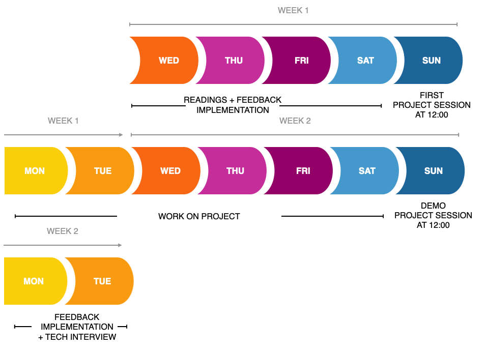

# O Projeto do Grupo

O objetivo do projeto é combinar tudo o que você aprendeu em um exemplo prático para mostrar o que você já pode fazer com o conhecimento que tem! Também queremos apresentá-lo ao trabalho em equipe e fornecer um mentor que o guiará nesse processo. No final será uma variação de algo como o seguinte (um projeto feito por alguns alunos da turma 31):

## O plano

Os projetos começam no domingo da semana 2. No domingo, vocês serão divididos em seus grupos e conectados a um mentor que explicará a base de código inicial e como vocês trabalharão juntos. Na próxima semana (até o domingo da semana 3), você se sentirá como um desenvolvedor que está criando recursos para um novo site! Haverá stand-ups com o seu grupo, vocês estarão olhando o código uns dos outros e estarão ajudando uns aos outros a construir uma versão tão legal quanto possível! No final, você fará uma demonstração do seu aplicativo para os outros e poderá perguntar uns aos outros como determinados recursos foram implementados. Nos últimos dias, você pode ajustar seu código com base no feedback e se preparar para a entrevista técnica em que perguntaremos sobre o código. Esses tipos de entrevistas são muito semelhantes ao que você encontrará quando começar a procurar um emprego, por isso é um bom momento para começar a praticar.

Para torná-lo agradável e visual, este é o cronograma:

## O repositório do projeto
Você pode dar uma olhada no repositório do projeto base [aqui](https://github.com/HackYourFuture/browser-quiz-project-starter). Seu mentor (ou ele mesmo ou pedirá a um de vocês) clonar este repositório para fornecer o espaço que sua equipe estará combinando código. Existe uma estrutura de pastas base, bem como um site fornecido, mas sinta-se à vontade para alterar o que quiser. Este é o projeto do seu grupo e você pode ajustá-lo ao seu gosto!

### A estrutura de pastas
Uma pergunta que recebemos muito é `existe uma estrutura de pastas padrão?` ou `é assim que todos os projetos são organizados?` e a resposta para ambas é não. Não há melhor maneira de organizar o código e isso se resume ao projeto, bem como ao(s) framework(s) que você está usando. A coisa a ter em mente é por que dividimos os arquivos em pastas. Há uma ótima resposta para esta pergunta de Max Fisher [aqui](https://www.quora.com/Why-do-you-want-to-split-your-program-code-into-multiple-files) que diz:

>É uma organização básica. Imagine que uma biblioteca colaria cada novo livro em uma pilha dos antigos. O Senhor dos Anéis passaria de um batente de porta para uma porta. Depois de derrotar Sauron, o leitor faria uma transição suave para A Pequena Sereia, antes de mergulhar em 50 Tons de Cinza.

>Arquivos pequenos são mais fáceis de digerir. Se cada arquivo servir apenas a um tópico, você saberá rapidamente onde procurar. Você também sabe imediatamente o que não pertence ao tópico, sem ter que ler os comentários.

>Vários arquivos permitem uma organização não linear. Os blocos de construção de um programa raramente seguem uma única cadeia linear de interações. Componentes fracamente acoplados são facilmente representados por arquivos individuais, e as pastas permitem adicionar estrutura externa.

>Arquivos distintos são mais fáceis de reorganizar. À medida que a complexidade aumenta, os componentes são movidos para subpacotes e, às vezes, você só precisa limpar. Um arquivo pode simplesmente ser movido como um todo. Copiar/colar para migrar código é mais trabalhoso, especialmente se você tiver adicionado toda a estruturação manualmente.

>Arquivos individuais são mais fáceis de rastrear. O código está idealmente em um sistema de controle de versão. Saber que backend/datastore/fileio.cpp mudou já é bastante informativo e permite que você saiba se a alteração é relevante para você. Se tudo for um único arquivo, você obterá a linha 254–378 em app.cpp alterada e terá que pesquisar o contexto você mesmo.

Basicamente, um único arquivo é fácil de escrever. Vários arquivos são muito fáceis de ler, manter e gerenciar. Para o desenvolvimento de software, o último é muito mais importante. Mesmo se você estiver trabalhando sozinho, no futuro - você não sabe tudo o que o passado - você fez.

Isso também significa que a estrutura de pastas pode mudar à medida que seu aplicativo muda, contanto que você mantenha os princípios básicos em mente: você deseja separar o código em partes lógicas e, da mesma forma, deseja separar seus arquivos em pastas lógicas para ajudá-lo a identificar o que cada arquivo é responsável. Isso tornará bases de código maiores mais gerenciáveis para as equipes, bem como para o seu futuro eu.

Tendo explicado isso, o readme no repositório do projeto explica a pasta inicial [structure](https://github.com/HackYourFuture/browser-quiz-project-starter#structure) que este aplicativo está usando. Se você como um grupo quiser reorganizá-lo, tudo bem, contanto que você possa explicar a lógica por trás disso!

### Os requisitos
Em geral, queremos dar a você um pouco de liberdade sobre o que você deseja construir, mas há alguns requisitos que o projeto final deve seguir:

- O projeto precisa ser um quiz
- O questionário precisa exigir que o usuário responda 10 perguntas
- Cada pergunta no quiz precisa ter 4 respostas
- Precisa haver um botão para ir para a próxima pergunta
- O projeto precisa ser implantado em algum lugar para que possamos vê-lo (antes do último domingo)

#### Recursos
No repositório do projeto também há um [backlog](https://github.com/HackYourFuture/browser-quiz-project-starter#backlog). Veja isso como um guia, os `must-have`'s são obrigatórios, os `nice-to-have`'s são sugestões de recursos extras, mas sinta-se à vontade para pensar em seus próprios.

## A apresentação
No último domingo cada grupo apresentará seu projeto aos demais. A apresentação deverá ter um máximo de 15 minutos em que faça o seguinte:

- Demo do aplicativo, mostrando todos os recursos que você construiu
- Percorra a base de código, explique os arquivos que você fez e o que faz o quê
- Destaque um recurso e explique como esse recurso foi implementado

O restante do grupo, incluindo os mentores, dará feedback à sua equipe sobre seu aplicativo e seu código. Anote essas coisas, pois você estará corrigindo isso nos 2 dias após a apresentação.

## A entrevista
No final do módulo, você terá uma entrevista técnica simulada como teste para este módulo. A estrutura dessas entrevistas geralmente é a seguinte:

- Em primeiro lugar, serão feitas algumas perguntas conceituais. Coisas como: 'O que é o DOM?' 'O que um ouvinte de eventos faz?', etc.
- Você será solicitado a compartilhar sua tela e demonstrar o projeto. Faça-o curto, apenas alguns minutos e finja que o está apresentando a alguém que nunca o viu antes.
- Pediremos que você demonstre o código. Geralmente você quer:
    - explicar a estrutura de pastas do projeto (tudo na pasta 'src'). Quais são os arquivos em cada pasta responsáveis?
    - escolha um ou dois recursos do seu aplicativo e veja como esse recurso é implementado
- Durante ou após a demonstração do código, perguntaremos a você sobre determinadas linhas de código. Perguntas como: 'O que esta linha faz?', 'Por que você a implementou assim?', 'Por que você usou uma instrução switch aqui?', etc.

### Módulo de navegadores específico
No módulo Browsers adicionamos mais um passo à entrevista:

- No final, escolheremos um recurso que seu grupo não implementou e pediremos que você explique amplamente o que precisa ser feito para implementar esse recurso.

### Preparação
Para se preparar melhor, aqui estão algumas dicas:
- Pratique a demonstração do seu projeto e do seu código, certifique-se de que seja curto e conciso
- Ser capaz de compartilhar sua tela e ter seu projeto aberto localmente (e certificar-se de que ainda funciona)
- Percorra o código do projeto e certifique-se de entender como ele funciona
- Veja os outros recursos no repositório do projeto e tenha uma ideia do que é necessário para implementá-los
