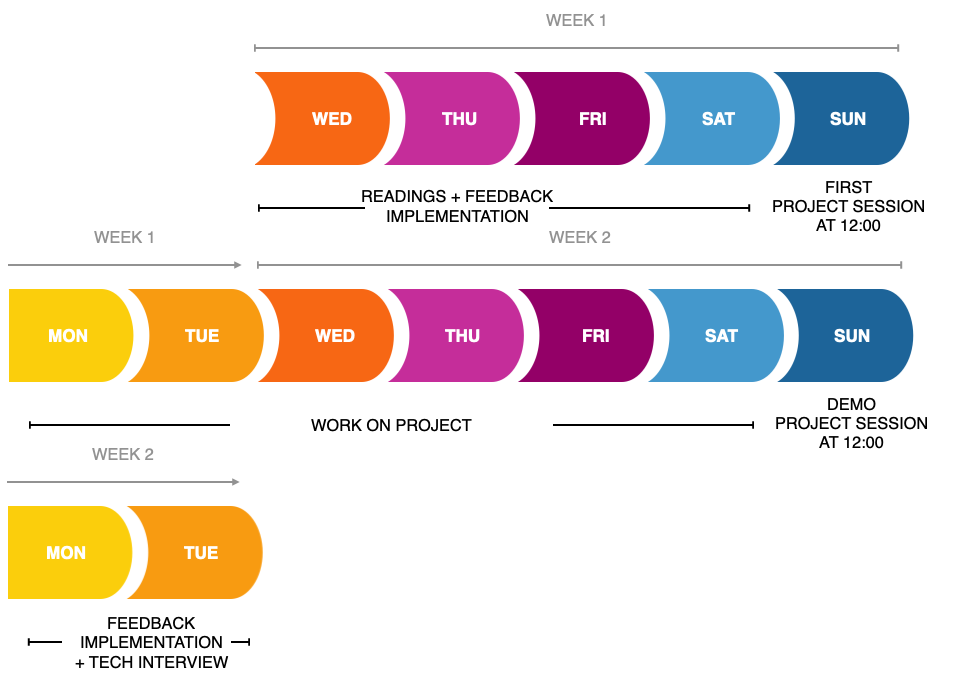

# Função de mentor do projeto

Em primeiro lugar, obrigado por disponibilizar seu tempo!

Esta cartilha deve ajudá-lo a saber onde esperamos que os alunos estejam neste momento e o que se espera de você como mentor. Você pode ver a descrição do projeto no [arquivo PROJETO](./PROJECT.md) que os alunos irão ler.

## Cronograma
Este é o cronograma do projeto (começa no domingo da segunda semana):

### Pré-partida
Antes do primeiro domingo, há uma coisa a fazer: criar um repositório para o seu grupo trabalhar. O repositório inicial está [aqui](https://github.com/HackYourFuture/browser-quiz-project-starter), mas fique à vontade para ajustar se quiser. Apenas certifique-se de explicar todas as alterações que você fez. Se você se sentir muito ambicioso, você também pode criar seu próprio repositório para fazer algo completamente diferente. O objetivo deste exercício em grupo é aprender sobre como trabalhar em grupo, bem como usar a manipulação do DOM para criar um site interativo. Desde que o projeto faça isso, ele se encaixa no que pode ser feito aqui.

### Primeiro domingo
No primeiro domingo dividiremos a turma em grupos e você terá seu próprio quarto com seu grupo. Este é o momento de fazer o seguinte:

- passe pelo repositório inicial para explicar a estrutura do código. Esta é a primeira vez que eles escrevem vários arquivos JavaScript, então explique por que fazemos isso para projetos maiores. Há uma implementação básica de perguntas e, ao clicar nelas, você pode usar como exemplo.
- mostre um único ciclo de vida de PR sobre como o código chega ao branch master. Os alunos saberão sobre PR's de sua lição de casa e terão lido sobre Agile, mas acho que é bom ter uma demonstração disso. Sugerimos algumas mudanças no CSS para deixar o quiz um pouco melhor.
- explique à sua equipe como vai funcionar a próxima semana. Queremos que eles tenham uma reunião diária para saber como isso funciona, mas isso também pode ser feito por meio de mensagens do slack, se for mais fácil para você. Certifique-se de informar ao seu grupo como você gostaria que perguntas fossem enviadas para você (no canal do slack? Agrupadas e dadas em uma reunião diária?). O que quer que funcione para você.
- examine a lista de recursos e discuta-os com a equipe para priorizá-los. Você estará jogando como Product Owner, Scrum master e Tech lead neste projeto.
- Divida a equipe em grupos menores (provavelmente 2 grupos de 2) e dê a eles sua primeira característica. Se você tiver tempo, você pode querer fazer um recurso junto com eles para ter uma ideia de como tudo funciona.
- E o mais importante! Pense em um nome de equipe e informe Tjebbe ou Rob para que eles possam criar um bom canal de slack para você se comunicar!

### Durante a semana
Há algumas coisas que gostaríamos que você fizesse durante a semana:

- Esteja disponível para perguntas e check-in com seu grupo. Uma semana não é muito tempo e notamos que alguns ainda não estão à vontade para pedir ajuda, então um rápido 'Como vai pessoal?' de vez em quando, para ver o que está acontecendo, ajudará a mover as coisas.
- Dê uma olhada nos PRs e revise-os. Uma vez aprovado, você pode mesclá-lo no branch principal!

### Segundo Domingo
No segundo domingo queremos nos reunir com toda a turma e mostrar os projetos que foram feitos. Decida entre o grupo quem apresentará o projeto aos outros grupos. Esta é uma demonstração do aplicativo, bem como passar pelo código de um recurso.

Como mentor neste dia, gostaríamos que você fornecesse feedback aos outros grupos e o que eles construíram.