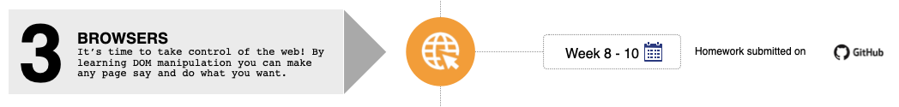

> Se você estiver seguindo o currículo do HackYourFuture, recomendamos que comece com o módulo 1: [HTML/CSS/GIT](https://github.com/HackYourFuture/HTML-CSS). Para obter uma visão geral completa do currículo HackYourFuture primeiro, clique [aqui](https://github.com/HackYourFuture/curriculum).

> Ajude-nos a melhorar e compartilhe seus comentários! Se você encontrar tutoriais ou links melhores, compartilhe-os [abrindo um pull request](https://github.com/HackYourFuture/Browsers/pulls).

# Módulo #3 - Navegadores

Se você perguntasse a uma pessoa aleatória na rua a pergunta "O que é um navegador?", provavelmente obteria uma variedade de respostas (incorretas). Para provar, confira [este](https://www.youtube.com/watch?v=o4MwTvtyrUQ).

Você pode ser uma dessas pessoas agora, mas depois deste módulo não mais. Em **Navegadores**, você aprenderá tudo sobre como os navegadores funcionam e como usar o JavaScript que acabou de aprender no navegador.

## Metas de aprendizagem

Para concluir com sucesso este módulo, você precisará dominar o seguinte:

- Entenda o que é o `DOM`
- Use o básico de `Manipulação DOM`
- Construa um site de quiz legal do zero como um grupo
- Aprenda a se apresentar e ao seu código

## Como usar este repositório

### Conteúdo do repositório

Este repositório é composto por 2 partes essenciais por semana:

1. `README`: este documento contém toda a teoria necessária que você precisa entender **enquanto** trabalha na lição de casa. Ele contém a lista de conceitos que você vai querer estudar esta semana e aponta para o seu livro de estudo para ler tudo sobre eles. Esta é a **primeira coisa** com a qual você deve começar toda semana
2. `MAKEME`: este documento contém as instruções para o dever de casa de cada semana. Comece com os exercícios rapidamente, para que você possa fundamentar os conceitos sobre os quais leu anteriormente.

### Como estudar

Digamos que você esteja começando com o módulo Browsers. Isto é o que você faz...

1. A semana sempre começa na **quarta-feira**. A primeira coisa que você vai fazer é abrir o `README.md` dessa semana. Para a primeira semana de `Browsers`, seria [Week1 Reading](/Week1/README.md)
2. Você passa a **quarta-feira** e a **quinta-feira** examinando os recursos e tentando obter uma compreensão básica dos conceitos. Enquanto isso, você também implementará qualquer feedback que tenha recebido na lição de casa da semana passada (do módulo JavaScript1)
3. Na **Sexta** você começa com o dever de casa, encontrado no `MAKEME.md`. Para a primeira semana de `Browsers`, isso seria [Week1 Homework](/Week1/MAKEME.md)
4. Você passa a **sexta-feira** e o **sábado** brincando com os exercícios e anotando quaisquer dúvidas que possa ter
5. **Prazo 1**: você enviará suas dúvidas até **sábado, 23h59**, no canal da turma
6. No **Domingo** você vai assistir à aula. Será no formato de perguntas e respostas, o que significa que não haverá material novo. Em vez disso, suas perguntas devem ser discutidas e você pode aprender com os outros
7. Você passa a **segunda-feira** e a **terça-feira** finalizando sua lição de casa
8. **Prazo 2**: Você envia sua lição de casa para os canais certos (GitHub) antes de **terça-feira, 23h59**. Se você não puder chegar a tempo, por favor comunique ao seu mentor
9. Comece a nova semana voltando ao ponto 1!

Resumindo:

Para ter uma visão geral mais detalhada das diretrizes, verifique o repositório de sua turma ou pergunte ao seu mentor/turma no Slack!

## Planejamento

| Semana | Tópico | Materiais de Leitura | Lição de casa |
| ---- | ----- | ----------------- | -------- |
| 1. | Modelo de Documento-Objeto (DOM), manipulação de DOM, Módulo de Apresentação semana 1 | [Leitura W1](/Week1/README.md) | [Trabalho de casa W1](/Week1/MAKEME.md) |
| 2. | Módulo de apresentação semana 2, semana 1 do projeto em grupo! | [Leitura W2](/Week2/README.md) | [Trabalho de casa W2](/Week2/MAKEME.md) |
| 3. | Projeto de grupo semana 2 | [Leitura W3](/Week3/README.md) | Nenhum dever de casa individual |

## Finalizado?

Você terminou o módulo? Bom trabalho! Você está indo bem!

Se você se sentir pronto para o próximo desafio, clique [aqui](https://www.github.com/HackYourFuture/Using-APIs) para acessar Using API's!

_O currículo HackYourFuture está sujeito aos direitos autorais CC BY. Isso significa que você pode usar nossos materiais livremente, mas certifique-se de nos dar crédito por isso :)_

 Esta obra está licenciada sob uma <a rel="license" href="http://creativecommons.org /licenses/by/4.0/">Licença Creative Commons Atribuição 4.0 Internacional</a>.
