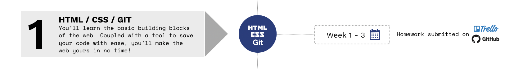
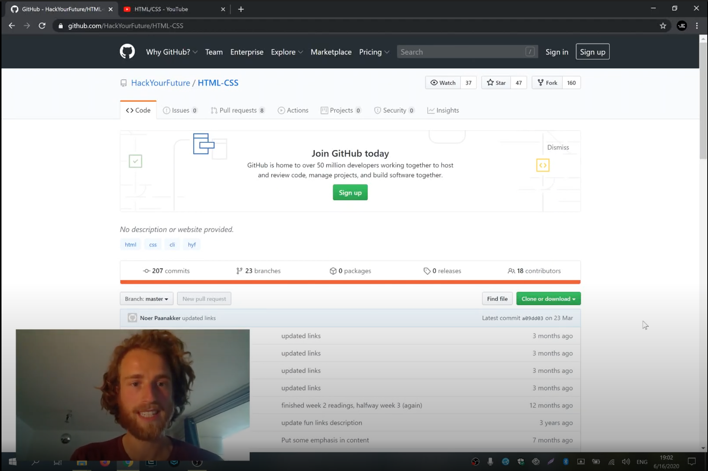

> Se você está seguindo o currículo do HackYourFuture, recomendamos que você dê uma olhada no currículo completo, que você pode encontrar [aqui](https://github.com/HackYourFuture/curriculum).

> Ajude-nos a melhorar e compartilhe seus comentários! Se você encontrar tutoriais ou links melhores, compartilhe-os [abrindo um pull request](https://github.com/HackYourFuture/HTML-CSS/pulls).

# Módulo #1 - HTML, CSS e GIT (Frontend)

Bem-vindo ao maravilhoso mundo do desenvolvimento web! Neste módulo você aprenderá os blocos básicos de construção da web: HTML e CSS. HTML nos dá o poder de adicionar texto, imagens e vídeos a uma página. CSS nos dá o poder de organizar essas partes e torná-las bonitas.

Os produtos de HTML e CSS compreendem dois terços do que é chamado de `frontend` (o terço final é JavaScript do lado do cliente, sobre o qual você aprenderá em módulos posteriores). O que é frontend? É outra palavra para a parte de apresentação de um software. Em termos de desenvolvimento web, estamos falando de "o que você vê" quando acessa qualquer site.

Pense assim: se uma página da web fosse uma pessoa, o HTML seria o esqueleto e o CSS a pele e a roupa!

Você também aprenderá [GIT](https://www.youtube.com/watch?v=P0kF3vvy3QM), software que permitirá que você salve suas pastas e arquivos caso sejam excluídos acidentalmente ou acabem corrompidos. Ele pode fazer muito mais e você aprenderá tudo sobre isso a partir da semana 2!

## Metas de aprendizagem

Para concluir com sucesso este módulo, você precisará dominar o seguinte:

- Ser capaz de escrever `HTML` e `CSS` sintaticamente corretos
- Entenda o que se entende por desenvolvimento web `responsivo`
- Pratique a navegação em seu computador usando a `interface de linha de comando (CLI)`
- Aprenda sobre `GIT` e seu uso básico
- Familiarize-se com `Trello` e `GitHub` como forma de enviar sua lição de casa
- Conheça o seu caminho em torno do `Visual Studio Code`
- Sinta-se confortável trabalhando com o seu `inspetor do navegador`

## Como usar este repositório

> Antes de fazer qualquer coisa, primeiro vá [aqui](Week0/README.md).

### Conteúdo do repositório

Este repositório é composto por 3 partes essenciais:

1. `README`: este documento contém toda a teoria necessária que você precisa entender **enquanto** trabalha na lição de casa. Ele contém não apenas os recursos certos para aprender sobre os conceitos, mas também palestras feitas por professores do HackYourFuture. Esta é a **primeira coisa** com a qual você deve começar toda semana
2. `MAKEME`: este documento contém as instruções para o dever de casa de cada semana. Comece com os exercícios rapidamente, para que você possa fundamentar os conceitos sobre os quais leu anteriormente.
3. `PLANO DE AULA`: este documento é uma referência para professores. No entanto, como estudante, não tenha vergonha de dar uma olhada também!

### Como estudar

Digamos que você está apenas começando com o HackYourFuture. Isto é o que você faz...

1. A semana sempre começa na **quarta-feira**. A primeira coisa que você vai fazer é abrir o `README.md` dessa semana. Para a primeira semana de `HTML-CSS`, seria [Week1 Reading](/Week1/README.md)
2. Você passa a **quarta-feira** e a **quinta-feira** examinando os recursos e tentando obter uma compreensão básica dos conceitos. A partir da segunda semana, você também implementará qualquer feedback recebido sobre a lição de casa da semana passada
3. Na **Sexta** você começa com o dever de casa, encontrado no `MAKEME.md`. Para a primeira semana de `HTML-CSS`, isso seria [Week1 Homework](/Week1/MAKEME.md)
4. Você passa a **sexta-feira** e o **sábado** brincando com os exercícios e anotando quaisquer dúvidas que possa ter
5. **Prazo 1**: você enviará suas dúvidas até **sábado, 23h59**, no canal da turma
6. No **Domingo** você vai assistir à aula. Será no formato de perguntas e respostas, o que significa que não haverá material novo. Em vez disso, suas perguntas devem ser discutidas e você pode aprender com os outros
7. Você passa a **segunda-feira** e a **terça-feira** finalizando sua lição de casa
8. **Prazo 2**: Você envia sua lição de casa para os canais certos (Trello/GitHub) antes de **terça-feira 23.59**. Se você não puder chegar a tempo, por favor comunique ao seu mentor
9. Comece a nova semana voltando ao ponto 1!

Resumindo:

Para ter uma visão geral mais detalhada das diretrizes, leia [este documento](https://docs.google.com/document/d/1JUaEbxMQTyljAPFsWIbbLwwvvIXZ0VCHmCCN8RaeVIc/edit?usp=sharing) ou pergunte ao seu mentor/classe no Slack!

### Vídeo aulas

Para cada módulo, o HackYourFuture oferece palestras em vídeo. Estes são feitos por desenvolvedores de software experientes que sabem do que estão falando. O professor principal deste módulo será [Arco Mul](https://hackyourfuture.slack.com/team/UBVNH7CG1): um experiente desenvolvedor de jogos e web!

Você pode saber mais sobre ele aqui:

- [Site pessoal](https://www.arcomul.nl/)
- [GitHub](https://github.com/ArcoMul)
- [@Arco no Slack](https://hackyourfuture.slack.com/team/UBVNH7CG1)

Aprenda com o Arco na seguinte playlist de vídeos que ele fez para você! (Clique na imagem para abrir o link)

## Planejamento

| Semana | Tópico | Materiais de Leitura | Lição de casa | Plano de aula |
| ---- | -------------------------------------------------- ---- | ------------------------------ | ------------------------------- | --------------------------------------- |
| 0. | Começo rápido! | [Leitura W0](Semana0/README.md) | - | - |
| 1. | Noções básicas de interface de linha de comando, sintaxe HTML/CSS | [Leitura W1](/Week1/README.md) | [Trabalho de casa W1](/Week1/MAKEME.md) | [Plano de aula W1](/Week1/LESSONPLAN.md) |
| 2. | Introdução ao GIT, design responsivo | [Leitura W2](/Week2/README.md) | [Trabalho de casa W2](/Week2/MAKEME.md) | [Plano de aula W2](/Week2/LESSONPLAN.md) |
| 3. | Ramificações GIT, frameworks CSS, Trabalhando com o navegador | [Leitura W3](/Week3/README.md) | [Trabalho de casa W3](/Week3/MAKEME.md) | [Plano de aula W3](/Week3/LESSONPLAN.md) |

## Finalizado?

Você terminou o módulo? Excelente! Dê um tapinha nas costas pelo ótimo trabalho que você fez.

Se você se sentir pronto para o próximo desafio, clique [aqui](https://www.github.com/hackyourfuture/javascript1) para acessar **JavaScript1**!

_O currículo HackYourFuture está sujeito aos direitos autorais CC BY. Isso significa que você pode usar nossos materiais livremente, mas certifique-se de nos dar crédito por isso :)_
