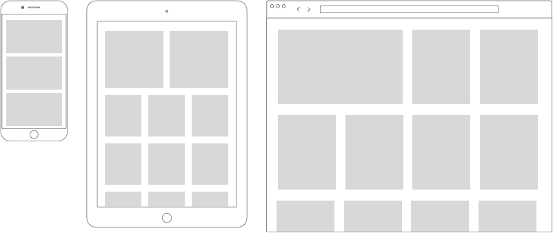

# Site de drones

Neste projeto, você estará construindo em um projeto existente. É seu trabalho torná-lo 'responsivo' e parecer organizado em vários dispositivos.

O HTML e as imagens estão nesta pasta. Você vai escrever o CSS para esta página, **não é permitido alterar o HTML**.

A página contém duas grades: a primeira deve funcionar usando `flexbox`, a segunda usando `grid`. Cuidado para não misturar os dois!

Fora isso, você deve usar `consultas de mídia`. Aqui estão os requisitos para cada tamanho de dispositivo:

- Em telefones celulares (menores que 600px): uma grade de uma coluna, que abrange toda a largura
- Em tablets (entre 600px e 1024px): uma grade de três colunas, com exceção de que os dois primeiros itens abrangem toda a largura juntos (então, primeiro temos duas colunas, depois dos dois primeiros itens temos três colunas)
- Em desktops (1024px e superior): uma grade de quatro colunas, com exceção de que o primeiro item abrange duas colunas.
- Deve haver alguma `margem` entre os itens da grade

Para que funcione assim:

## Coisas para pensar

- Qual maneira você acha que é melhor para este caso de uso? Flex ou grade? Que casos de uso você pode pensar que fariam você usar o outro?
- Todo navegador pode rodar flex e grid? E quanto a certos recursos de flex e grid? Qual é uma maneira fácil de ver se os navegadores suportam um determinado recurso?
- Você usou o inspetor do navegador para o exercício? Qual é a razão para sim/não aqui?
