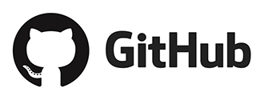

# Bem-vindo ao HackYourFuture!

Olá novo aluno, bem-vindo ao HackYourFuture! Neste documento, você encontrará todas as instruções necessárias para se preparar para sua jornada no HackYourFuture e além!

## Agenda

Vamos discutir os seguintes pontos:

- Como me comunico com todos? Use a ferramenta de comunicação [Slack](https://www.slack.com)
- Onde escrevo meu código? Dentro de um editor de código chamado [Visual Studio Code](https://code.visualstudio.com/)
- Qual é a maneira de enviar minha lição de casa? Use a ferramenta de planejamento [Trello](https://trello.com/)
- Como coloco meu código online? Na plataforma de desenvolvimento de software [GitHub](https://www.github.com/)

### Como me comunico com todos? Usar o Slack


Slack é um aplicativo que nos permite nos comunicar com outras pessoas por meio de bate-papo (vídeo). É usado na maioria das empresas de tecnologia e é muito fácil de usar. Para que você se familiarize, vamos usá-lo também!

Veja isso

Faça o download do aplicativo em seu desktop:

- [macOS](https://slack.com/downloads/mac)
- [Windows](https://slack.com/downloads/windows)
- [Linux](https://slack.com/downloads/linux)

E se você realmente não pode ficar sem seu telefone, também pode obtê-lo para celular:

- [App store](https://itunes.apple.com/nl/app/slack/id803453959?mt=12)
- [Google Play](https://play.google.com/store/apps/details?id=com.Slack&hl=nl)

Quando tudo estiver instalado, é hora de entrar nele! Primeiro experimente a demonstração:

- [Demonstração do Slack](https://slackdemo.com/)

Coisas importantes a serem observadas são:

- fazer uso de tópicos para isolar discussões
- formatar o código para facilitar a leitura usando a sintaxe ` ``` your code ``` `

Estas são as primeiras coisas a fazer depois de ter sido convidado para o slack:

- Adicione uma foto de perfil (com aparência profissional)
- Adicione uma boa descrição sobre você
- Diga oi para seus colegas no canal de aula

Feito? Isso é opcional, mas para quem estiver curioso:

- [Folha de dicas para noções básicas e atalhos](https://slack.com/intl/en-nl/help/articles/201374536-Slack-keyboard-shortcuts)
- [Como formatar suas mensagens no Slack](https://api.slack.com/reference/surfaces/formatting)

### Onde escrevo meu código? Dentro de um editor de código chamado Visual Studio Code


Tecnicamente falando, você pode escrever código para a web em qualquer aplicativo que permita escrever e salvar arquivos de texto simples (como o Bloco de Notas ou o TextEdit). No entanto, um editor de código é uma ferramenta projetada especificamente para edição de código.

Dependendo da linguagem de programação, o editor de código destaca palavras-chave especiais, dá sugestões até certo ponto, adiciona recuo automático e às vezes também possui uma interface de linha de comando integrada (mais sobre isso na próxima seção).

Embora seu editor de código faça o trabalho básico de permitir que você escreva código, ele sempre pode ser aprimorado para facilitar nossas vidas como desenvolvedores. Neste [vídeo](https://www.youtube.com/watch?v=ORrELERGIHs&t=324s), você terá uma ótima introdução sobre todos os recursos. Seu código é python, então não se preocupe em entender o código, trata-se de como navegar no ambiente de código do Visual Studio.

Atualmente, o Visual Studio Code é um dos principais editores de código do mercado. Como tal, escolhemos que ele tenha nosso editor de código padrão para usar. Clique no link a seguir para baixá-lo:

- [Código do Visual Studio](https://code.visualstudio.com/)

#### Melhorando nosso editor de código

Sempre podemos melhorar o que temos, inclusive nosso editor de código! Podemos adicionar `extensões` para tornar nossa vida de programação muito mais fácil. Instale também as seguintes extensões e veja por si mesmo!

- [Servidor ao vivo](https://marketplace.visualstudio.com/items?itemName=ritwickdey.LiveServer)
- [Prettier](https://marketplace.visualstudio.com/items?itemName=esbenp.prettier-vscode) (Certifique-se de habilitar 'Format on save' nas configurações do Visual Studio Code após instalar este plugin)

Para obter informações mais específicas sobre como configurar seu editor:

- [Dicas do VSCode](https://github.com/HackYourFuture/fundamentals/tree/master/VSCodeTips)

### Qual é a maneira de enviar minha lição de casa? Use a ferramenta de planejamento Trello

<br/>
<a href="http://www.youtube.com/watch?feature=player_embedded&v=tVooja0Ta5I" target="_blank"></a><br/>

O Trello é uma ferramenta de planejamento que permite fazer listas de tarefas para organizar e priorizar seus projetos. No HackYourFuture vamos usá-lo para enviar sua lição de casa para o primeiro módulo. Antes de iniciar sua primeira aula, faça o seguinte:

- [Cadastre-se](https://trello.com/signup) para uma conta
- Obtenha acesso ao quadro `Feedback Assignments`, perguntando a @Wouter no Slack
- Crie um cartão com seu nome. Dentro, adicione um URL CodePen de sua atribuição técnica + uma breve descrição do seu site

### Como coloco meu código online? Na plataforma de desenvolvimento de software GitHub

<a href="http://www.youtube.com/watch?feature=player_embedded&v=w3jLJU7DT5E" target="_blank"></a>

O GitHub é um lugar onde você pode colocar seu código online. Por quê? Para armazenar seu código com segurança caso algo ruim aconteça com seu computador (travamento do computador, vírus, arquivos defeituosos). Você sempre poderá acessar esse código do GitHub, usando qualquer outro computador.

- [Cadastre-se](https://github.com/join) para uma conta
- Coloque o URL da sua conta no canal da turma

### Verificação dupla

Vamos garantir que você tenha feito tudo o que é necessário:

- Slack: baixou, adicionou perfil e disse oi
- Visual Studio Code: plugins baixados e adicionados
- Trello: cadastrou e adicionou um cartão, incluindo a URL do CodePen do seu trabalho técnico + breve descrição
- Github: cadastre-se e coloque a URL da sua conta no canal da aula

> Se a resposta for 'não', não entre em pânico. Primeiro tente e veja se você pode encontrar algumas informações sobre as ferramentas acima (dica: pergunte primeiro ao Google). Se isso não funcionar, não tenha vergonha de perguntar aos seus colegas ou a qualquer pessoa do HackYourFuture sobre o que fazer a seguir.

### Finalizado?

Você já terminou com tudo? Tenha orgulho de si mesmo, pois você se preparou de maneira ideal com todas as ferramentas necessárias para tornar sua aventura de codificação um sucesso!

Antes de ficar técnico, leia sobre a cultura HackYourFuture [aqui](https://github.com/HackYourFuture/culture) e também verifique [estes cenários](https://github.com/HackYourFuture/culture/blob/main/ cenários.md) que lhe dará uma dica sobre como trabalhamos. Na primeira ou segunda semana do curso, haverá uma sessão colaborativa com toda a turma para discutir tudo isso.

Agora, com isso fora do caminho, podemos começar com as leituras para a primeira semana. Você pode encontrar isso [aqui](https://github.com/HackYourFuture/HTML-CSS/blob/master/Week1/README.md). Certifique-se de ter terminado antes de sua primeira aula no domingo!
