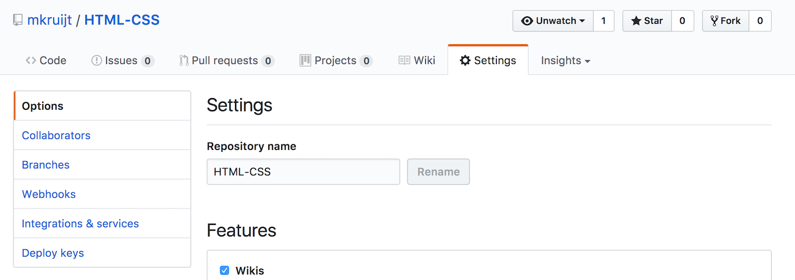

# Como entregar o dever de casa

Durante este módulo, você entregará sua lição de casa na seguinte ordem:

1. [GitHub](https://www.github.com/HackYourFuture/HTML-CSS).

Você primeiro criará um repositório pessoal do GitHub (um local de armazenamento para código) no qual fará upload de todos os arquivos de lição de casa.

2. [Trello](https://trello.com/b/U1gK8Q1c/feedback-assignments).

Depois de enviar seus arquivos, você copiará o link para a pasta de trabalhos de casa no GitHub e colará em um cartão no Trello no quadro "Feedback Assignments" (na semana correta).

Nos guias a seguir, você aprenderá como fazer isso passo a passo.

## 1. Guia de lição de casa do GitHub

No início do módulo:

1. Vá para o Github e [crie um novo repositório](https://github.com/new) chamado `HYF-Module-HTMLCSSGIT` (selecione a opção: inicialize com README)

Em seguida, siga estas etapas para cada semana do módulo HTML/CSS/GIT:

2. Dentro do novo repositório crie uma pasta com o nome da semana apropriada (ex. `week1`)
3. Carregue os arquivos de lição de casa
4. Antes de enviar o upload, escreva uma mensagem que diga algo sobre o que você fez. Para a semana1, a mensagem pode ser: "escreveu comandos cli e construiu currículo digital"
5. Abra os arquivos em sua pasta para verificar se tudo isso funcionou.
6. Agora vá para as configurações do seu repositório:

7. E vá para _Github Pages_ selecione "main" ou "master" em vez de "none"

8. Agora você pode ver sua lição de casa online em: https://_hereyouplaceyourgithubusername_.github.io/HYF-Module-HTMLCSSGIT/week1, este URL também estará visível na página de configurações:

> Aqui está um exemplo de como seu repositório de trabalhos de casa deve ficar: https://github.com/mkruijt/HTML-CSS

## 2. Guia de lição de casa do Trello

Siga estas etapas para fazer upload do link para sua lição de casa:

1. Vá para o quadro "Atribuições de feedback"
2. Na semana correta, crie um cartão com seu nome e o número da semana (como "Trabalho de casa da Semana 1 da Noer Paanakker")
3. Clique no cartão e anexe a URL do seu repositório GitHub e/ou outros links relevantes. Além disso, adicione uma breve descrição do que você fez

Se você tiver alguma dúvida ou se algo não estiver totalmente claro ¯\\\_(ツ)\_/¯, pergunte/comente no Slack!
