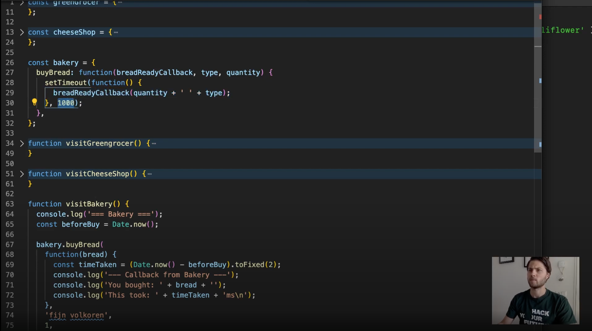

# OBSOLETO - JavaScript 2
Este módulo foi substituído pelo módulo Browsers, encontre-o [aqui](https://github.com/HackYourFuture/Browsers)


```Se você perguntasse a uma pessoa aleatória na rua a pergunta "O que é um navegador?", você provavelmente obterá uma variedade de respostas (incorretas). Para provar, confira [este](https://www.youtube.com/watch?v=o4MwTvtyrUQ).

Você pode ser uma dessas pessoas agora, mas depois deste módulo não mais. Em **JavaScript2**, você aprenderá tudo sobre como usar JavaScript no navegador.

## Metas de aprendizagem

Para concluir com sucesso este módulo, você precisará dominar o seguinte:

- Entenda o que é o `DOM`
- Use o básico de `Manipulação DOM`
- Diferenciar entre operações `síncronas` e `assíncronas`
- Ganhar consciência do funcionamento interno do JavaScript
- Aprenda a pensar com base em `princípios`, em vez de bibliotecas e frameworks

## Como usar este repositório

### Conteúdo do repositório

Este repositório é composto por 3 partes essenciais:

1. `README`: este documento contém toda a teoria necessária que você precisa entender **enquanto** trabalha na lição de casa. Ele contém não apenas os recursos certos para aprender sobre os conceitos, mas também palestras feitas por professores do HackYourFuture. Esta é a **primeira coisa** com a qual você deve começar toda semana
2. `MAKEME`: este documento contém as instruções para o dever de casa de cada semana. Comece com os exercícios rapidamente, para que você possa fundamentar os conceitos sobre os quais leu anteriormente.
3. `PLANO DE AULA`: este documento é uma referência para professores. No entanto, como estudante, não tenha vergonha de dar uma olhada também!

### Como estudar

Digamos que você está apenas começando com o módulo JavaScript2. Isto é o que você faz...

1. A semana sempre começa na **quarta-feira**. A primeira coisa que você vai fazer é abrir o `README.md` dessa semana. Para a primeira semana de `JavaScript2`, seria [Week1 Reading](/Week1/README.md)
2. Você passa a **quarta-feira** e a **quinta-feira** examinando os recursos e tentando entender os conceitos básicos. Enquanto isso, você também implementará qualquer feedback que tenha recebido na lição de casa da semana passada (do módulo JavaScript1)
3. Na **Sexta** você começa com o dever de casa, encontrado no `MAKEME.md`. Para a primeira semana de `JavaScript2`, isso seria [Week1 Homework](/Week1/MAKEME.md)
4. Você passa a **sexta-feira** e o **sábado** brincando com os exercícios e anotando quaisquer dúvidas que possa ter
5. **Prazo 1**: você enviará suas dúvidas até **sábado, 23h59**, no canal da turma
6. No **Domingo** você vai assistir à aula. Será no formato de perguntas e respostas, o que significa que não haverá material novo. Em vez disso, suas perguntas devem ser discutidas e você pode aprender com os outros
7. Você passa a **segunda-feira** e a **terça-feira** finalizando sua lição de casa
8. **Prazo 2**: Você envia sua lição de casa para os canais certos (GitHub) antes de **terça-feira, 23h59**. Se você não puder chegar a tempo, por favor comunique ao seu mentor
9. Comece a nova semana voltando ao ponto 1!

Resumindo:


Para ter uma visão geral mais detalhada das diretrizes, leia [este documento](https://docs.google.com/document/d/1JUaEbxMQTyljAPFsWIbbLwwvvIXZ0VCHmCCN8RaeVIc/edit?usp=sharing) ou pergunte ao seu mentor/classe no Slack!

### Vídeo aulas

Para cada módulo, o HackYourFuture oferece palestras em vídeo. Estes são feitos por desenvolvedores de software experientes que sabem do que estão falando. O professor principal deste módulo será [Wilgert Velinga](https://hackyourfuture.slack.com/team/UGTGC0T41): desenvolvedor frontend sênior e consultor!

Você pode saber mais sobre ele aqui:

- [GitHub](https://github.com/wilgert)
- [@Wilgert no Slack](https://hackyourfuture.slack.com/team/UGTGC0T41)

Aprenda com Wilgert na seguinte playlist de vídeos que ele fez para você! (Clique na imagem para abrir o link)

<a href="https://www.youtube.com/playlist?list=PLVYDhqbgYpYU-7_oyPBkUuuis5bL1Dk8n" target="_blank"></a>

## Planejamento

| Semana | Tópico | Materiais de Leitura | Lição de casa | Plano de aula |
| ---- | -------------------------------------------------- ------------------ | ------------------------------ | ------------------------------- | --------------------------------------- |
| 1. | Modelo de Documento-Objeto (DOM), manipulação de DOM | [Leitura W1](/Week1/README.md) | [Trabalho de casa W1](/Week1/MAKEME.md) | [Plano de aula W1](/Week1/LESSONPLAN.md) |
| 2. | Síncrono vs. assíncrono, Loop de Eventos, Callbacks, Funções de Array | [Leitura W2](/Week2/README.md) | [Trabalho de casa W2](/Week2/MAKEME.md) | [Plano de aula W2](/Week1/LESSONPLAN.md) |
| 3. | Escopo, Içamento, Fechamentos, Pensando como um programador II | [Leitura W3](/Week3/README.md) | [Trabalho de casa W3](/Week3/MAKEME.md) | [Plano de aula W3](/Week1/LESSONPLAN.md) |
| 4. | Teste | [Detalhes](/test/README.md) | - | - |

## Finalizado?

Você terminou o módulo? Bom trabalho! Você está indo bem!

Se você se sentir pronto para o próximo desafio, clique [aqui](https://www.github.com/HackYourFuture/JavaScript3) para ir para JavaScript3!

_O currículo HackYourFuture está sujeito aos direitos autorais CC BY. Isso significa que você pode usar nossos materiais livremente, mas certifique-se de nos dar crédito por isso :)_

<a rel="license" href="http://creativecommons.org/licenses/by/4.0/"></a><br />Esta obra está licenciada sob uma <a rel="license" href="http://creativecommons.org /licenses/by/4.0/">Licença Creative Commons Atribuição 4.0 Internacional</a>.```
