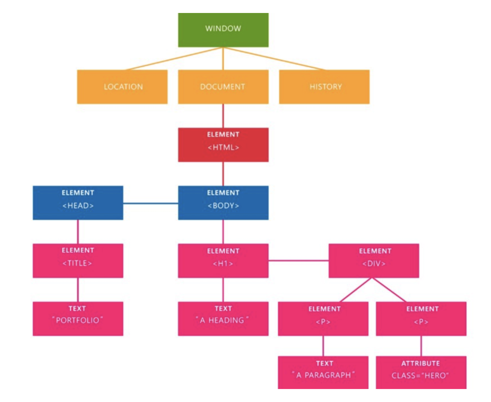

# Plano de aula JavaScript2 Semana 1

## Agenda

O objetivo desta aula é apresentar ao aluno:

- Como uma página da web é composta de objetos (DOM)
- Como o JavaScript pode ser usado para manipular esses objetos (manipulação DOM)
- Funções e propriedades definidas pelo navegador comumente usadas

## Conceitos principais

PRIMEIRA METADE (12h00 - 13h30)

> Esta é sua primeira palestra para esta aula?
> Por favor, apresente-se brevemente:
>
> - Trabalho
> - Educação
> - Cidade
> - Por que você ama programar (se você ama)

## 1. Modelo de Objeto de Documento (DOM)

### Explicação

O [Document Object Model (DOM)](https://developer.mozilla.org/en-US/docs/Web/API/Document_Object_Model/Introduction) é uma _representação orientada a objetos_ de uma página da web (documento HTML). Cada elemento HTML (ex. `h1`, `p` ou `img`) é corrigido primeiro e depois convertido em um objeto JavaScript pelo navegador, tornando possível usar JavaScript para alterar o conteúdo. Usando código JavaScript podemos acessar o `DOM` através de um objeto global chamado `document` ou `window.document`.

### Exemplo

> Mostre ao aluno o seguinte HTML no navegador e, em seguida, consulte-o no console do navegador.

```html
<!DOCTYPEhtml>
<html>
  <cabeça>
    <title>Meu título</title>
  </head>

  <corpo>
    <h1>Meu cabeçalho</h1>
    <p>Este é um bom parágrafo</p>
    <ul>
      <li>Item 1</li>
      <li>Item 2</li>
    </ul>
    <a href="https://www.w3schools.com/js/pic_htmltree.gif">Meu link</a>
  </body>
</html>
```



Observe como o DOM é estruturado de maneira semelhante a uma árvore. Vai do nível superior (mais alto) ao nível inferior (mais baixo). É muito parecido com uma árvore genealógica: o nível mais alto é o tataravô, enquanto o nível mais baixo é o bisneto.

### Exercício

1. Crie um arquivo HTML incluindo a estrutura de uma página da web básica (incluindo `!DOCTYPE`, `html`, `head` e `body`, 1 `h1` e 1 `p`)
2. Descubra como segmentar os elementos `head`, `body` e `h1` usando o console do navegador
3. Apresente sua solução e como você a descobriu (_Professor escolhe duas pessoas_)

### Essência

**O DOM é criado pelo navegador: ele lê seu arquivo HTML e transforma os elementos em objetos. Usamos JavaScript para selecionar esses elementos e alterá-los.**

## 2. Funções e propriedades definidas pelo navegador comumente usadas

### Explicação

Como desenvolvedores, podemos usar o código que outros escreveram. O navegador contém funções predefinidas que podemos usar para fazer certas coisas. Por exemplo, podemos adicionar/atualizar/remover novos elementos HTML ao DOM. O navegador também nos oferece propriedades, para que também possamos brincar com a experiência de visualização do usuário. Por exemplo, podemos modificar a largura do navegador programaticamente para que possamos oferecer um site responsivo.

### Exemplo

``` js
// 1. Imprime a página atual
janela.print();

// 2. Obtenha o URL da barra de endereço
janela.local.href;

// 3. Faça uma solicitação XHR para um serviço externo
window.fetch('https://dog.ceo/api/breeds/image/random');
```

### Exercício

Encontre funções ou propriedades do navegador para mostrar como podemos...

1. exibir uma caixa de alerta?
2. descobrir qual é o nome do navegador?
3. voltar uma página?

### Essência

**Podemos usar funções e propriedades predefinidas pelo navegador para moldar a experiência do usuário em nosso aplicativo.**

SEGUNDA METADE (14.00 - 16.00)

## 3. Manipulação do DOM

### Explicação

`Manipulação DOM` refere-se ao ato de usar JavaScript para selecionar e modificar elementos dentro do DOM. Fazemos isso para fornecer aos usuários interatividade com a página: por exemplo, se um botão for clicado, a cor do plano de fundo mudará ou se um item de menu for passado sobre ele ficará maior.

### Exemplo

```html
<!DOCTYPEhtml>
<html>
  <cabeça>
    <title>Meu título</title>
  </head>

  <corpo>
    <h1>Meu cabeçalho</h1>
    <p>Este é um bom parágrafo</p>
    <ul>
      <li>Item 1</li>
      <li>Item 2</li>
    </ul>
    <button>Meu botão</button>
    <a href="https://www.w3schools.com/js/pic_htmltree.gif">Meu link</a>
  </body>
</html>
```

``` js
// 1. Torna a cor de fundo do corpo vermelha
const corpo = documento.corpo;
body.style.background = 'vermelho';

// 2. Alterar o conteúdo do parágrafo
const p = document.querySelector('p');
p.innerHtml = 'Este parágrafo foi alterado!';

// 3. Crie e adicione um novo elemento a um elemento HTML existente
const thirdLi = document.createElement('li');
const ul = document.querySelector('ul');
ul.appendChild(terceiroLi);

// 4. Ao clicar no botão alerta o usuário!
botão const = document.querySelector('button');
button.addEventListener('click', function() {
  alert('Você clicou no botão!');
});
```

### Exercício

Escreva código JavaScript que...

1. altera o valor `href` para `https://www.hackyourfuture.net/`
2. altera o texto do `button` para `Make background colour!`
3. colore o fundo do `corpo` com sua cor favorita, quando o botão é clicado

Apresente sua solução e como você a descobriu (_Professor escolhe duas pessoas_)

### Essência

**Usando JavaScript podemos selecionar e modificar elementos DOM. Dessa forma, podemos fornecer ao usuário interações úteis com as páginas da web em que ele está envolvido.**
