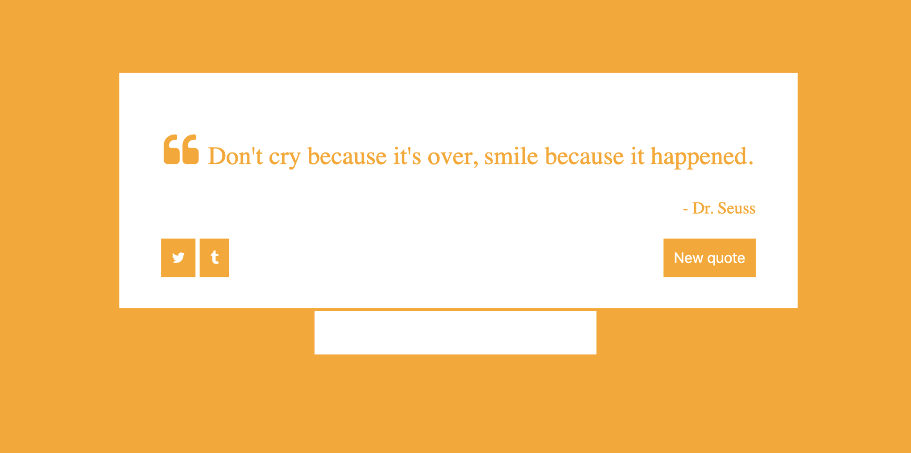

# Homework JavaScript2 Semana 1

## **Lista de afazeres**

1. Pratique os conceitos
2. Exercícios de JavaScript
3. Codifique junto
4. PROJETO: Gerador de Cotações Aleatórias

## **1. Pratique os conceitos**

Antes de começarmos os exercícios, pode ser bom fazer alguns exercícios interativos primeiro! No recurso a seguir, você encontrará alguns exercícios que ensinarão o básico da interação entre JavaScript e DOM:

- [Tornar as páginas da web interativas](https://www.khanacademy.org/computing/computer-programming/html-css-js)

## **2. Exercícios de JavaScript**

> Dentro do seu fork `JavaScript2`, encontre a pasta chamada `Week1`. Dentro dessa pasta, encontre a pasta chamada `js-exercises`. Nesta pasta você encontrará cinco arquivos `.js` (às vezes com um arquivo `.html` correspondente), um para cada exercício onde você precisa escrever seu código. Por favor, use o arquivo correto para o respectivo exercício.

**Exercício 1: A lista de livros**

Eu gostaria de exibir meus três livros favoritos dentro de uma boa página da web!

``` js
livros const = [
  {
    título: 'O design das coisas cotidianas',
    autor: 'Don Norman',
    já lido: false
  },
  {
    título: 'O Humano Mais Humano',
    autor: 'Brian Christian',
    já lido: verdade
  },
  {
    título: 'O programador pragmático',
    autor: 'Andrew Hunt',
    já lido: verdade
  }
];
```

1. Percorra a matriz de livros.
2. Para cada livro, crie um elemento `<p>` com o título do livro e o autor e anexe-o à página.
3. Use um `<ul>` e um `<li>` para exibir os livros.
4. Adicione um `` a cada livro que vincule a um URL da capa do livro.
5. Mude o estilo do livro dependendo se você o leu (verde) ou não (vermelho).

O resultado final deve ser algo assim:
https://hyf-js2-week1-makeme-ex1-demo.herokuapp.com/

**Exercício 2: Sobre mim**

Dado este HTML:

```html
<!DOCTYPEhtml>
<html>
  <cabeça>
    <meta charset="utf-8" />
    <title>Sobre mim</title>
  </head>
  <corpo>
    <h1>Sobre mim</h1>

    <ul>
      <li>Apelido: <span id="nickname"></span></li>
      <li>Comida favorita: <span id="fav-food"></span></li>
      <li>Cidade natal: <span id="hometown"></span></li>
    </ul>
  </body>
</html>
```

1. Adicione uma tag de script na parte inferior do corpo HTML.
2. (No JavaScript) Altere o estilo da tag body para que ela tenha uma família de fontes "Arial, sans-serif".
3. (No JavaScript) Substitua cada um dos intervalos (apelido, fav-food, cidade natal) por suas próprias informações.
4. Percorra cada li e altere a classe para "list-item".
5. (No cabeçalho HTML) Adicione uma tag de estilo que define uma regra para .list-item tornar a cor vermelha.
6. Crie um novo elemento img e defina seu atributo src para uma foto sua. Anexe esse elemento à página.

**Exercício 3: O sequestro do logotipo**

Nenhuma página inicial está a salvo do bandido do logotipo! Toda vez que ele vê um logotipo do Google, ele o substitui por um logotipo do HackYourfuture: https://www.hackyourfuture.dk/static/logo-dark.svg.

Neste exercício, você deve escrever uma função JavaScript que possa ser executada no console do [site do Google](https://www.google.com).

1. Descubra como selecionar o elemento que contém o logotipo do Google e armazená-lo em uma variável
2. Modifique a fonte e o conjunto de fontes do logotipo para que seja substituído pelo logotipo do HackYourFuture

**Exercício 4: Que horas são?**

Por que usar um relógio quando você pode verificar a hora ao vivo em sua página da web?

1. Crie um arquivo HTML básico
2. Inclua uma tag de script e vincule o arquivo JavaScript
3. Dentro do arquivo JS, escreva uma função que inclua a hora atual na página da web. Certifique-se de que está escrito na notação HH:MM:SS (hora, minuto, segundo). Dica: use `setInterval()` para garantir que o tempo permaneça atual
4. Faça com que a função seja executada quando estiver carregando no navegador

**Exercício 5: O passeio de gato**

Comece com esta página da web, que tem uma única tag img de um GIF animado de um gato passeando.

```html
<!DOCTYPEhtml>
<html>
  <cabeça>
    <meta charset="utf-8" />
    <title>Passeio do Gato</title>
  </head>
  <corpo>
    
  </body>
</html>
```

1. Crie uma variável para armazenar uma referência ao img.
2. Mude o estilo da img para ter uma "esquerda" de "0px", de forma que ela comece à esquerda das telas.
3. Crie uma função chamada catWalk() que mova o gato 10 pixels para a direita de onde ele começou, alterando a propriedade de estilo "left".
4. Chame essa função a cada 50 milissegundos. Seu gato agora deve estar se movendo pela tela da esquerda para a direita. Viva!
5. Quando o gato alcançar o lado direito da tela, reinicie-o do lado esquerdo ("0px"). Então eles devem continuar andando da esquerda para a direita pela tela, para todo o sempre.
6. Quando o gato chegar ao meio da tela, substitua a img por uma imagem de um gato dançando (use este URL: https://tenor.com/StFI.gif), mantenha-o dançando por 5 segundos e, em seguida, substitua a img com a imagem original e faça com que continue a caminhada.


O resultado final deve se parecer e se comportar de maneira semelhante a [https://dancingcat-sandbox.mxapps.io](https://dancingcat-sandbox.mxapps.io)

## **3. Código junto**

No tutorial a seguir, você aprenderá como fazer um pequeno aplicativo da Web que permite ao usuário adicionar novos problemas a um quadro. Está incluída a prática com o [Bootstrap](https://getbootstrap.com/).

Aproveitar!

- [Crie um rastreador de problemas](https://www.youtube.com/watch?v=NYq9J-Eur9U)

## **4. PROJETO: Gerador de Cotações Aleatórias**

> Cada semana termina com um projeto que você deve construir por conta própria. Em vez de obter instruções claras, você receberá uma lista de critérios que seu projeto precisa atender.

> Escreva o código do projeto na pasta `Week1\project`.

No projeto desta semana você estará fazendo um Gerador de Citações Aleatórias! Ele inclui uma caixa de texto e um botão simples que, quando clicado, tira uma citação aleatória de uma quantidade definida de citações e a mostra na página. Veja como deve ficar:



Aqui estão os requisitos:

- Incluir pelo menos 1 arquivo JavaScript, CSS e HTML
- O design deve ser semelhante ao da imagem acima
- Nenhum framework CSS permitido
- Cada vez que o botão é clicado, ele deve mostrar uma cotação aleatória
- Crie uma função que seja acionada após o clique do botão
- Colete 6 de suas citações favoritas (citação e autor) e armazene-as na estrutura de dados correta

Boa sorte!

## ** ENVIE SUA LIÇÃO DE CASA!**

Depois de terminar sua lista de tarefas, é hora de nos mostrar o que você tem! Faça upload de todos os seus arquivos para um repositório bifurcado (uma cópia do original, que neste caso é o repositório [JavaScript2](https://www.github.com/HackYourFuture/JavaScript2)) usando o GIT. Em seguida, faça um pull request para o original.

Se você precisar de uma atualização, dê uma olhada no seguinte [guia](../hand-in-homework-guide.md) para ver como isso é feito.

A lição de casa que precisa ser enviada é a seguinte:

1. Exercícios de JavaScript
2. Projeto: Gerador de Cotações Aleatórias

_Prazo sábado 23.59 CET_
