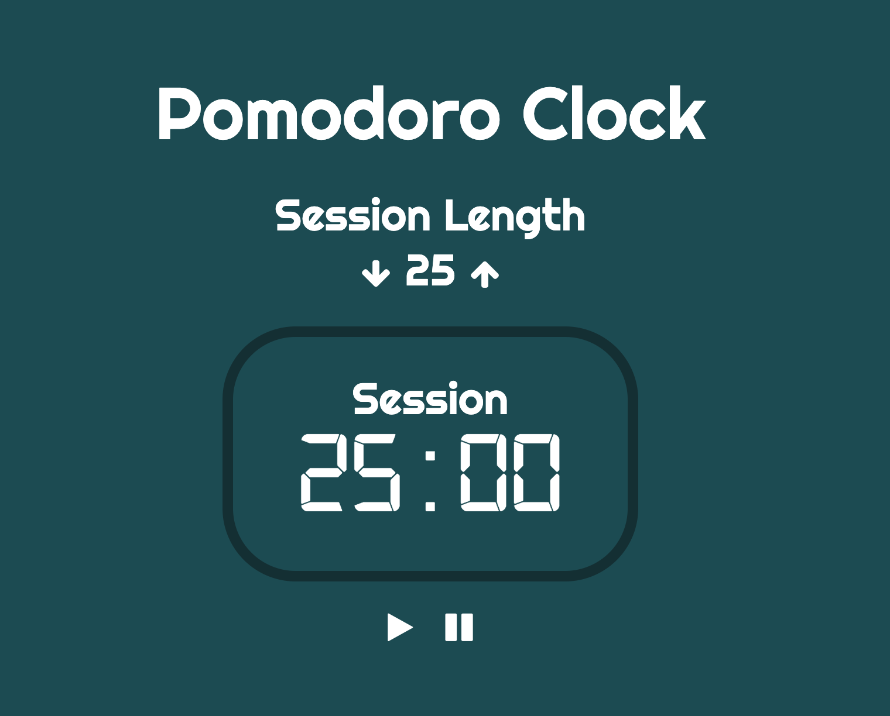

# Trabalho de casa JavaScript2 Semana 2

## **Lista de afazeres**

1. Pratique os conceitos
2. Exercícios de JavaScript
3. Codifique junto
4. PROJETO: O Relógio Pomodoro

## **1. Pratique os conceitos**

Antes de começarmos os exercícios, pode ser bom fazer alguns exercícios interativos primeiro! No recurso a seguir, você encontrará alguns exercícios que ensinarão tudo sobre retornos de chamada e funções de matriz!

- [Aprenda JavaScript: Iteradores](https://www.codecademy.com/learn/introduction-to-javascript/modules/learn-javascript-iterators)

## **2. Exercícios de JavaScript**

> Dentro do seu fork `JavaScript2`, encontre a pasta chamada `Week2`. Dentro dessa pasta, encontre a pasta chamada `js-exercises`. Nesta pasta você encontrará cinco arquivos `.js`, um para cada exercício onde você precisa escrever seu código. Por favor, use o arquivo correto para o respectivo exercício.

**Exercício 1: Os estranhos fora**

Observe o seguinte trecho de código:

``` js
function doubleEvenNumbers(numbers) {
  const novosNúmeros = [];
  for (seja i = 0; i < números.comprimento; i++) {
    if (números[i] % 2 === 0) {
      newNumbers.push(numbers[i] * 2);
    }
  }
  retornar novosNúmeros;
}

const meusNúmeros = [1, 2, 3, 4];
console.log(doubleEvenNumbers(myNumbers)); // Registra "[4, 8]" no console
```

A função `doubleEvenNumbers` retorna apenas os números pares no array `myNumbers` e os duplica. Como você aprendeu no [README](README.md), esse bloco de código não é fácil de decifrar.

Vamos reescrevê-lo.

- Usando as funções `map` e `filter`, reescreva a função `doubleEvenNumbers`.

**Exercício 2: Quanto vale a sua segunda-feira?**

Quando você é um desenvolvedor em uma grande empresa, sua segunda-feira pode ser algo assim:

``` js
const segunda-feiraTarefas = [
  {
    nome: 'Standup diário',
    duração: 30, // especificado em minutos
  },
  {
    nome: 'Discussão de recurso',
    duração: 120,
  },
  {
    nome: 'Tempo de desenvolvimento',
    duração: 240,
  },
  {
    name: 'Fale com diferentes membros da equipe do produto',
    duração: 60,
  },
];
```

Vamos supor que sua taxa horária seja de € 25. Quanto você ganharia nesse dia?

- Escreva um programa que descubra qual seria sua taxa horária em uma segunda-feira
- Use a função de array `map` para tirar o tempo de duração de cada tarefa.
- Multiplique cada duração por uma taxa por hora para faturamento e some tudo.
- Saída de um valor em euros formatado, arredondado para centavos de euro, por exemplo: `€11,34`.
- Certifique-se de que o programa pode ser usado em qualquer array de objetos que contenha uma propriedade `duration` com um valor numérico

**Exercício 3: Alergia ao limão**

Sua mãe comprou uma cesta de frutas para você, porque você está indo muito bem no HackYourFuture. Que doce da parte dela!

``` js
const cesta de frutas = ['Maçã', 'Limão', 'Toranja', 'Limão', 'Banana', 'Melancia', 'Limão'];
```

No entanto, ela esqueceu que você é alérgico a limões! Vamos eliminá-los rapidamente antes que você receba um ataque.

- Escreva uma função
- Use a função de array `filter` para tirar os limões
- Saída de uma string que diz: "Minha mãe me comprou uma cesta de frutas, contendo [array of fruit]!"

**Exercício 4: Idade coletiva**

Você já se perguntou quantos anos os membros da equipe HackYourFuture têm? Ou melhor ainda: qual é a idade coletiva? Vamos descobrir!

``` js
const hackYourFutureMembers = [
  { nome: 'Wouter', idade: 33 },
  { nome: 'Federico', idade: 32 },
  { nome: 'Noer', idade: 27 },
  { nome: 'Tjebbe', idade: 22 },
];
```

- Escreva um programa que calcule a idade combinada de cada membro
- Faça uso da função `map` para obter as idades
- Deve conter uma função que recebe um retorno de chamada
- O retorno de chamada soma todas as idades e retorna o número
- A função principal deve registrar a string "A idade coletiva da equipe HYF é: [número]" no console e depois retornar o número

**Exercício 5: Meus hobbies favoritos**

Tenho alguns hobbies que quero mostrar em uma página da web.

``` js
const meusHobbies = [
  'Meditação',
  'Lendo',
  'Programação',
  'Saindo com os amigos',
  'Indo para a academia',
];
```

- Escreva um programa que produza cada um deles dentro de um arquivo HTML
- Crie um arquivo HTML e JavaScript, vincule-os juntos
- Use a função `map` e/ou `forEach` para colocar cada hobby em um item de lista
- Saída dos itens da lista em uma lista não ordenada

## **3. Código junto**

A programação pode ser usada não apenas para criar sites, mas também para jogos! No tutorial a seguir, você aplicará suas habilidades de manipulação do DOM para fazer um jogo clássico: Pedra, Papel, Tesoura! Aproveitar!

- [Construa um jogo de pedra, papel e tesoura](https://www.youtube.com/watch?v=WR_pWXJZiRY)

## **4. PROJETO: O Relógio Pomodoro**

> Cada semana termina com um projeto que você deve construir por conta própria. Em vez de obter instruções claras, você receberá uma lista de critérios que seu projeto precisa atender.

> Escreva o código do projeto na pasta `Week2 \ project`.

No projeto desta semana você estará fazendo um Relógio Pomodoro! Um usuário pode especificar quantos minutos o cronômetro deve ser definido e, com um clique no botão play, ele começa a contagem regressiva! Se o usuário quiser pausar o cronômetro, ele poderá fazê-lo clicando no botão de pausa.

Deve ficar assim:



Aqui estão os requisitos:

- Se o cronômetro estiver em execução, o usuário não poderá mais alterar a duração da sessão
- Use pelo menos 3 funções
- Exibir minutos e segundos
- Se o cronômetro terminar, o cronômetro deve ser substituído pela mensagem: `Time's up!`

Se você está tendo problemas para entender a funcionalidade, verifique esta [demonstração](https://pomodoroclock-sandbox.mxapps.io).

Boa sorte!

## ** ENVIE SUA LIÇÃO DE CASA!**

Depois de terminar sua lista de tarefas, é hora de nos mostrar o que você tem! A lição de casa que precisa ser enviada é a seguinte:

1. Exercícios de JavaScript
2. PROJETO: O Relógio Pomodoro

Carregue ambos para seu repositório JavaScript2 bifurcado no GitHub. Faça um pull request para o repositório original.

> Esqueceu como fazer o upload de sua lição de casa? Vá até o [guia](../hand-in-homework-guide.md) para aprender como fazer isso novamente.

_Prazo sábado 23.59 CET_
