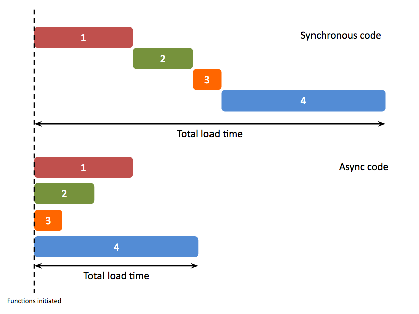

# Material de leitura JavaScript2 Semana 2

## Agenda

Estes são os tópicos da semana 2:

1. Síncrono vs. assíncrono
   - Síncrono
   - Assíncrono
2. Apresentando assincronicidade usando retornos de chamada
   - Funções de ordem superior
   - Funções como argumentos para outras funções
3. Funções de matriz
4. Ciclo de Eventos

## 0. Vídeo-aulas

Seu professor Wilgert fez palestras em vídeo para o material desta semana. Você pode encontrá-los aqui: [Vídeos 11 - 21](https://www.youtube.com/playlist?list=PLVYDhqbgYpYU-7_oyPBkUuuis5bL1Dk8n)

<a href="https://www.youtube.com/playlist?list=PLVYDhqbgYpYU-7_oyPBkUuuis5bL1Dk8n" target="_blank"></a>

## 1. Síncrono vs. assíncrono

### Síncrono

No módulo anterior, você aprendeu sobre **controle de fluxo**. Resumindo: é a ordem em que o computador executa as instruções em um script. Em JavaScript isso vai da esquerda para a direita, de cima para baixo.

Vejamos a execução do código de outro ângulo. O programa que executa seu código pode fazê-lo de duas maneiras básicas: síncrona ou assíncrona. Sempre que os blocos de código são executados linha após linha (de cima para baixo), chamamos isso de **execução síncrona**. No entanto, quando blocos de código podem ser executados **sem ter que esperar até que um comando termine**, chamamos isso de **execução assíncrona**. Isso é ilustrado no diagrama a seguir:



Agora imagine o seguinte cenário:

> O Noer quer tomar o pequeno-almoço mas não tem comida em casa. Ele decide que quer comer aveia. Os ingredientes (aveia e leite) podem ser comprados no supermercado. Como fazer isso? Primeiro Noer toma banho. Em seguida, ele coloca algumas roupas. Em seguida, alguns sapatos. Então ele abre a porta e sai. Então ele pula na moto e vai até o supermercado mais próximo. Depois de procurar por algum tempo, ele encontra os ingredientes. Então Noer compra os ingredientes. Então ele pula de volta na moto e vai para casa. Em seguida, ele mistura os ingredientes e faz mingau de aveia. Então Noer come e se sente incrível!

Neste exemplo, cada ação só poderia acontecer após a conclusão da anterior. Noer não consegue calçar os sapatos enquanto toma banho. Ou ele não pode comer aveia enquanto compra os ingredientes.

Como você pode ver, cada ação é executada de forma síncrona. Ou seja: em uma ordem lógica sequencialmente e apenas uma ação por vez.

**É também assim que o JavaScript funciona por padrão**. Apenas uma operação pode acontecer por vez. Se outra coisa quiser começar, tem que esperar até que a ação atual termine.

### Assíncrono

Às vezes queremos fazer várias coisas ao mesmo tempo, sem que cada ação seja dependente uma da outra. A execução assíncrona evita esse gargalo. Você está essencialmente dizendo: “Eu sei que esta chamada de função vai levar muito tempo, mas meu programa não quer esperar enquanto é executado”. Considere o seguinte cenário:

> Wouter está com fome, então decide ir a um restaurante. Ele chega lá e entra na fila para pedir comida. Depois de fazer o pedido, ele se senta e, enquanto espera, lê um livro. Ocasionalmente, ele olha ao redor e vê coisas diferentes acontecendo: novas pessoas entram no restaurante, algumas pessoas servem sua comida e outras estão apenas conversando. Depois de um curto período de tempo, a comida de Wouter chega e é hora de cavar!

Neste exemplo, Wouter lê um livro, mas isso não afeta a preparação de sua refeição. Enquanto sua refeição é preparada, há outras pessoas andando, comendo ou apenas conversando entre si. Resumindo: várias coisas estão acontecendo simultaneamente e cada evento não depende de outro.

Isso não acontece por padrão em JavaScript e precisa ser invocado. Uma maneira de fazer isso é usando `callbacks`, que você aprenderá na próxima seção.

## 2. Apresentando assincronicidade usando retornos de chamada

Antes de nos aprofundarmos no que é um `callback`, temos que entender um pouco sobre `funções de ordem superior`.

### Funções de ordem superior

Vamos começar com uma definição simples e prática: uma função de ordem superior é qualquer função que pode receber outra função como argumento ou retornar uma função.

``` js
// Exemplo 1
function HigherOrderFunction(anotherFunction) {
  outraFunção();
  Retorna;
}

// Exemplo 2
function outraHigherOrderFunction() {
  função de retorno () {
    Retorna;
  };
}
```

Por que nós precisamos deles? Uma função de ordem superior integra várias funções, cada uma com um propósito operacional singular. Isso nos permitirá reutilizar o código muito mais do que se tivéssemos que escrever tudo.

> Funções de ordem superior são um conceito central dentro de um paradigma de programação chamado "programação funcional". Não é relevante para você saber ou se importar com isso, mas é importante estar exposto a isso.

### Funções como argumentos para outras funções

Imagine a seguinte situação:

> São 15h00 e você está estudando em casa para uma prova no dia seguinte. De repente, seu telefone toca. Você pega e descobre que é seu melhor amigo! Eles perguntam se você gostaria de sair mais tarde. O que você faz? Por um lado, você adoraria sair e se divertir. Por outro lado, você realmente deveria estudar um pouco mais. Você não sabe, então diz ao seu amigo que vai _ligar de volta_ mais tarde com sua resposta. Você termina a conversa e volta a estudar. Talvez você faça uma pausa ou faça um lanche também. Na outra linha, seu amigo desliga o telefone e continua com o dia: vai fazer compras, limpar a casa e fazer o jantar. Depois de terminar seus estudos, você liga para seu amigo e faz planos para sair juntos.

Este exemplo ilustra o conceito de **assincronicidade**: existem vários processos acontecendo simultaneamente, sem que uma única coisa dependa de outra. Seu amigo não está esperando ao lado do telefone até que você tenha a resposta. Ou em termos técnicos: até que o callback (que é você) tenha o valor de retorno (a resposta ao pedido do seu amigo para sair).

Esta é a utilidade dos `callbacks`: eles nos permitem introduzir assincronicidade no fluxo de controle de uma aplicação.

Estude os seguintes recursos para saber mais sobre a importância dos retornos de chamada:

- [JavaScript assíncrono](https://www.youtube.com/watch?v=YxWMxJONp7E)
- [Noções básicas sobre retornos de chamada JavaScript](https://www.youtube.com/watch?v=Nau-iEEgEoM)
- [Funções de retorno de chamada](https://www.youtube.com/watch?v=QRq2zMHlBz4)

## 3. Funções de matriz

Existem diferentes maneiras de lidar com arrays. A maneira mais comum é usar um loop e, em seguida, escrever uma lógica personalizada dentro dele para manipular os valores. Esta solução funciona, mas tem várias desvantagens.

1. A primeira desvantagem é que o uso de loops exige que escrevamos uma lógica personalizada para cada caso de uso. Isso pode levar a códigos repetidos, que sempre queremos [evitar](https://www.youtube.com/watch?v=IGH4-ZhfVDk)
2. A segunda desvantagem é que um loop não é descritivo sobre o que pretende fazer. Se outro desenvolvedor ler esse código, não seria óbvio o que ele faria, sem gastar tempo para decifrá-lo

Existem certas funções, `funções array`, que visam resolver esses dois problemas simultaneamente. As funções de matriz são funções de ordem superior, porque recebem uma função como argumento.

Vamos dar um exemplo: a função `map()`. Ele recebe uma função como argumento e a executa para cada posição de índice do array, retornando no final um novo array com todos os valores "mapeados".

Dê uma olhada no trecho de código a seguir para vê-lo em ação:

``` js
const números = [2, 4, 6, 8, 10];

function addDois(número) {
  retornar número + 2;
}

const númerosMaisDois = números.map(adicionarDois);

console.log(numbersPlusTwo);
```

Copie e cole este snippet no console do navegador para ver como ele funciona. Como você pode ver, a função `addTwo` adicionou 2 a cada valor no array `numbers`, porque é isso que a função `map()` faz: ela "mapeia" uma função para cada índice do array.

Poderíamos ter feito a mesma coisa com um loop regular, mas isso teria sido (1) muito menos legível e (2) muito mais código:

``` js
const números = [2, 4, 6, 8, 10];
const númerosMaisDois = [];

for (seja i = 0; i < números.comprimento; i++) {
  const numero = numeros[i];
  const adicionadoDois = número + 2;

  númerosPlusTwo.push(addedTwo);
}

console.log(numbersPlusTwo);
```

Você pode ver por que a função array é o melhor caminho a seguir?

Percorra os seguintes recursos para saber mais sobre as diferentes funções de matriz e seu uso:

- [Funções e matrizes JavaScript de ordem superior](https://www.youtube.com/watch?v=rRgD1yVwIvE)
- [8 métodos obrigatórios de matriz JavaScript](https://www.youtube.com/watch?v=R8rmfD9Y5-c)

## 4. Ciclo de eventos

Se uma página da Web contiver JavaScript, o navegador saberá que deve executar as instruções contidas nos arquivos de script. Mas como o navegador sabe o que fazer primeiro? É aqui que entra o `Event Loop`.

Observação: embora seja importante conhecer esse mecanismo, lembre-se de que você não o usará ativamente no desenvolvimento.

Em termos simples, o `Event Loop` é um mecanismo que opera no navegador. Ele mantém o controle da ordem de execução dos comandos JavaScript. é composto por 4 partes:

1. Pilha. É aqui que o navegador atribui espaço na memória a cada processo
2. Pilha de Chamadas. Esta é a quantidade de comandos JavaScript (leia-se: chamadas de função e eventos) que precisam ser executados
3. APIs da Web. Estes são objetos (como o documento) e funções (como XMLHttpRequest) que podem ser usados dentro dos comandos JavaScript encontrados na pilha de chamadas
4. Fila de retorno de chamada. Esta é a "linha de espera" para chamadas de funções assíncronas

Para vê-lo em ação, confira os seguintes recursos:

- [O que diabos é um loop de eventos?](https://www.youtube.com/watch?v=8aGhZQkoFbQ)
- [Loop de evento JavaScript](https://www.youtube.com/watch?v=XzXIMZMN9k4)

## Finalizado?

Você terminou de passar pelos materiais? Toca aqui! Se você se sentir pronto para ser prático, clique [aqui](./MAKEME.md).
