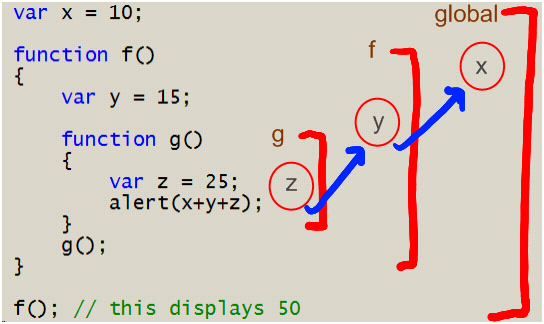

# Plano de aula JavaScript2 Semana 3

## Agenda

O objetivo desta aula é apresentar ao aluno:

- A importância do escopo (global, funcional e bloco)
- O que é o içamento e a diferença entre o tempo de compilação e o tempo de execução
- O uso e finalidade dos fechamentos

## Conceitos principais

PRIMEIRA METADE (12h00 - 13h30)
## 1. Perguntas e respostas sobre os conceitos e trabalhos de casa da semana passada
- síncrono vs. assíncrono
- retornos de chamada
- loops de eventos
- mapear, filtrar, reduzir

Nota: Você pode pedir aos alunos que expliquem um conceito ou resumir a última aula por conta própria

## 2. Escopo (global, funcional e bloco)
### Explicação
Os escopos definem a visibilidade das declarações de variáveis e funções.

O nível superior fora de todas as suas funções é chamado de _escopo global_. Os valores definidos no escopo global são acessíveis de qualquer lugar no código. Já as variáveis definidas no escopo local só podem ser acessadas e alteradas dentro do escopo em que foram criadas.

- Declarações `var` e `function` são visíveis com o escopo da função.
- Declarações `let` e `const` são visíveis com escopo de bloco. Um bloco pode ser visto como um conjunto de instruções entre chaves ({}).

Âmbito global:

- Pode ser uma ferramenta muito útil ou um pesadelo.
- Útil em cenários onde queremos exportar módulos JS, usar bibliotecas de terceiros como jQuery etc.
- Grande risco de causar conflitos de namespace com várias variáveis com o mesmo nome sendo criadas em locais diferentes.

Escopo Local:

- Pense no escopo local como qualquer novo escopo criado dentro do escopo global.
- Cada função escrita em JavaScript cria um novo escopo local.
- Variáveis definidas dentro de uma função não estão disponíveis fora dela. Eles são criados quando uma função inicia e são _de certa forma_ destruídos/ocultos quando uma função termina.

https://github.com/HackYourFuture/fundamentals/blob/master/fundamentals/scope.md
### Exemplo


```Javascript
let villan = "Coringa"; // | Âmbito global
                                             // |
function minhaFunção() { // | | escopo da função
    deixe herói = "Batman"; // | |
    if (hero === "Batman") { // | | | escopo do bloco
        let coHerói = "Robin"; // | | |
        console.log(herói); // | | |
        console.log(coHerói); // | | |
        console.log(vilão); // | | |
    } // | | |
    console.log("------") // | |
    console.log(herói); // | |
    console.log(coHerói); // | |
    console.log(vilão); // | |
} // | |
                                             // |
minhaFunção(); // |
```

E o mesmo link da Explicação
### Exercício
O que acontece se usarmos o mesmo nome de variável em escopos diferentes?

```Javascript
função minhaFunção() {
    deixe herói = "Batman";
    se for verdade) {
        let hero = "O Flash";
        console.log(herói);
    }
    console.log(herói);
}

minhaFunção();
```
Feito por Yash: https://github.com/yash-kapila/HYF-JS2-Week3/blob/master/src/scope.js
### Essência
Mesmo link da explicação

## 3. O que é o içamento e a diferença entre o tempo de compilação e o tempo de execução
### Explicação
### Exemplo
### Exercício
Feito por Yash: https://github.com/yash-kapila/HYF-JS2-Week3/blob/master/src/hoisting.js
### Essência
Notas:

- O tempo de compilação é quando o JavaScript está preparado para ser executado no navegador
- O tempo de execução é quando o JavaScript é realmente executado, linha por linha


SEGUNDA METADE (14.00 - 16.00)

## 4. Fechamentos
### Explicação
Créditos a Yash:
Um encerramento é quando a função interna lembra o ambiente em que foi criada, mesmo após a função externa ter retornado.

Um uso poderoso de closures é usar a função externa como uma fábrica para criar funções que estão de alguma forma relacionadas.

No trecho de código abaixo, podemos ver que a função `carColor` ainda tem acesso às propriedades da função externa como `wheels`, `seats` e `brand` mesmo após a função `manufactureCar` ter retornado. Podemos então usar o `carColor` como uma fábrica para criar vários cartões do mesmo tipo, mas com uma cor diferente.
### Exemplo
```JavaScript
função fabricaCarro() {
  rodas const = 4;
  assentos const = 5;
  const marca = 'Alguma Marca';

  return function carColor(color) {
    Retorna {
      rodas,
      assentos,
      marca,
      cor,
    }
  };
}

const basicCar = fabricaCar();

const redCar = basicCar('red');
const blueCar = basicCar('azul');
const greenCar = basicCar('verde');
```

``` Javascript
{
  'usar estrito';

  const printName = () => {
    const mensagem = 'Meu nome é ';

    const displayName = nome => {
      console.log(`${message}${name}`);
    }

    retornar displayName;
  };
  
  const nome = printName();
  nome('Yash Kapila');
}
```

### Exercício

### Essência


