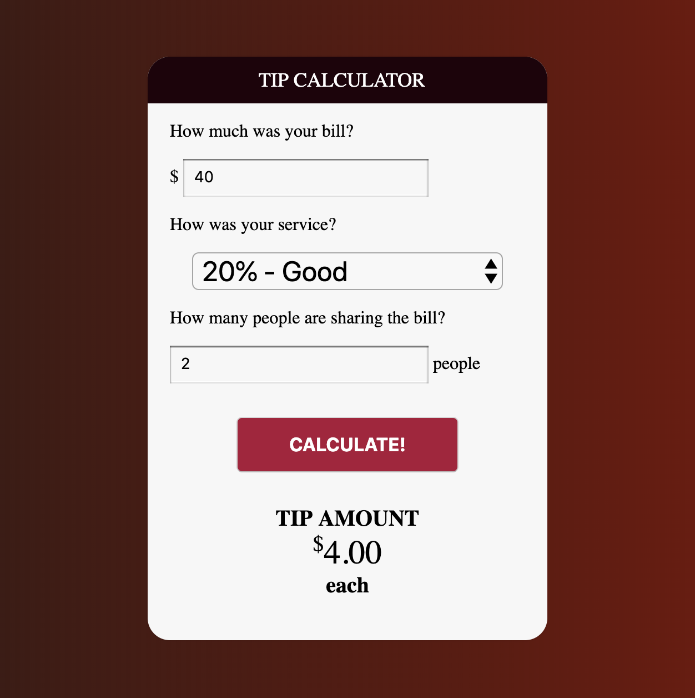
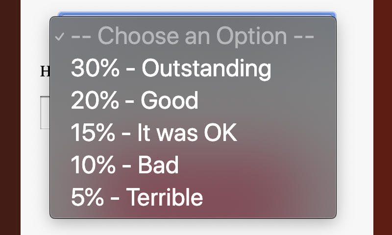

# Tarefa JavaScript2 Semana 3

## **Lista de afazeres**

1. Pratique os conceitos
2. Exercícios de JavaScript
3. Codifique junto
4. PROJETO: A Calculadora de Gorjetas

## **1. Pratique os conceitos**

Vamos nos familiarizar com os conceitos básicos de Javascript, com exercícios interativos! Confira os seguintes recursos:

- [Introdução ao JavaScript: Escopo](https://www.codecademy.com/courses/introduction-to-javascript/lessons/scope/exercises/scope)

## **2. Exercícios de JavaScript**

> Dentro do seu fork `JavaScript2`, navegue até a pasta `Week3`. Em seguida, para a pasta `js-exercícios`. Nesta pasta você encontrará arquivos separados para cada exercício. Por favor, coloque seu código no arquivo correto.

**Exercício 1: Adicione nove**

Declare uma função chamada `createBase`. A função recebe um número como parâmetro e retorna um encerramento, que adiciona um número ao argumento do número base.

Chame a função três vezes. Os valores de retorno devem ser:

1. 15
2. 24
3. 33

Deve ficar um pouco assim:

``` js
função criarBase() {
  //Coloque aqui sua lógica...
}

const addNine = createBase(6);

//Coloque aqui suas chamadas de função...
addNove();
```

**Exercício 2: Retire as duplicatas**

Escreva uma função chamada `removeDuplicates`, que receba um array como argumento:

``` js
letras const = ['a', 'b', 'b', 'c', 'd', 'a', 'e', 'f', 'f', 'c', 'b'];
```

A função deve modificar o array original: deve remover letras duplicadas e `retornar` o resultado.

O resultado final deve ser:

``` js
['a', 'b', 'c', 'd', 'e', 'f'];
```

**Exercício 3: Adivinhe a saída**

Neste exercício, você verá um snippet de código. Sua tarefa é adivinhar a saída e escrever seu raciocínio em 50 palavras ou menos.

``` js
// Trecho
seja a = 10;
const x = (função() {
  a = 12;
  função de retorno(){
    alerta(a);
  };
})();

x();
```

**Exercício 4: Adivinhe mais**

Neste exercício, você verá outro trecho de código. Adivinhe a saída e escreva seu raciocínio em 50 palavras ou menos.

``` js
// Trecho
const x = 9;
função f1(val) {
  vale = vale + 1;
  valor de retorno;
}
f1(x);
console.log(x);

const y = { x: 9 };
função f2(val) {
  val.x = val.x + 1;
  valor de retorno;
}
f2(y);
console.log(y);
```

**Exercício 5: A máquina de loteria**

Você não adora a emoção da loteria? E se eu te disser que podemos fazer nossa própria máquina de loteria? Vamos começar!

Escreva uma função que receba 4 argumentos.

- Um valor inicial
- Um valor final
- Um retorno de chamada que é executado se o número for divisível por 3
- Um retorno de chamada que é executado se o número for divisível por 5

A função deve primeiro gerar um array contendo valores do valor inicial ao valor final (inclusive).

Em seguida, a função deve pegar o array recém-criado e iterar sobre ele, e chamar o primeiro retorno de chamada se o valor do array for divisível por 3.

A função deve chamar o segundo retorno de chamada se o valor da matriz for divisível por 5.

Ambas as funções devem ser chamadas se o valor da matriz for divisível por 3 e 5.

Aqui está um modelo inicial:

``` js
function threeFive(startIndex, stopIndex, threeCallback, fiveCallback) {
  const numeros = [];
  //cria matriz
  // começa no início do array e verifica se você deve chamar threeCallback ou fiveCallback ou ir para o próximo
}

trêsCinco(10, 15, digamosTrês, digamosCinco);

// Deve criar um array [10,11,12,13,14,15]
// e chama sayFive, sayThree, sayThree, sayFive
```

## **3. Código junto**

No seguinte "código junto" você estará fazendo um App Booklist. Um usuário poderá adicionar livros a uma lista preenchendo um formulário e também excluir cada entrada de livro na lista.

Você criará o aplicativo usando JavaScript vanilla e estrutura CSS [Bootstrap](https://www.getbootstrap.com).

Feliz aprendizado!

- [Crie um aplicativo de lista de livros](https://www.youtube.com/watch?v=JaMCxVWtW58)

## **4. PROJETO: A Calculadora de Gorjeta**

> Cada semana termina com um projeto que você deve construir por conta própria. Em vez de obter instruções claras, você receberá uma lista de critérios que seu projeto precisa atender.

> Importante! Coloque seu código na pasta `Week3\project`.

No projeto desta semana você estará fazendo uma Calculadora de Gorjetas! Um usuário pode preencher 3 coisas:

1. O valor da conta
2. Quão bom foi o serviço
3. Quantas pessoas vão dividir a conta

Quando o botão é clicado, um cálculo é feito e o usuário pode ler o valor da gorjeta abaixo.

Deve ficar assim:



Aqui estão os requisitos:

- Não são permitidos frameworks
- Use um formulário, que tenha 3 campos de entrada (o primeiro e o último só podem receber números)
- O segundo campo deve ter as seguintes opções:



- Se houver apenas 1 pessoa que compartilha a conta, emita apenas o valor da gorjeta (omitir o "cada")
- Se algum dos campos de entrada estiver vazio quando o botão for clicado, chame um alerta que diga: "Você precisa preencher todos os campos!"

Veja em ação [aqui](https://tipcalculator-sandbox.mxapps.io/).

Boa sorte!

## ** ENVIE SUA LIÇÃO DE CASA!**

Finalizado? Bem em você! A lição de casa que precisa ser enviada é a seguinte:

1. Exercícios de JavaScript
2. PROJETO: A Calculadora de Gorjetas

Carregue ambos para seu repositório JavaScript2 bifurcado no GitHub. Faça um pull request para o repositório original.

> Esqueceu como fazer o upload de sua lição de casa? Vá até o [guia](../hand-in-homework-guide.md) para aprender como fazer isso novamente.

_Prazo sábado 23.59 CET_
