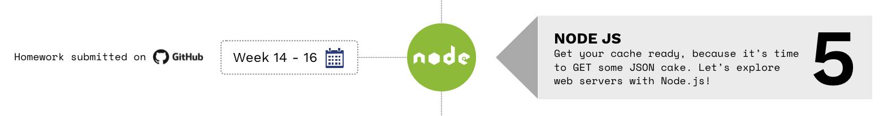

> Se você estiver seguindo o currículo do HackYourFuture, recomendamos que comece com o módulo 1: [HTML/CSS/GIT](https://github.com/HackYourFuture/HTML-CSS). Para obter uma visão geral completa do currículo do HackYourFuture primeiro, clique [aqui](https://github.com/HackYourFuture/curriculum).

> Ajude-nos a melhorar e compartilhe seus comentários! Se você encontrar tutoriais ou links melhores, compartilhe-os [abrindo um pull request](https://github.com/HackYourFuture/JavaScript1/pulls).

# Módulo 5 - Entenda o backend: criando servidores web com JavaScript usando Node.js (Backend)

Até agora você aprendeu sobre os fundamentos do que compõe uma página da Web em seu navegador. Chamamos isso de `frontend`: o HTML que dá estrutura às nossas páginas, o CSS que dá uma boa aparência e o JavaScript que torna nossa página interativa. Tudo o que você pode "ver" e "interagir" é feito dessas tecnologias.

No entanto, há toda uma parte de aplicativos que você pode não conhecer. Você já se perguntou como os dados se movem de um lugar para outro, de uma página para outra?

É aqui que entra o `backend`: todas as partes de uma aplicação que não podem ser acessadas diretamente pelo usuário, mas acontecem "atrás da tela". Bem, aqui está o segredo: existe um código que diz ao computador como mover e manipular dados. Este código está escondido do usuário, porque não há necessidade de que eles saibam sobre isso.

Durante as 2 semanas seguintes, você aprenderá tudo sobre isso. Como ferramenta para ilustrar esses conceitos, usaremos `Node.js`: software que nos permite usar a linguagem JavaScript para escrever aplicativos backend.

## Metas de aprendizagem

Neste módulo, você se familiarizará com o mundo do desenvolvimento de back-end. Ao final, você aprendeu:

- O que significa o termo `backend`
- O modelo `cliente-servidor`
- O que significa `HTTP` e `REST`
- Como `criar seus próprios servidores web` com Node.js, usando `Express.js`
- O que é um 'motor de modelagem'.
- Como usar o `Node Package Manager (NPM)`.
- Como usar o Express.js para fazer uma `API RESTful`
- Como construir um pequeno `aplicativo full-stack`

## Antes que você comece

Antes de começar você precisa instalar um software muito importante: Node.js! Usaremos a versão estável mais recente dele, que é a **v16.x**. Clique no link a seguir para baixá-lo em seu computador:

- Para [Ubuntu](https://github.com/nodesource/distributions#debinstall)
- Para [macOS](https://nodejs.org/en/download/)
- Para [Windows](https://nodejs.org/en/download/)

Verifique a instalação executando `node -v` (-v é a abreviação de versão) na linha de comando. Deve dizer: `v16.13.0` ou uma versão posterior a essa.

## Como usar este repositório

### Conteúdo do repositório

Este repositório é composto por 3 partes essenciais:

1. `README`: este documento contém toda a teoria necessária que você precisa entender **enquanto** trabalha na lição de casa. Ele contém não apenas os recursos certos para aprender sobre os conceitos, mas também palestras feitas por professores do HackYourFuture. Esta é a **primeira coisa** com a qual você deve começar toda semana
2. `MAKEME`: este documento contém as instruções para o dever de casa de cada semana. Comece com os exercícios rapidamente, para que você possa fundamentar os conceitos sobre os quais leu anteriormente.
3. `PLANO DE AULA`: este documento é uma referência para professores. No entanto, como estudante, não tenha vergonha de dar uma olhada também!

### Como estudar

Digamos que você esteja começando com o módulo Node.js. Isto é o que você faz...

1. A semana sempre começa na **quarta-feira**. A primeira coisa que você vai fazer é abrir o `README.md` dessa semana. Para a primeira semana de `Node.js`, seria [Week1 Reading](/Week1/README.md)
2. Você passa a **quarta-feira** e a **quinta-feira** examinando os recursos e tentando entender os conceitos básicos. Enquanto isso, você também implementará qualquer feedback que tenha recebido na lição de casa da semana passada (do módulo JavaScript3)
3. Na **Sexta** você começa com o dever de casa, encontrado no `MAKEME.md`. Para a primeira semana de `Node.js`, isso seria [Week1 Homework](/Week1/MAKEME.md)
4. Você passa a **sexta-feira** e o **sábado** brincando com os exercícios e anotando quaisquer dúvidas que possa ter
5. **Prazo 1**: você enviará suas dúvidas até **sábado, 23h59**, no canal da turma
6. No **Domingo** você vai assistir à aula. Será no formato de perguntas e respostas, o que significa que não haverá material novo. Em vez disso, suas perguntas devem ser discutidas e você pode aprender com os outros
7. Você passa a **segunda-feira** e a **terça-feira** finalizando sua lição de casa
8. **Prazo 2**: Você envia sua lição de casa para os canais certos (GitHub) antes de **terça-feira, 23h59**. Se você não puder chegar a tempo, por favor comunique ao seu mentor
9. Comece a nova semana voltando ao ponto 1!

Resumindo:

Para ter uma visão geral mais detalhada das diretrizes, leia [este documento](https://docs.google.com/document/d/1JUaEbxMQTyljAPFsWIbbLwwvvIXZ0VCHmCCN8RaeVIc/edit?usp=sharing) ou pergunte ao seu mentor/classe no Slack!

### Vídeo aulas

Para cada módulo, o HackYourFuture oferece palestras em vídeo. Estes são feitos por desenvolvedores de software experientes que sabem do que estão falando. O professor principal deste módulo será [Andrej Gajduk](https://hackyourfuture.slack.com/team/UL0P2MB52): Product Owner e Senior Full-Stack Developer!

Você pode saber mais sobre ele aqui:

- [Site pessoal](https://gajd.uk/)
- [GitHub](https://github.com/gajduk)
- [@gajduk no Slack](https://hackyourfuture.slack.com/team/UL0P2MB52)

Aprenda com Andrej na seguinte playlist de vídeos que ele fez para você! (Clique na imagem para abrir o link)

## Planejamento

| Semana | Tópico | Leituras | Lição de casa | Plano de aula |
| ---: | ----------------------------------- | ------------------------------ | ------------------------------ | -------------------------- |
| 1. | Modelo cliente-servidor, HTTP & Express | [Leituras W1](semana1/README.md) | [Trabalho de casa W1](semana1/MAKEME.md) | [Plano de aula W1](week1/LESSONPLAN.md) |
| 2. | REST, CRUD, chamadas de API, testes | [Leituras W2](semana2/README.md) | [Dever de casa W2](week2/MAKEME.md) | [Plano de aula W2](week2/LESSONPLAN.md) |

## Finalizado?

Você terminou o módulo? Você é uma estrela do rock!

Se você se sente pronto para o próximo desafio, clique [aqui](https://www.github.com/HackYourFuture/databases) para acessar Bancos de Dados!

_O currículo HackYourFuture está sujeito aos direitos autorais CC BY. Isso significa que você pode usar nossos materiais livremente, mas certifique-se de nos dar crédito por isso :)_

 Esta obra está licenciada sob uma <a rel="license" href="http://creativecommons.org /licenses/by/4.0/">Licença Creative Commons Atribuição 4.0 Internacional</a>.
