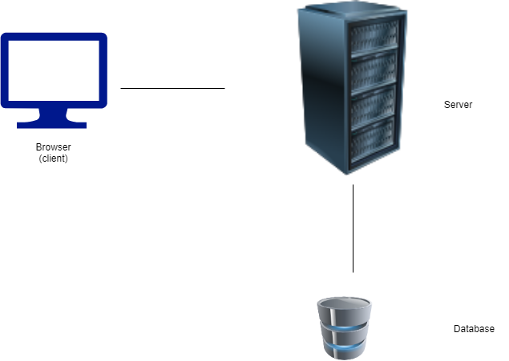

# Node.js Semana 1 (Plano de aula)

## Agenda

O objetivo desta aula é apresentar ao aluno:

- Recapitulação dos conceitos mais relevantes do módulo anterior

1. Noções básicas de back-end e Node.js
2. Modelo cliente-servidor
3. Node.js e NPM básico (`npm init`, `npm install`, `package.json`, `require` e `modules.export`)
4. Como criar um servidor Express.js básico
5. Servindo arquivos estáticos com o Express

## PRIMEIRA METADE (12.05 - 13.30)

**COMECE A GRAVAR A AULA (Quicktime ou Open Broadcast Software)**

### 1. Noções básicas de back-end e Node.js

#### Explicação

Todos os web sites consistem em um frontend (HTML/CSS e JavaScript do navegador) e um backend (servidor web que interage com o banco de dados e envia dados para o frontend).

O frontend (através do navegador) permite que os usuários interajam com o aplicativo. O back-end está lá para lidar com o tráfego de dados de entrada e saída.



Node.js é uma plataforma do lado do servidor, que nos permite usar JavaScript para escrever aplicativos de back-end.

#### Exemplo

Mostre aos alunos como usar o Node.js para executar arquivos JavaScript. Comece com o exemplo simples a seguir, mas explique como esse log será encontrado dentro da linha de comando em vez de

``` js
console.log('Olá Mundo!');
```

#### Exercício

Em um novo arquivo JavaScript, escreva uma função que retorne true se um dia for um fim de semana e false se não for.

```javascript
function isWeekend(dayOfWeek) {
  if (dayOfWeek === 'sábado') return true;
  if (dayOfWeek === 'Segunda') return false;
  // preenche o resto
}

console.log('Terça-feira é ' + (isWeekend('Terça-feira') ? 'fim de semana' : 'dia da semana')); //dia da semana
console.log('Sexta é ' + (isWeekend('Sexta') ? 'fim de semana' : 'dia da semana')); //dia da semana
console.log('Domingo é ' + (isWeekend('Sunday') ? 'weekend' : 'week day')); // final de semana
```

Execute o arquivo com `node` na linha de comando.

#### Essência

Podemos usar o Node.js, a partir da linha de comando, para executar arquivos JavaScript para realizar cálculos (sem uso de navegador) ou que possam interagir com o sistema operacional.

### 2. Modelo cliente-servidor

#### Explicação

A maneira como um cliente e um servidor interagem entre si é chamada de `modelo cliente-servidor`. Ele diz que se um cliente precisar de dados, ele enviará um `request` para um servidor, que fornecerá ao cliente esses dados. O servidor faz isso enviando uma `resposta` de volta ao cliente, que inclui os dados solicitados.

`HyperText Transfer Protocol` (HTTP) é a diretriz de comunicação de como isso deve acontecer.

`Uniform Resource Locator` (URL) é o endereço onde um determinado arquivo (ou em termos mais técnicos, `resource`) pode ser encontrado.

`Porta` é a porta pela qual a comunicação web pode passar. Um número de porta é atribuído antes que a comunicação possa passar por ele.

`Content-Type` é uma propriedade que deve ser incluída em um cabeçalho de solicitação, para especificar ao servidor web receptor que tipo de dados (por exemplo, JSON, XML, Binary, etc.) serão enviados.

#### Exemplo

Mostre aos alunos as solicitações e respostas do seguinte aplicativo, usando a guia Rede no navegador:

- https://fullstack-exampleapp.herokuapp.com/

#### Exercício

Peça a diferentes alunos para identificar o seguinte nesta captura de tela:


- URL:
- PORTO:
- Endereço de IP:
- Tipo de conteúdo:

#### Essência

O modelo cliente-servidor descreve como cada um se comunica com o outro, por meio de `requests` e `responses`. De um modo geral, o cliente envia `requests` para `GET`ting ou `POST`ing dados, e o servidor responde com o que o cliente queria ter.

## SEGUNDA METADE (14.00 - 16.00)

### 3. Gerenciador de pacotes de nós (NPM)

#### Explicação

O Node Package Manager (NPM) é uma coleção de módulos funcionais que outros desenvolvedores escreveram, para serem reutilizados por outros desenvolvedores para construir soluções para problemas de TI mais rapidamente.

O NPM é acessível na linha de comando, usando `npm [COMMAND]`. Online você pode encontrar um registro de diferentes módulos: [NPM](https://www.npmjs.com).

#### Exemplo

Explique o propósito da função `require`, usando um arquivo local (veja a pasta `build-with-students`, passo 1)

Explique o comando `npm init` e o propósito de um arquivo `package.json` (veja a pasta `build-with-students`, passo 2)

Explique `npm install` instalando Express.js dentro dessa pasta. Mostre a pasta `node_modules` e explique sua finalidade.

#### Exercício

Peça aos alunos que configurem um novo projeto Node.js, com apenas um arquivo `package.json` e JavaScript vazio inicializado.

Peça que instalem o pacote [one-liner-joke](https://www.npmjs.com/package/one-liner-joke).

Em seguida, peça-lhes que completem o seguinte código JavaScript:

```javascript
// o que está faltando aqui?

console.log(oneLinerJoke.getRandomJoke().body);
```

#### Essência

Os desenvolvedores não querem reconstruir a mesma coisa, portanto temos módulos acessíveis publicamente que outros fizeram (e que nós mesmos também podemos fazer) para serem usados livremente. O NPM é o local onde eles são armazenados para módulos JavaScript.

### 4. Express.js

#### Explicação

Express.js é o pacote NPM mais popular para criar facilmente servidores web em Node.js. Através dos métodos predefinidos podemos rotear o tráfego de dados, conectar-se a outros servidores web, interagir com bancos de dados e atender aplicações do lado do cliente.

#### Exemplo (código junto)

Mostre a eles um aplicativo Express em execução.

Use a guia Rede do navegador para mostrar a resposta da solicitação do seguinte aplicativo:

https://obscure-anchorage-82962.herokuapp.com/

Em uma nova pasta:

```concha
> npm init
> npm instalar expresso
```

Crie um arquivo JavaScript chamado `server.js`, com o seguinte código:

```javascript
const express = require('express');
const app = express();
const PORTA = 3000;

app.get('/', (req, res) => res.send('Olá Mundo!'));

app.listen(PORT, () => console.log(`Exemplo de aplicativo escutando na porta ${PORT}!`));
```

Inicie o aplicativo usando `node server.js`. Verifique se o aplicativo está sendo executado abrindo a seguinte URL no navegador `localhost:3000`

#### Exercício

Escreva um aplicativo Express que veicule o seguinte HTML:

```html
<html>
  <cabeça>
    <title>Aplicativo de tarefas</title>
  </head>
  <corpo>
    <h1>O que fazer</h1>
    <ul>
      <li>Escreva o dever de casa</li>
      <li>Comprar mantimentos</li>
      <li>Prepare o jantar</li>
      <li>Assista ao filme</li>
    </ul>
  </body>
</html>
```


#### Essência

Express.js é usado para criar facilmente servidores web, que nos permitem (entre outras razões) servir HTML para que nosso navegador possa lê-lo. O navegador envia uma solicitação para um endereço específico, como `/`, e nosso servidor (através do Express) responde com um arquivo HTML.

### 5. Servindo arquivos estáticos com o Express

#### Explicação
Motivação baseada no exercício anterior onde o código HTML é colocado no javascript. Ao invés de fazer isso, o HTML pode ser salvo em um arquivo no projeto e então enviado com express quando necessário.

#### Exemplo
Salve o conteúdo HTML em um novo arquivo no projeto, por exemplo. `index.html`. Em seguida, modifique o código javascript para servir o HTML do arquivo em vez de tê-lo codificado.
```javascript
const express = require('express');
const app = express();
const PORTA = 3000;

app.get('/', (req, res) => res.sendfile('index.html'));

app.listen(PORT, () => console.log(`Exemplo de aplicativo escutando na porta ${PORT}!`));
```

#### Exercício
``` css
li:nth-child(even) {background-color: #CCC}
```
Se sobrar tempo: Salve o CSS acima em um arquivo `style.css`.
Vincule a folha de estilo no arquivo HTML. Estenda o aplicativo expresso para retornar a folha de estilo da rota `\style.css`.

#### Essência

Ao servir conteúdo de arquivos, nosso código javascript é mantido limpo e, ao mesmo tempo, os designers de interface do usuário podem trabalhar facilmente nos arquivos HTML/CSS sem precisar navegar pelo código.
