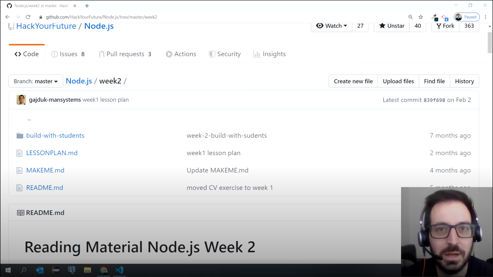

# Material de leitura Node.js Semana 1

## Agenda

Estes são os tópicos da semana 1:

1. [O que é back-end?](https://study.hackyourfuture.net/#/software-development/backend.md)
2. [O modelo cliente-servidor](https://study.hackyourfuture.net/#/definitions/client-server-model.md)
   - [HTTP](https://study.hackyourfuture.net/#/the-internet/http.md)
   - [Quais são os métodos HTTP (Hypertext Transfer Protocol)?](https://study.hackyourfuture.net/#/the-internet/http-methods)
3. [O que é Node.js?](https://study.hackyourfuture.net/#/node-js/)
4. Escrevendo um servidor em Node.js
   - [Express.js](https://study.hackyourfuture.net/#/node-js/express-js)
5. [Carteiro](https://study.hackyourfuture.net/#/tools/postman.md)

### Leitura extra (opcional)

1. [Como funciona a internet?](https://study.hackyourfuture.net/#/the-internet/)

## 0. Vídeos

Seu professor Andrej fez alguns vídeos para o material desta semana que complementa o material de leitura. Você pode encontrá-los aqui: [Vídeos 1 - 6](https://www.youtube.com/playlist?list=PLVYDhqbgYpYXpc_l_Vlj8yz3LjgkkWXnn) (até e incluindo o exemplo Express)

## Metas da semana

Esta semana teremos nossa primeira reunião com o backend e aprenderemos a fazer API's como as que você usou durante seu projeto final no módulo Using API's.

Vamos primeiro dar uma olhada no que o termo backend realmente significa lendo sobre ele [aqui](https://study.hackyourfuture.net/#/software-development/backend.md). Um termo comum usado ao analisar o ecossistema frontend/backend é o modelo cliente-servidor, leia sobre isso [aqui](https://study.hackyourfuture.net/#/definitions/client-server-model.md). Também seria bom se aprofundar um pouco mais no protocolo de comunicação usado na internet, analisando o [protocolo http](https://study.hackyourfuture.net/#/the-internet/http.md) e os [métodos http](https://study.hackyourfuture.net/#/the-internet/http-methods) que são usados para comunicar determinadas ações.

Agora que temos uma visão geral, é hora de ver como podemos construir essas coisas. Para poder usar JavaScript no backend, foi criado o Node.js. Dê uma boa olhada no que é o Node.js [aqui](https://study.hackyourfuture.net/#/node-js/).

Na página Node.js você leu sobre diferentes módulos (ou pacotes como alguns os chamam) e usaremos um deles chamado **Express.js** com o qual podemos facilmente criar servidores web. O pacote express.js tornou-se um padrão da indústria amplamente utilizado. Dê uma olhada no que ele faz [aqui](https://study.hackyourfuture.net/#/node-js/express-js).

Por fim, testar suas APIs sem um frontend é um pouco complicado. Dê uma olhada na ferramenta Postman que é muito usada para testar API's [aqui](https://study.hackyourfuture.net/#/tools/postman.md)

## Leitura extra

Se você tiver tempo sobrando esta semana (ou qualquer semana deste módulo), então é uma boa ideia dar uma olhada no tópico 'internet' e aprender como funciona [aqui](https://study.hackyourfuture.net/ #/a Internet/). Isso será valioso quando você entrar em aplicativos mais complexos e também poderá ajudar na sua compreensão do quadro geral.

## Finalizado?

Você terminou de passar pelos materiais? Toca aqui! Se você se sentir pronto para ser prático, clique [aqui](./MAKEME.md).
