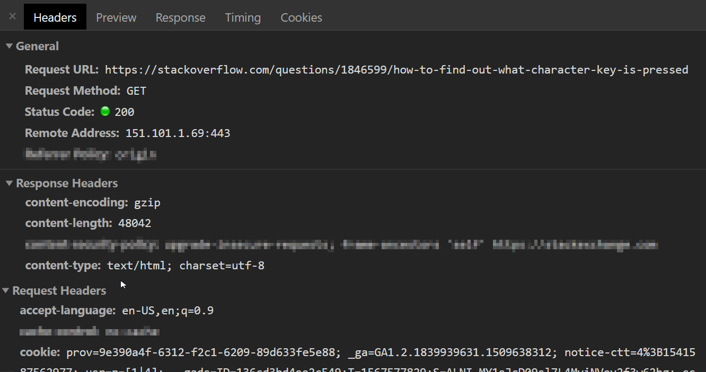

# Node.js Semana 2 (Plano de aula)

## Agenda

1. DESCANSO
2. Métodos CRUD e HTTP
3. API RESTful

## Conceitos principais

PRIMEIRA METADE (12h00 - 13h30)

### DESCANSO

**Explicação**

REST significa Transferência de Estado Representacional.

1. API não repousante apenas REST

   - foco nos recursos e como eles são o centro do REST

   Recurso — um recurso pode ser qualquer objeto sobre o qual a API possa fornecer informações. Na API do Instagram, por exemplo, um recurso pode ser um usuário, uma foto, uma hashtag. Cada recurso possui um identificador exclusivo. O identificador pode ser um nome ou um número. Agora vamos voltar ao REST.

Uma aplicação web RESTful expõe informações sobre si mesma na forma de metadados: descrições de seus recursos. Ele também permite que o cliente execute ações nesses recursos, como (1) criar novos recursos (ou seja, criar um novo usuário) ou (2) alterar recursos existentes (ou seja, editar uma postagem).

- métodos http, urls, corpo da solicitação, parâmetros de consulta, status, corpo da resposta, tratamento de erros

**Exemplo**

Facebook: Explique quais são os principais recursos: usuários, postagens, comentários.

**Exercício**

1. Peça aos alunos para identificar os recursos no Github e anotá-los juntos.

2. Peça aos alunos que identifiquem o seguinte nesta captura de tela:

- URL
- PORTO
- Método
- Endereço de IP
- Solicitação ?? status
- Explicar cabeçalhos de solicitação
- Situação da resposta
- Explicar os cabeçalhos de resposta

**Essência**

### Métodos CRUD e HTTP

**Explicação**

Explique as quatro operações: criar, ler, atualizar, excluir

Como eles mapeiam para verbos http: post, get, put, delete

**Exemplo**

**Exercício**

**Essência**

### APIs RESTful

**Explicação**

Comece explicando o que é uma API da Web: https://hackr.io/blog/web-application-architecture-definition-models-types-and-more/thumbnail/large

Por fim, complete o quadro completo das APIs tranquilas: recursos e operações.

Mencione que RESTful não é a única maneira de construir APIs, mas não entre em detalhes

**Exemplo**

Consulte a API do Github para repositórios:

https://developer.github.com/v3/repos/#create

https://developer.github.com/v3/repos/#list-your-repositories

https://developer.github.com/v3/repos/#edit

https://developer.github.com/v3/repos/#delete-a-repository

**Exercício**

Peça aos alunos que definam os endpoints para uma API de biblioteca. Escreva-os juntos.

**Essência**

SEGUNDA METADE (14.00 - 16.00)

**Construa com os alunos**

- aplicativo de biblioteca com as quatro operações básicas, sem salvar/ler de/para arquivo,
  - certifique-se de explicar como as rotas são definidas (verbo + url)
  - como o corpo da solicitação pode ser obtido
  - como os parâmetros podem ser extraídos da url (:id)
  - como gerar ids
  - como responder com o status correto
  - como lidar corretamente com quaisquer erros (retorne 500 ou 404 e uma mensagem de erro amigável, enquanto registra os detalhes do erro)
- mostrar como testar os diferentes endpoints e métodos usando o carteiro
