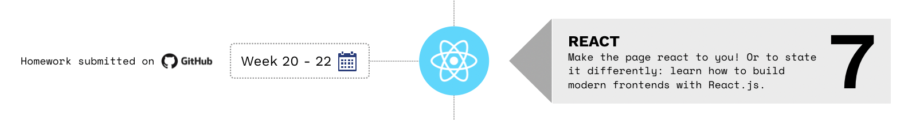

> Se você estiver seguindo o currículo do HackYourFuture, recomendamos que comece com o módulo 1: [HTML/CSS/GIT](https://github.com/HackYourFuture/HTML-CSS). Para obter uma visão geral completa do currículo HackYourFuture primeiro, clique [aqui](https://github.com/HackYourFuture/curriculum).

> Ajude-nos a melhorar e compartilhe seus comentários! Se você encontrar tutoriais ou links melhores, compartilhe-os [abrindo um pull request](https://github.com/HackYourFuture/React/pulls).

# Módulo 7 - React.js: Construindo UIs dinâmicas com JavaScript moderno (Frontend)



Bem-vindo ao módulo React! Parabéns por chegar até aqui!

Nestas 4 semanas voltaremos ao frontend e aprenderemos a fazer interfaces de usuário mais rápidas e modernas. Nos módulos HTML e JavaScript, você aprendeu tudo sobre como criar páginas da Web que contêm dados imutáveis. Não importa quem está usando o site, os dados serão sempre os mesmos. Chamamos isso de 'site estático'. Ao mesmo tempo, você construiu várias páginas HTML para que o usuário possa acessar várias partes do site. Chamamos isso de `aplicativo de várias páginas (MPA)`

No módulo Node.js, você aprendeu como alterar o conteúdo da página, com base na entrada do usuário, usando um `mecanismo de modelagem`. Digite uma palavra-chave e o servidor envia de volta um `template` com dados personalizados. Chamamos isso de 'site dinâmico'. No entanto, fizemos isso de tal forma que ainda tínhamos que enviar páginas diferentes para o cliente dependendo da URL (por exemplo, `/` ou `/users`). Este também é um MPA.

Neste módulo, no entanto, você aprenderá a criar sites mais complexos. No entanto, não vamos mais chamá-los de sites: eles serão `aplicativos da web`. Eles não são apenas informativos, mas permitem que o usuário interaja com ele. Isso é semelhante a qualquer aplicativo em sua área de trabalho. Esses aplicativos React também lidam com `dados dinâmicos`: seu `estado` muda dependendo de quem o está usando.

Além de serem dinâmicos, os aplicativos React também são `aplicativos de página única (SPA)`. Essencialmente, isso significa que ao carregar toda a aplicação (cada página e seu conteúdo) fica acessível ao usuário, sem a necessidade de enviar solicitações ao servidor para obter outra página.

## Antes que você comece

Para trabalhar adequadamente com este módulo, vamos usar um software que nos permitirá escrever aplicativos React com facilidade. É chamado de `create-react-app`.

Vá para sua linha de comando e execute o seguinte:

```bash
npm install -g create-react-app
```

Agora, verifique se você o possui executando o seguinte:

```bash
create-react-app --version
```

Deve ser pelo menos a versão `2.1.x`.

## Metas de aprendizagem

Para concluir com sucesso este módulo, você precisará dominar o seguinte:

- Compreender o modo React de pensar sobre `interfaces de usuário`
- Conheça a importância e o lugar do 'estado' e como transmiti-lo
- Ser capaz de trabalhar com diferentes `ganchos` e até mesmo criar seus próprios
- Reconhecer a utilidade da `modularização`
- Colocando ênfase na escrita de código reutilizável (`components`)
- Como lidar com o `roteamento do lado do cliente`

## Como usar este repositório

### Conteúdo do repositório

Este repositório é composto por 3 partes essenciais:

1. `README`: este documento contém toda a teoria necessária que você precisa entender **enquanto** trabalha na lição de casa. Ele contém não apenas os recursos certos para aprender sobre os conceitos, mas também palestras feitas por professores do HackYourFuture. Esta é a **primeira coisa** com a qual você deve começar toda semana
2. `MAKEME`: este documento contém as instruções para o dever de casa de cada semana. Comece com os exercícios rapidamente, para que você possa fundamentar os conceitos sobre os quais leu anteriormente.
3. `PLANO DE AULA`: este documento é uma referência para professores. No entanto, como estudante, não tenha vergonha de dar uma olhada também!

### Como estudar

Digamos que você esteja começando com o módulo Bancos de Dados. Isto é o que você faz...

1. A semana sempre começa na **quarta-feira**. A primeira coisa que você vai fazer é abrir o `README.md` dessa semana. Para a primeira semana de `Bancos de dados`, isso seria [Leitura da Semana1](/Week1/README.md)
2. Você passa a **quarta-feira** e a **quinta-feira** examinando os recursos e tentando obter uma compreensão básica dos conceitos. Enquanto isso, você também implementará qualquer feedback recebido na lição de casa da semana passada (do módulo Node.js)
3. Na **Sexta** você começa com o dever de casa, encontrado no `MAKEME.md`. Para a primeira semana de `React`, isso seria [Week1 Homework](/Week1/MAKEME.md)
4. Você passa a **sexta-feira** e o **sábado** brincando com os exercícios e anotando quaisquer dúvidas que possa ter
5. **Prazo 1**: você enviará suas dúvidas até **sábado, 23h59**, no canal da turma
6. No **Domingo** você vai assistir à aula. Será no formato de perguntas e respostas, o que significa que não haverá material novo. Em vez disso, suas perguntas devem ser discutidas e você pode aprender com os outros
7. Você passa a **segunda-feira** e a **terça-feira** finalizando sua lição de casa
8. **Prazo 2**: Você envia sua lição de casa para os canais certos (GitHub) antes de **terça-feira, 23h59**. Se você não puder chegar a tempo, por favor comunique ao seu mentor
9. Comece a nova semana voltando ao ponto 1!

Resumindo:


Para ter uma visão geral mais detalhada das diretrizes, leia [este documento](https://docs.google.com/document/d/1JUaEbxMQTyljAPFsWIbbLwwvvIXZ0VCHmCCN8RaeVIc/edit?usp=sharing) ou pergunte ao seu mentor/classe no Slack!

## Planejamento

| Semana | Tópicos | Materiais de Leitura | Lição de casa |
| ---- | -------------------------------------------------- ----- | -------------------------------- | -------------------------------- |
| 1. | O que é React, JSX, State & Props, Implante um site estático | [Leituras W1](./week1/README.md) | [Trabalho de casa W1](./week1/MAKEME.md) |
| 2. | chamadas de API, teste | [Leituras W2](./week2/README.md) | [Trabalho de casa W2](./week2/MAKEME.md) |
| 3. | Roteamento do lado do cliente, Contexto, Ganchos personalizados | [Leituras W3](./week3/README.md) | [Trabalho de casa W3](./week3/MAKEME.md) |
| 4. | Projeto! | [Leituras W4](./week4/README.md) | |

## Finalizado?

Você terminou o módulo? Impressionante!

Se você se sentir pronto para o desafio **final**, clique [aqui](https://www.github.com/HackYourFuture/Project) para acessar o Projeto!

_O currículo HackYourFuture está sujeito aos direitos autorais CC BY. Isso significa que você pode usar nossos materiais livremente, mas certifique-se de nos dar crédito por isso :)_

<a rel="license" href="http://creativecommons.org/licenses/by/4.0/"></a><br />Esta obra está licenciada sob uma <a rel="license" href="http://creativecommons.org /licenses/by/4.0/">Licença Creative Commons Atribuição 4.0 Internacional</a>.
