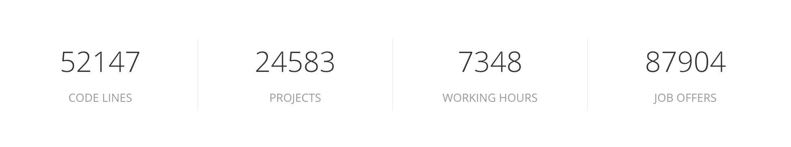
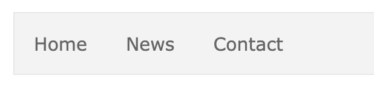
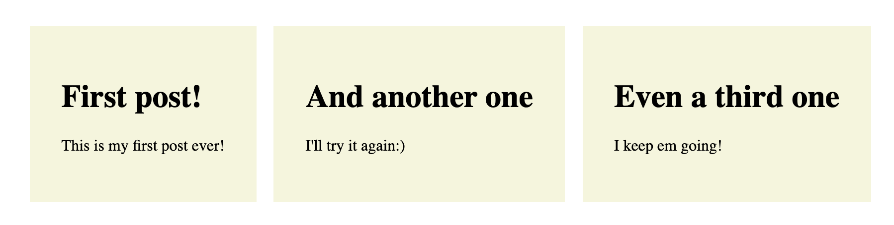

# Plano de aula Semana 1

## Agenda

O objetivo desta aula é apresentar ao aluno os conceitos mais básicos do React:

- Como olhar para uma `página da web` do ponto de vista do React
- O que é `create-react-app`
- Como escrever `componentes reutilizáveis` e por quê
- O propósito do `JSX`
- O que são `props` e como `passá-los componentes`
- O que é 'estado'?

Ao ilustrar esses conceitos, use [create-react-app](https://github.com/facebook/create-react-app). Certifique-se de que os alunos também o instalaram.

_Explique aos alunos o que cada biblioteca faz: React, ReactDOM e Babel._

## Conceitos principais

## 1. Olhando para páginas da web do ponto de vista do React

### Explicação

O React visa construir páginas da web, dividindo a página em pequenos pedaços: componentes. Esses componentes são bits isolados de HTML que podem receber dados alterados para serem reutilizáveis para diferentes propósitos. Dessa forma, você poderia dizer que os componentes são elementos HTML personalizados.

Esses componentes são estruturados de forma semelhante ao DOM: em uma estrutura em forma de árvore. O elemento de nível superior contém o componente que possui o restante do aplicativo aninhado dentro dele.

### Exemplo

Dê uma olhada no exemplo a seguir:



Isso é feito usando um único componente (reutilizado várias vezes):

``` jsx
const Stat = ({ statNum, statDesc }) => {
Retorna (
<div>
<span>{statNum}</span>
<span>{statDesc}</span>
</div>
);
};
```

Ao instanciá-lo várias vezes, você pode produzi-lo como na imagem:

``` jsx
<>
<Stat statNum={'52147'} statDesc={'CODE LINES'} />
<Stat statNum={'24583'} statDesc={'PROJECTS'} />
<Stat statNum={'7348'} statDesc={'WORKING HORAS'} />
<Stat statNum={'87904'} statDesc={'OFERTAS DE TRABALHO'} />
</>
```

### Exercício

Mostre este [exemplo](https://htmlstream.com/preview/unify-v2.6.2/unify-main/home/home-default.html) e divida uma parte do site em componentes. Depois, peça a 2 alunos que façam o mesmo.

### Essência

O uso do React nos permite criar páginas da Web usando blocos de construção reutilizáveis: componentes. Isso nos poupa tempo e esforço a longo prazo!

## 2. criar-reagir-aplicativo

### Explicação

Para começar a construir aplicativos React rapidamente, podemos usar uma ferramenta chamada `create-react-app`. É um pacote NPM que configura um projeto de modelo básico, incorporando ferramentas necessárias para traduzirmos o código React em JavaScript normal que o navegador possa entender.

Essas ferramentas são `webpack` (que agrupa e otimiza nossos arquivos de componentes em um) e `babel` (que transforma nosso JavaScript moderno em uma versão mais antiga que a maioria dos navegadores entenderá).

Para configurar isso manualmente, custará muito tempo, portanto, podemos facilitar as coisas usando `create-react-app`.

### Exemplo

_Instale o `create-react-app` e crie um projeto de amostra. Percorra os vários arquivos e explique qual é a sua finalidade._

### Exercício

Peça aos alunos que instalem o `create-react-app` e iniciem em suas máquinas!

### Essência

`create-react-app` nos permite:

- Gere um ambiente React pronto para uso e totalmente funcional
- Resolva o problema de configurar manualmente o empacotador de arquivos (como Webpack) ou transpilador (Babel)
- Melhorar nosso fluxo de trabalho de desenvolvimento por meio de `recarregamento a quente`
- Dê uma estrutura de pastas mais realista
- Construir uma versão de produção do aplicativo reagir e implantar no serviço de hospedagem de site estático (netlify/now)

## 3. Componentes

### Explicação

Um componente é uma parte de uma página da Web. Ele contém 2 coisas: (1) o HTML necessário para estruturar o elemento e (2) o JavaScript necessário para fornecer dados dinâmicos.

### Exemplo

No mundo React você encontrará 2 tipos de componentes: baseados em `class` e baseados em `função`.

``` jsx
// Componente baseado em classe (antiga maneira)
contador de classe {
estado = {
contagem: 0,
};

render(){
return <div>{this.state.count}</div>;
}
}
```

``` jsx
// Componente baseado em função (Novo caminho)
const ThisIsAComponent = () => {
const [count, setCount] = useState(0);

return <div>{setCount}</div>;
};
```

Você deve focar em componentes baseados em `funções`.

### Exercício

Peça aos alunos que reconstruam o seguinte:



- Os componentes devem ser `funcionais`
- Faça 2 componentes `NavBar` e `NavBarItem`
- Passe props para cada instância `NavBarItem`
- O estilo é opcional

Depois disso, discuta e destaque os trabalhos de pelo menos 2 alunos.

### Essência

Os componentes são:

- Elementos HTML personalizados: blocos de construção reutilizáveis usados para criar páginas da web.
- Projetado para receber dados diferentes em cada instância.
- Capaz de exibir valores JavaScript usando os símbolos `{ }`.
- Sempre retornando elementos semelhantes a HTML, que são chamados de JSX

## 4. JSX

### Explicação

`JSX` significa JavaScript XML. Efetivamente, é nossa capacidade de retornar elementos HTML em nossos componentes React.

### Exemplo

``` jsx
const Seção = () => {
Retorna (
<seção>
<h1>O componente de seção</h1>
<p>Neste componente, retornamos HTML. No mundo React chamamos isso de JSX!</p>
</section>
);
};
```

### Exercício

Peça aos alunos para criarem um componente funcional que retorne os seguintes elementos HTML:

- 1 `<nav>`
- 1 `<ul>`
- 2 `<li>`: t

### Essência

- Uma maneira de escrever código HTML dinâmico com JavaScript
- É uma versão mais intuitiva da função `createElement()` (que leva o nome da função DOM `createElement()`)
- Um componente deve sempre retornar JSX
- Estas são as partes que irão construir a estrutura DOM

_Mostre um exemplo do componente JSX e createElement e peça aos alunos que façam o mesmo._

## 5. Adereços

### Explicação

`Props` é a abreviação de `property`: como aqueles que você dá a um elemento HTML. No entanto, em React podemos criar nossos próprios nomes de propriedades para os componentes que criamos.

Com `props` podemos passar informações de um nível da árvore de componentes para outro nível inferior.

Dessa forma, podemos fornecer dados diferentes a cada instância de componente. Podemos acessar esses dados dessa instância usando o nome `prop`.

### Exemplo

``` jsx
const UserItem = ({ nome }) => {
retornar <li>{name}</li>
}

const UserList = () => {
Retorna (
<ul>
<UserItem name={"Wouter"}>
<UserItem name={"Federico"}>
<UserItem name={"Noer"}>
</ul>
)
}
```

### Exercício

Peça aos alunos que façam uma **lista de postagens**, em que cada postagem tenha uma parte "título" e uma parte "conteúdo". Deve ficar parecido com isso:



Requisitos:

- Crie um componente funcional chamado `PostList`, que irá armazenar 3 posts
- Crie um componente funcional chamado `Post`, que terá 2 props: `title` e `content`
- O estilo é opcional

### Essência

`Props` são:

- usado para passar dados de componente para componente.
- são propriedades HTML com nome personalizado.
- tornando possível que nossos componentes sejam reutilizáveis

## 6. Formulários

### Explicação

Em HTML, os formulários têm um comportamento padrão. Eles armazenam os dados e desejam atualizar automaticamente a página. Em React estamos tentando parar este comportamento padrão e trazer os dados sob nosso controle: colocando-os em `state`!

Trazemos os dados do formulário para o estado ouvindo-os, usando o atributo `onChange` e `value`. Estamos controlando nossos campos `<input>`, criando assim `entradas controladas`. Então, quando queremos enviá-lo, podemos usar o atributo `onSubmit`.

### Exemplo

``` jsx
formulário const = () => {
const [formValues, setFormValues] = useState({ title: '' });

const inputHandler = (evento) => {
setFormValues();
};

Retorna (
<form onSubmit={}>
<input type="text" onChange={inputHandler} value={formValues.title} />
</form>
);
};
```

### Exercício


### Essência


## 7. O que é estado?

### Explicação

Estado são todos os dados no aplicativo, que podem mudar devido à interação do usuário. Ele é definido usando uma função especial do React, chamada `useState`.

Esta função `useState` fornece o valor do estado e uma função que nos permite modificar o valor do estado.

Todos os valores de estado devem ser declarados na função top, de preferência no componente pai.

Sempre que queremos passar um valor de estado para um componente, nós o atribuímos a um personalizado chamado `prop`. Ele pode ser acessado como parte dos `props` dentro desse componente filho.

### Exemplo

``` jsx
contador const = () => {
// Valor do estado, modificador de estado, estado inicial
const [count, setCount] = useState(0);

// Manipulador para mudar o estado
const handleClick = () => {
setCount((prevState) => prevState + 1);
};

Retorna (
<div>
<Contagem={conta} />
<button onClick={handleClick}>+ 1</button>
</div>
);
};

const Contagem = ({ contagem }) => {
return <p>Contagem é: {count}</p>;
};
```

### Exercício

Peça aos alunos que refaçam sozinhos o que foi mencionado acima.

### Essência

Ter estado permite que nosso aplicativo lide com 'dados dinâmicos': dados que podem mudar. Usando a função `useState` definida pelo React, podemos definir e modificar todas as partes do estado que precisam ser alteradas
