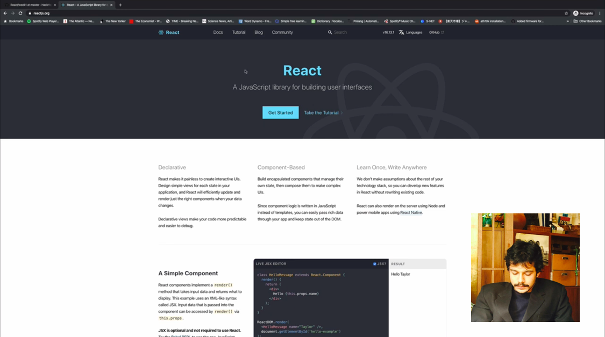

# Material de Leitura Reagir Semana 1

## Agenda

Estes são os tópicos da semana 1:

1. [O que é React.js?](https://study.hackyourfuture.net/#/react/README.md)
   - O que React não é
   - Componentização
   - HTML em JS: JSX
2. [State & Props](https://study.hackyourfuture.net/#/react/state-and-props.md)
3. [ganchos](https://study.hackyourfuture.net/#/react/react-hooks.md)
   - useState
   - useEfeito
4. [Formulários: controlado vs não controlado](https://study.hackyourfuture.net/#/react/controlado-vs-uncontrolado.md)
5. [Ferramentas](https://study.hackyourfuture.net/#/react/tools.md)
   - Ferramentas de desenvolvimento React
   - comando `create-react-app`
   - Hospedagem estática

## Nota importante sobre React
> No mundo React, há uma grande mudança acontecendo desde a introdução dos 'hooks' em 2018. Antes dos hooks, o React foi construído usando componentes de classe e função. Atualmente, é recomendado usar apenas componentes de função em combinação com ganchos para todo o código que você construir a partir de agora. No entanto, quando você vai fazer pesquisa por conta própria ou quando você entra em seu estágio, você vai se deparar com componentes de classe. Isso será cada vez menos com o passar do tempo e esperamos que possamos remover isso em algum momento no futuro.

> Nós do HackYourFuture ensinaremos apenas a maneira recomendada de criar aplicativos e fornecemos uma seção no livro de estudo para compartilhar os detalhes mais básicos sobre como ler os componentes da classe [aqui](https://study.hackyourfuture.net/ #/react/class-vs-function-components.md). Se você encontrar componentes de classe em sua pesquisa, tente procurar um tutorial, pergunta ou vídeo mais atualizado. Se você encontrar componentes de classe durante seu estágio, converta-o em um componente de função. Os desenvolvedores vão te amar :).

## Metas da semana

Essa semana iniciaremos a maravilhosa jornada do React! Vamos começar aprendendo o que é React e, mais importante, o que não é, uma vez que você começa a trabalhar com grandes frameworks como este, fica difícil identificar onde está o limite e queremos ter certeza de que você entende onde o React termina e onde o JavaScript começa. Dê uma olhada em nossa introdução ao React [aqui](https://study.hackyourfuture.net/#/react/README.md).

O React é um grande framework que introduz muitas novas terminologias e maneiras de pensar para simplificar a construção de aplicativos maiores. Vamos começar aprendendo sobre State e Props [aqui](https://study.hackyourfuture.net/#/react/state-and-props.md). Agora vamos aos ganchos básicos que o React oferece para você construir sua aplicação [aqui](https://study.hackyourfuture.net/#/react/react-hooks.md). Por enquanto é melhor focar no `useState` e no `useEffect` pois eles são os que você vai usar muito, mas você já pode dar uma olhada nos outros para tê-los em mente. A última coisa que queremos que você dê uma olhada é como trabalhar com a entrada do usuário (já que os sites sempre precisarão responder à entrada do usuário). Para isso, entraremos em uma discussão sobre componentes controlados versus não controlados. Este é um tópico um pouco mais amplo, mas os formulários e a entrada do usuário são o melhor exemplo para isso. Dê uma olhada [aqui](https://study.hackyourfuture.net/#/react/control-vs-uncontroled.md) e certifique-se de usar sempre a maneira controlada de escrever formulários em seus aplicativos.

Ufa, isso foi muito, mas agora você tem conhecimento dos blocos de construção básicos com os quais você já pode criar alguns aplicativos muito legais. Mas como você começa?

Vejamos algumas [ferramentas](https://study.hackyourfuture.net/#/react/tools.md) que permitirão que você inicie rapidamente (create-react-app) e implemente facilmente qualquer coisa que você criar no web (hospedagem estática).

Para reunir tudo isso, você pode seguir Shriyans no vídeo a seguir, que usará todas essas informações para criar um pequeno aplicativo. Você pode parar o vídeo em 35 minutos, a lição de casa mudou desde então.

## Finalizado?

Você terminou de passar pelos materiais? Toca aqui! Se você se sentir pronto para ser prático, clique [aqui](./MAKEME.md).
