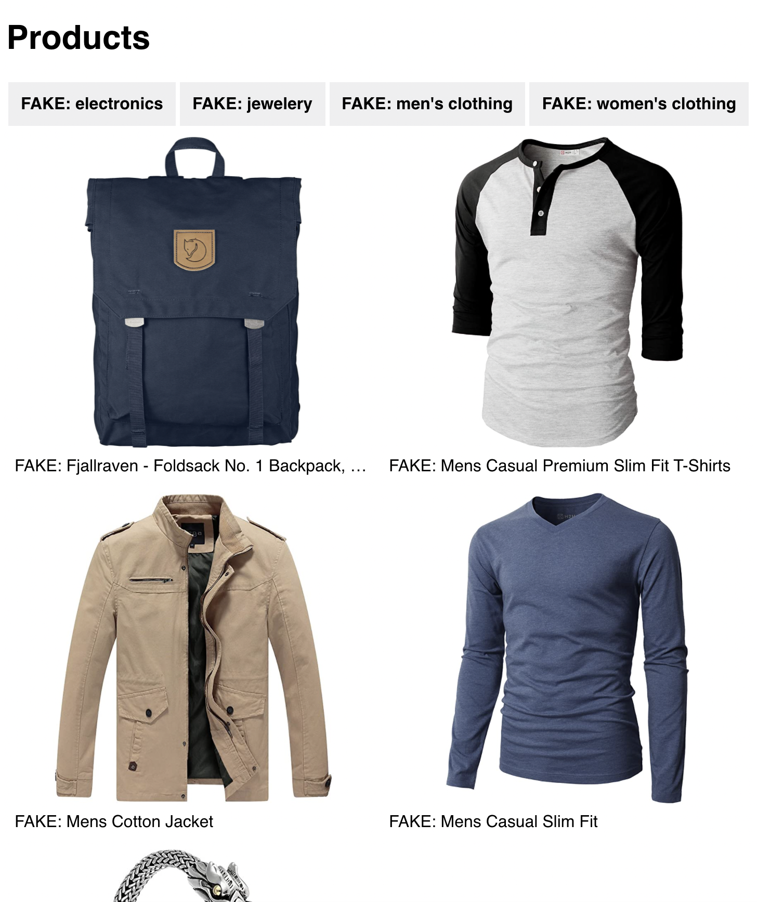

# Projeto de comércio eletrônico I

## 1. Configuração

O primeiro passo para qualquer projeto é configurar seu ambiente de desenvolvimento. Siga os passos:

1. Dentro desta pasta (`week1/project`), use `create-react-app` para criar uma aplicação React. Dê-lhe o nome de `ecommerce`
   > Você vai copiar e refatorar seu código toda semana, mas simultaneamente receberá feedback das semanas anteriores. Assim, no início de cada semana, você copia os arquivos do projeto da semana anterior para uma nova pasta e uma nova ramificação. Para ajudá-lo a identificar se está tudo bem, sugerimos mantê-lo na pasta da semana da qual faz parte.
2. Copie e cole a pasta `fake-data` dentro da pasta `src` do seu novo projeto

## 2. Requisitos

Esta semana você construirá a base do seu aplicativo. Deverá eventualmente ficar assim:

Existe uma versão ao vivo [aqui](https://hyf-react-w1-example.netlify.app)

Usaremos as informações na pasta `fake-data` como exemplo do que recebemos da API. A conexão real com a API será feita na próxima semana.

O que você precisa ter feito no final da semana:

- Uma lista de produtos que exibe todos os produtos no arquivo `all-products`. _Observação: o site é responsivo, então dê uma olhada nos pontos de interrupção no projeto de exemplo implantado._
- Uma lista de categorias que exibe todas as categorias no arquivo `all-categories` na parte superior da página
- Se o usuário clicar em uma categoria apenas os produtos que possuem essa categoria em sua propriedade `category` devem ser exibidos na tela.
- Deve haver apenas 1 categoria ativa por vez e o usuário deve ver qual categoria está selecionada.
