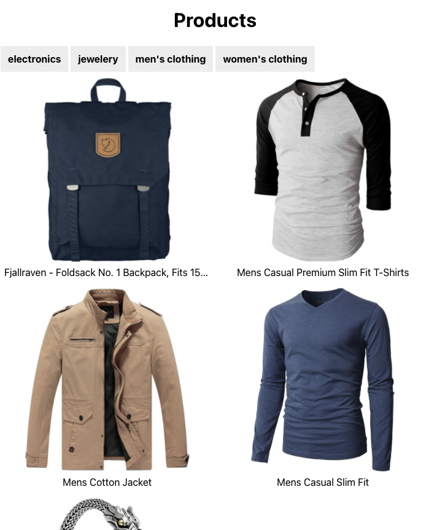

# Projeto de comércio eletrônico II

## 1. Configuração

Certifique-se de ter criado um novo branch week2 do branch `main` do seu repositório bifurcado. Em seguida, copie a pasta `ecommerce` que você criou na semana passada para a pasta `week2/project`. Dessa forma, qualquer feedback que você receber para a semana1 pode ser alterado na ramificação da semana1 e você está livre para refatorar esta semana como achar melhor. Isso significa que você pode precisar aplicar as mesmas alterações em várias ramificações, mas digamos que isso seja bom para o processo de aprendizado :).

## 2. Requisitos

Vamos nos concentrar em vincular nosso aplicativo à API esta semana. Ao final da tarefa, seu aplicativo deve funcionar de forma semelhante a isto:

Existe uma versão ao vivo [aqui](https://hyf-react-w2-example.netlify.app/)

_Observação: A API é uma API totalmente aberta, portanto às vezes pode demorar um pouco para responder. Ótimo para verificar sua UX de carregamento!_

O que você precisa ter feito no final da semana:

- O diretório de dados falsos não deve mais fazer parte do seu projeto
- Seu aplicativo precisará fazer 2 consultas aos seguintes endpoints:
  - `https://fakestoreapi.com/products/categories` -> Para obter todas as categorias
  - `https://fakestoreapi.com/products` ou `https://fakestoreapi.com/products/category/<selectedCategory>` -> Para obter os produtos. A API precisa fazer a filtragem, não o frontend. Normalmente a quantidade de produtos será muito grande para fazer a filtragem no frontend.
- Seu aplicativo precisa mostrar que está carregando enquanto aguarda a solicitação de retorno. Você pode testar isso imitando uma conexão lenta nas ferramentas de desenvolvedor de seus navegadores
- Seu aplicativo precisa mostrar uma mensagem de erro se a solicitação falhar
- Seu aplicativo precisa ir para uma página de detalhes `/product/:id` sempre que você clicar no cartão do produto na lista. Isso deve obter os detalhes do endpoint: `https://fakestoreapi.com/products/<id>`. Por enquanto não adicionaremos uma barra de navegação, o botão 'voltar' do navegador fará o truque. _DICA: Você precisará adicionar o pacote `react-router-dom` e adicionar o roteamento ao seu aplicativo independentemente._
