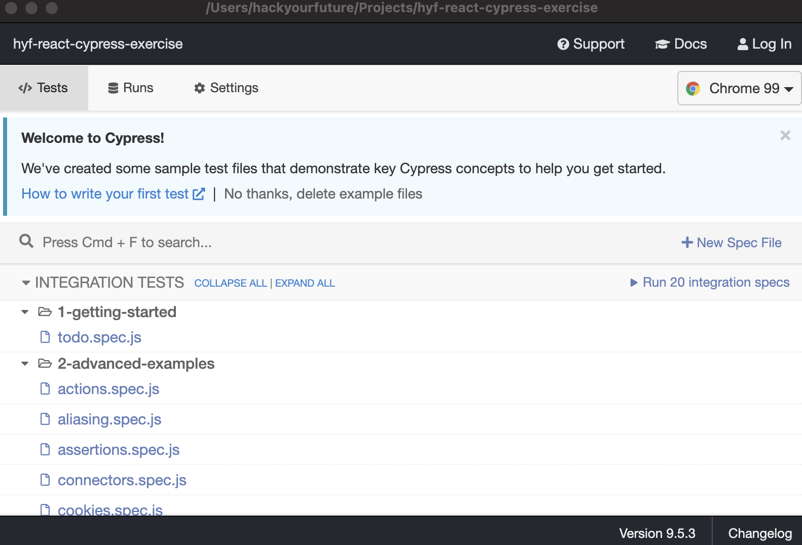

# Teste de ponta a ponta

Conforme mencionado nos materiais de leitura, o teste de ponta a ponta está se tornando cada vez mais popular, pois é o mais próximo possível de testar a experiência do usuário. Onde no passado a teoria era testar cada componente separadamente para identificar erros no início do desenvolvimento, com as tecnologias atuais, o teste de ponta a ponta está se tornando rápido o suficiente para identificar problemas no início também.

Neste exercício, veremos a ferramenta de teste de ponta a ponta [Cypress](https://www.cypress.io/), que é uma estrutura popular porque faz muito enquanto ainda é relativamente fácil de aprender. Tão perfeito para iniciantes para experimentar!

## Configurando

Então vamos começar! Vamos guiá-lo pelas etapas para configurar o cypress em um repositório separado.

1. Crie um novo repositório github, nomeie-o como `cypress-playground`, pois vamos brincar com ele aqui.

Agora vamos seguir o guia de instalação conforme mencionado [aqui](https://docs.cypress.io/guides/getting-started/installing-cypress):

2. Clone-o localmente e escreva `npm install cypress --save-dev` para instalar o pacote cypress. Observe que você _não_ precisa fazer nada com o React neste exercício, o teste de ponta a ponta é completamente independente de quaisquer detalhes de implementação.
3. Depois de instalar o pacote podemos rodar o cypress usando `npx cypress open`.

Isso faz muito! Você verá agora que uma pasta `cypress` foi adicionada ao seu sistema de arquivos. Há também um arquivo `cypress.json` que contém alguma configuração (ou geralmente vazio para iniciar). E ao abrir o cipreste você também tem uma janela que se parece um pouco com isso:

Cypress adicionou muitos testes de amostra para você que se conectam aos aplicativos implantados e mostram todas as coisas que você pode fazer com ele. Vá em frente e clique em alguns dos testes para ver por que todos ficam realmente empolgados com os testes de ponta a ponta. Você pode escrever programaticamente todos os testes que costuma fazer manualmente para verificar se um determinado fluxo de usuário ainda funciona após cada alteração feita!

Todos esses testes estão dentro da pasta `cypress` que foi adicionada ao seu projeto. Se você olhar na pasta `cypress/integration` verá todo o código que gera os testes dentro do cypress.

## Iniciar!

Agora para a parte divertida, brincando com nós mesmos!

1. Nesta pasta você encontrará uma pasta chamada `0-myown`. Copie isso para o seu projeto dentro da pasta `cypress/integration` para que fique ao lado dos exemplos de cypress. Começamos com '0-' para deixar o nosso bem no topo da lista :D!
2. Percorra esses arquivos, nós os numeramos para que você saiba por onde começar, as explicações extras ficam cada vez menos à medida que você avança. _Observação: a API que usamos às vezes é um pouco lenta com respostas e pode causar problemas de tempo limite. Se você conseguir isso, dê uma olhada na documentação do cipreste para descobrir como aumentar o tempo que o cipreste esperará por comando._
3. Preencha os testes que estão faltando!

## Coisas para pensar

- A API que usamos tem um conjunto de dados estável. Como você testaria um conjunto de dados que não é tão estável? O que você precisaria mudar nesses testes?
- É possível [adicionar seus próprios comandos](https://docs.cypress.io/api/cypress-api/custom-commands) para cypress, há coisas no código que você acha que deveria ser feito um comando personalizado?
