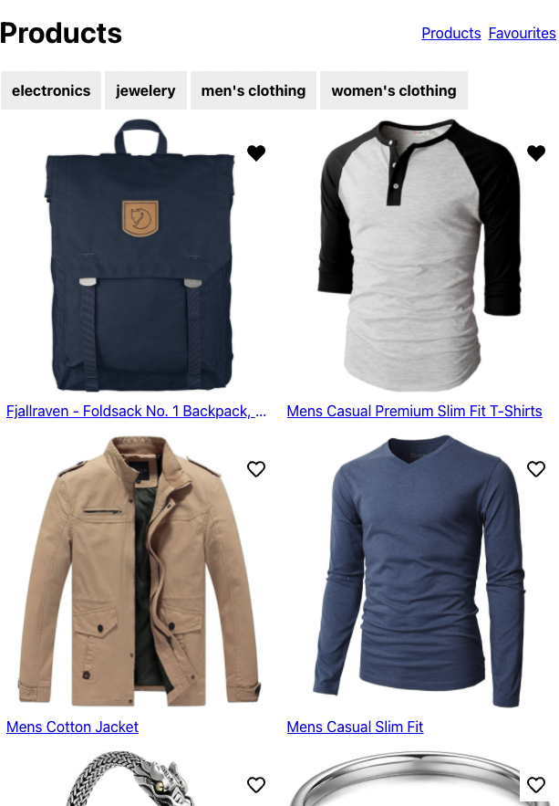

# Projeto de comércio eletrônico III

## 1. Configuração

Certifique-se de ter criado um novo branch week3 do branch `main` do seu repositório bifurcado. Em seguida, copie a pasta `ecommerce` que você criou na semana passada para a pasta `week3/project`.

Copie a pasta `assets` para sua pasta `ecommerce/src`. Usaremos esses arquivos svg para nossa funcionalidade de favoritos.

## 2. Requisitos

Vamos implementar alguns novos recursos interessantes esta semana, agora que temos todos os blocos de construção do React à nossa disposição. Ao final da tarefa, seu aplicativo deve funcionar semelhante a este:

Existe uma versão ao vivo [aqui](https://hyf-react-w3-example.netlify.app)

O que você precisa ter feito no final da semana:

- Deve haver um contexto que armazene o `id` de todos os favoritos do usuário. Você não deve armazenar o objeto inteiro!
- Para as imagens na lista de produtos, bem como na página de detalhes do produto, deve haver um coração que, se clicado, atualizará a matriz de favoritos no contexto. O coração deve mostrar o arquivo svg correto dependendo se é favorito ou não.
- Seu aplicativo deve ter uma página de favoritos para listar todos os produtos favoritos do usuário. Você precisará realizar várias buscas, pois você só tem o `id` dos favoritos.
  > Armazenar o objeto inteiro tornaria isso mais fácil, é claro, e neste exemplo provavelmente seria uma solução melhor, mas queremos desafiá-lo um pouco adicionando um cenário de busca múltipla.
- Adicione uma barra de navegação na parte superior que trata do roteamento entre `/` e `/favourites`. A rota `/favourites` deve ir para a página de favoritos.
- Se você fez as mesmas coisas que nós, nas páginas Produtos e Detalhes do Produto você terá muita lógica duplicada em relação aos estados `loading` e `error` de todas essas solicitações. Corrija isso criando um gancho personalizado `useFetch`.
  > Seu gancho personalizado terá alguns desafios. A URL dos produtos muda e você terá que realizar essa busca sempre que o usuário clicar em uma categoria, então você precisará dar ao usuário do seu gancho a opção de fazer isso.
  > Desafio extra: Nós propositadamente não dizemos página de Favoritos aqui, pois isso tornaria o gancho personalizado ainda mais difícil de construir. Se você estiver pronto para o desafio, adicione funcionalidade ao seu gancho para várias buscas!
