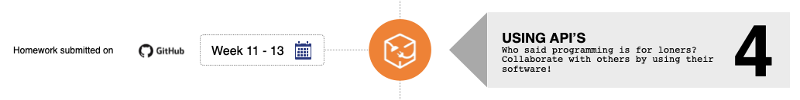
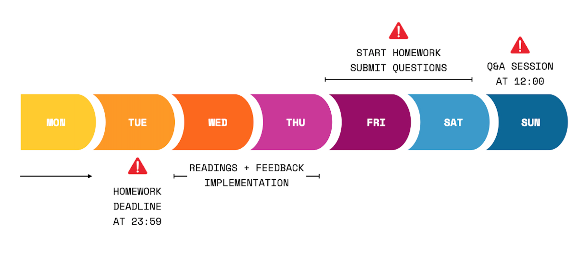

> Ajude-nos a melhorar e compartilhe seus comentários! Se você encontrar tutoriais melhores
> ou links, compartilhe-os [abrindo uma solicitação pull](https://github.com/HackYourFuture/UsingAPIs/pulls).

# Módulo #4 - Usando APIs (Frontend)

Bem-vindo ao Usando APIs! Parabéns por chegar até aqui. Você está bem no seu caminho para o topo!

Uma grande parte de ser um programador significa mover dados de um lugar para outro. Também significa trabalhar com software de outras pessoas. Neste módulo, você aprenderá sobre uma das coisas principais do que faz um desenvolvedor web: trabalhar com APIs!

## Metas de aprendizagem

Para concluir com sucesso este módulo, você precisará dominar o seguinte:

- Saiba o que é uma `Application Programming Interface` (API)
- Entenda como escrever `JavaScript assíncrono` mais legível
- Conecte-se com diferentes `APIs públicas`
- Crie um 'Aplicativo de página única' (SPA)

## Como usar este repositório

### Conteúdo do repositório

Este repositório é composto por 2 partes essenciais por semana:

1. `README`: este documento contém toda a teoria necessária que você precisa entender **enquanto** trabalha na lição de casa. Ele contém não apenas os recursos certos para aprender sobre os conceitos, mas também palestras feitas por professores do HackYourFuture. Esta é a **primeira coisa** com a qual você deve começar toda semana
2. `MAKEME`: este documento contém as instruções para o dever de casa de cada semana. Comece com os exercícios rapidamente, para que você possa fundamentar os conceitos sobre os quais leu anteriormente.

### Como estudar

Digamos que você esteja começando com o módulo Using API's. Isto é o que você faz...

1. A semana sempre começa na **quarta-feira**. A primeira coisa que você vai fazer é abrir o `README.md` dessa semana. Para a primeira semana de `Usando APIs`, isso seria [Week1 Reading](/Week1/README.md)
2. Você passa a **quarta-feira** e a **quinta-feira** examinando os recursos e tentando entender os conceitos básicos. Enquanto isso, você também implementará qualquer feedback que tenha recebido na lição de casa da semana passada (do módulo JavaScript2)
3. Na **Sexta** você começa com o dever de casa, encontrado no `MAKEME.md`. Para a primeira semana de `Usando APIs`, isso seria [Week1 Homework](/Week1/MAKEME.md)
4. Você passa a **sexta-feira** e o **sábado** brincando com os exercícios e anotando quaisquer dúvidas que possa ter
5. **Prazo 1**: você enviará suas dúvidas até **sábado, 23h59**, no canal da turma
6. No **Domingo** você vai assistir à aula. Será no formato de perguntas e respostas, o que significa que não haverá material novo. Em vez disso, suas perguntas devem ser discutidas e você pode aprender com os outros
7. Você passa a **segunda-feira** e a **terça-feira** finalizando sua lição de casa
8. **Prazo 2**: Você envia sua lição de casa para os canais certos (GitHub) antes de **terça-feira, 23h59**. Se você não puder chegar a tempo, por favor comunique ao seu mentor
9. Comece a nova semana voltando ao ponto 1!

Resumindo:

Para ter uma visão geral mais detalhada das diretrizes, leia [este documento](https://docs.google.com/document/d/1JUaEbxMQTyljAPFsWIbbLwwvvIXZ0VCHmCCN8RaeVIc/edit?usp=sharing) ou pergunte ao seu mentor/classe no Slack!

## Planejamento

| Semana | Tópico | Materiais de Leitura | Lição de casa |
| ---- | ----- | ----------------- | -------- |
| 1. | Síncrono vs assíncrono, Callbacks, Promises, The Event Loop | [Leitura W1](/Week1/README.md) | [Trabalho de casa W1](/Week1/MAKEME.md) |
| 2. | Interface de programação de aplicativos (API), busca, assíncrona/aguarda | [Leitura W2](/Week2/README.md) | [Trabalho de casa W2](/Week2/MAKEME.md) |
| 3. | Projeto individual + Entrevista como teste | [Projeto](/Week3/README.md) |

## Finalizado?

Você terminou o módulo? Toca aqui!

Se você se sentir pronto para o próximo desafio, clique [aqui](https://www.github.com/HackYourFuture/Node.js) para acessar o Node.js!

_O currículo HackYourFuture está sujeito aos direitos autorais CC BY. Isso significa que você pode usar nossos materiais livremente, mas certifique-se de nos dar crédito por isso :)_

 Esta obra está licenciada sob uma <a rel="license" href="http://creativecommons.org /licenses/by/4.0/">Licença Creative Commons Atribuição 4.0 Internacional</a>.
