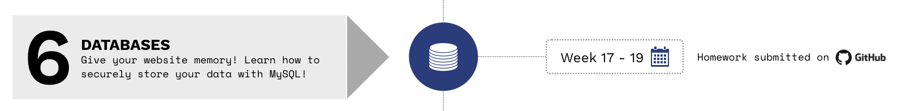

> Se você estiver seguindo o currículo do HackYourFuture, recomendamos que comece com o módulo 1: [HTML/CSS/GIT](https://github.com/HackYourFuture/HTML-CSS). Para obter uma visão geral completa do currículo HackYourFuture primeiro, clique [aqui](https://github.com/HackYourFuture/curriculum).

> Ajude-nos a melhorar e compartilhe seus comentários! Se você encontrar tutoriais ou links melhores, compartilhe-os [abrindo um pull request](https://github.com/HackYourFuture/JavaScript1/pulls).

# Módulo #6 - Bancos de dados: Armazene e recupere dados com MySQL (Backend)

Você já pensou em como seu cérebro se lembra das coisas? Isso acontece automaticamente para humanos, mas não é assim para computadores. Sempre que você for a um site e preencher alguns detalhes, por exemplo, em um formulário, essa `informação` precisa ser salva em algum lugar. Este "em algum lugar" é chamado de `banco de dados`.

Neste módulo, você aprenderá tudo sobre uma parte fundamental de qualquer aplicativo de software: como armazenar dados (com segurança), para que possam ser usados sob demanda. Você aprenderá a estruturar e agrupar dados para que seus aplicativos saibam onde encontrar e armazenar os dados corretos.

## Antes que você comece

**Antes** da sua primeira aula você precisa instalar o software necessário: MySQL. Isso difere dependendo do seu sistema operacional:

Durante a instalação do MySQL v8, em uma das últimas etapas você configurará a criptografia de senha.
Aqui está [uma captura de tela da etapa](https://i.stack.imgur.com/nFnWV.jpg).
**Você deve selecionar _Legacy_ para que todos os scripts fornecidos possam se conectar.**

- Para Windows, baixe o [MySQL Community Server](https://dev.mysql.com/downloads/mysql/)
- Para Linux (Ubuntu), assista ao vídeo a seguir: [Instalação do MySQL no Linux (Ubuntu)](https://www.youtube.com/watch?v=Y_LibBhOGOY)
- Para MacOS, assista ao vídeo a seguir: [Instalando o MySQL no MacOS](https://www.youtube.com/watch?v=HxCXyxFEA0s)

Depois, leia o seguinte [documento](./setup-db.md) para saber como configurar seu banco de dados **antes** de sua primeira aula.

## Metas de aprendizagem

Neste módulo, você se familiarizará com a complexidade do armazenamento de dados. Ao final, você aprendeu:

- Qual é o significado de uma `entidade de banco de dados`
- Como trabalhar com `Linguagem de Consulta Estruturada` (SQL)
- Aprenda tudo sobre o `modelo relacional`
- Reconhecer a `configuração básica de um banco de dados`
- Conhecer o `MySQL` como exemplo de um sistema de banco de dados relacional
- Aprenda sobre bancos de dados `NoSQL`, com ênfase em `MongoDB`

## Como usar este repositório

### Conteúdo do repositório

Este repositório é composto por 3 partes essenciais:

1. `README`: este documento contém toda a teoria necessária que você precisa entender **enquanto** trabalha na lição de casa. Ele contém não apenas os recursos certos para aprender sobre os conceitos, mas também palestras feitas por professores do HackYourFuture. Esta é a **primeira coisa** com a qual você deve começar toda semana
2. `MAKEME`: este documento contém as instruções para o dever de casa de cada semana. Comece com os exercícios rapidamente, para que você possa fundamentar os conceitos sobre os quais leu anteriormente.
3. `PLANO DE AULA`: este documento é uma referência para professores. No entanto, como estudante, não tenha vergonha de dar uma olhada também!

### Como estudar

Digamos que você esteja começando com o módulo Bancos de Dados. Isto é o que você faz...

1. A semana sempre começa na **quarta-feira**. A primeira coisa que você vai fazer é abrir o `README.md` dessa semana. Para a primeira semana de `Bancos de dados`, isso seria [Leitura da Semana1](/Week1/README.md)
2. Você passa a **quarta-feira** e a **quinta-feira** examinando os recursos e tentando obter uma compreensão básica dos conceitos. Enquanto isso, você também implementará qualquer feedback recebido na lição de casa da semana passada (do módulo Node.js)
3. Na **Sexta** você começa com o dever de casa, encontrado no `MAKEME.md`. Para a primeira semana de `Bancos de dados`, isso seria [Tarefa de casa da Semana1](/Semana1/MAKEME.md)
4. Você passa a **sexta-feira** e o **sábado** brincando com os exercícios e anotando quaisquer dúvidas que possa ter
5. **Prazo 1**: você enviará suas dúvidas até **sábado, 23h59**, no canal da turma
6. No **Domingo** você vai assistir à aula. Será no formato de perguntas e respostas, o que significa que não haverá material novo. Em vez disso, suas perguntas devem ser discutidas e você pode aprender com os outros
7. Você passa a **segunda-feira** e a **terça-feira** finalizando sua lição de casa
8. **Prazo 2**: Você envia sua lição de casa para os canais certos (GitHub) antes de **terça-feira, 23h59**. Se você não puder chegar a tempo, por favor comunique ao seu mentor
9. Comece a nova semana voltando ao ponto 1!

Resumindo:

Para ter uma visão geral mais detalhada das diretrizes, leia [este documento](https://docs.google.com/document/d/1JUaEbxMQTyljAPFsWIbbLwwvvIXZ0VCHmCCN8RaeVIc/edit?usp=sharing) ou pergunte ao seu mentor/classe no Slack!

## Planejamento

| Semana | Tópico | Leituras | Lição de casa | Plano de aula |
| ---: | -------------------------------------------------- --------------------------- | ------------------------------ | ------------------------------ | -------------------------- |
| 1. | O que é um banco de dados, Entidades, Estruturas de dados, Linguagem de consulta estruturada (SQL) | [Leituras W1](Semana1/README.md) | [Dever de casa W1](Week1/MAKEME.md) | [Plano de aula W1](Week1/LESSONPLAN.md) |
| 2. | Identificadores, Relacionamentos, Modelagem de Domínio, Comandos SQL Avançados | [Leituras W2](Semana2/README.md) | [Dever de casa W2](Week2/MAKEME.md) | [Plano de aula W2](Week2/LESSONPLAN.md) |
| 3. | Normalização, Transações, SQL Injection, NoSQL básico (com MongoDB) | [Leituras W3](Semana3/README.md) | [Trabalho de casa W3](Week3/MAKEME.md) | [Plano de aula W3](Week3/LESSONPLAN.md) |
| 4. | Comandos avançados NoSQL, Paginação, SQL vs NoSQL | [Leituras W4](Week4/README.md) | [Trabalho de casa W4](Week4/MAKEME.md) | |

## Finalizado?

Você terminou o módulo? Você está quase no topo!

Se você se sentir pronto para o próximo desafio, clique [aqui](https://www.github.com/HackYourFuture/react) para acessar o React!

_O currículo HackYourFuture está sujeito aos direitos autorais CC BY. Isso significa que você pode usar nossos materiais livremente, mas certifique-se de nos dar crédito por isso :)_

 Esta obra está licenciada sob uma <a rel="license" href="http://creativecommons.org /licenses/by/4.0/">Licença Creative Commons Atribuição 4.0 Internacional</a>.
