# Dicas do VSCode

## Instalação

Baixe e instale a versão apropriada do VSCode para seu sistema operacional no [site do VSCode](https://code.visualstudio.com/).

## Algumas extensões úteis

O VSCode pode ser estendido com _extensions_. Há três que recomendamos que você instale desde o primeiro dia.

1. **Verificador Ortográfico de Código**. Entendemos perfeitamente que vocês às vezes têm dificuldade com a ortografia correta em inglês ao escolher nomes para variáveis e funções em seus programas JavaScript. Isso não é nada para se envergonhar, mas por que não obter ajuda de uma extensão útil?

2. **ESLint**. Esta extensão pode verificar seu código JavaScript em busca de erros óbvios, como variáveis indefinidas, variáveis não utilizadas, etc.

3. ** Mais bonito - Formatador de código**. Prettier é um formatador de código que impõe um estilo consistente analisando seu código e reimprimindo-o com suas próprias regras que levam em consideração o comprimento máximo da linha, quebrando o código quando necessário.

   > Se você tiver outras extensões de formatador de código instaladas, por exemplo, **Beautify**, certifique-se de removê-las, pois podem entrar em conflito com **Prettier**.
   
4. **abra no navegador**. Esta extensão é útil durante as lições de JavaScript HYF. Ele permite que você abra rapidamente um arquivo HTML no navegador diretamente do VSCode.

5. **Servidor Ativo**. Inicie um servidor local de desenvolvimento com recurso de recarga ao vivo para páginas estáticas e dinâmicas.

### Instruções de instalação

1. Inicie o VSCode.

2. Pressione o botão na área da margem esquerda (chamada **Barra de Atividades**), conforme mostrado abaixo:

   

3. No campo de entrada no canto superior esquerdo, digite `code spell checker` como mostrado aqui:

   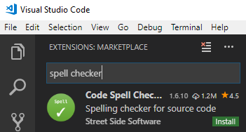

4. Pressione o botão verde `instalar` do **Code Spellchecker**.

5. Instale as extensões restantes repetindo as etapas 3 e 4, digitando os nomes das extensões:

   - ESLint
   - Mais bonito - Formatador de código
   - abra no navegador
   - Servidor ao vivo

6. Quando a extensão final terminar de instalar, você notará que o botão verde `instalar` muda para um botão azul `recarregar`. Pressione este botão para recarregar o VSCode e ativar as extensões recém-instaladas.
7. Agora você precisa instalar um pacote global do Node para oferecer suporte ao ESLint. Abra uma janela de terminal no VSCode selecionando **View**, **Integrated Terminal** na barra de menus.
8. Uma janela de terminal é aberta na metade inferior da janela do VSCode. Nesta janela, digite o comando abaixo (em sistemas Linux e MacOS você pode precisar prefixar este comando com `sudo`, por exemplo `sudo npm ...`):

   ```
   npm install -g eslint
   ```

## Personalize as configurações do VSCode

Recomendamos que você aplique algumas alterações nas configurações padrão do VSCode para ajudá-lo a criar um código JavaScript bem formatado. Siga esses passos:

1. Pressione a tecla de função F1 e digite o seguinte na caixa de texto:

    ```
    abrir configurações
    ```

    Um menu aparecerá com as opções de menu correspondentes:

   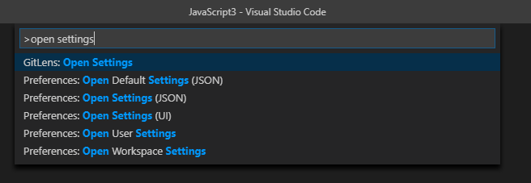

2. Selecione **Configurações de abertura de preferências (JSON)** na lista

5. Copie o conteúdo mostrado abaixo e cole-o (ou seja, substitua) o conteúdo existente.

   ``` json
   /// Coloque suas configurações neste arquivo para substituir as configurações padrão
   {
     "editor.bracketPairColorization.enabled": true,
     "editor.detectIndentation": false,
     "editor.formatOnSave": verdadeiro,
     "editor.minimap.enabled": falso,
     "editor.renderIndentGuides": true,
     "editor.tabSize": 2,
     "editor.codeActionsOnSave": {
       "source.fixAll": verdadeiro
     },
     "eslint.autoFixOnSave": verdadeiro,
     "files.autoSave": "onFocusChange",
     "prettier.singleQuote": verdadeiro,
     "prettier.trailingComma": "all"
   }
   ```

6. Feche as guias Configurações.

## Configurando o Shell Padrão (somente usuários do Windows)

Por padrão, uma instalação do VSCode no Windows usa o **PowerShell** para o Terminal Integrado. Para alterar isso para **Git Bash**, siga estas etapas:

1. Pressione a combinação de teclas **Ctrl-Shift-p** para abrir a Paleta de Comandos VSCode.
2. Digite as palavras: `select default`
3. No menu suspenso, selecione **Terminal: Select Default Shell**
4. Um novo menu suspenso aparecerá. Nesse menu, selecione **Git Bash**.

## Usando o VSCode para sua lição de casa

Você obterá o máximo do VSCode se organizar seu trabalho em pastas, digamos, uma pasta para cada semana no módulo JavaScript.

(Mais tarde no curso, você estará "clonando" repositórios Git em pastas locais como base para sua lição de casa ou projetos.)

Para começar a trabalhar com o VSCode em uma pasta específica, inicie o VSCode e abra a pasta relevante: no menu, selecione **File**, **Open Folder**. O VSCode agora abrirá esta pasta para ser sua "pasta do projeto", até que você feche o VSCode ou abra outra pasta.

> Crie o hábito no VSCode de sempre abrir a **pasta** que contém o projeto em que você está trabalhando, em vez de arquivos individuais nessa pasta.

Na figura abaixo a pasta chamada `JavaScript2` foi aberta no VSCode. A árvore de diretórios dessa pasta é mostrada no painel **Explorer**. O nome da pasta `JAVASCRIPT2` é exibido em letras maiúsculas na barra de título do painel da árvore de diretórios.

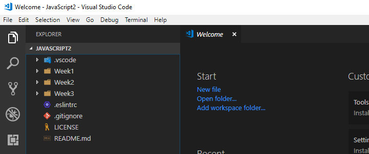

## Criando seu arquivo JavaScript

Agora você está pronto para começar a adicionar seu primeiro arquivo JavaScript.

1. Abra a pasta onde você irá manter seus arquivos de trabalho, por exemplo `hyf-javascript1`.
2. Clique com o botão direito do mouse em um espaço vazio na janela `EXPLORER` e selecione **New File** no menu de contexto. Você verá o seguinte:

   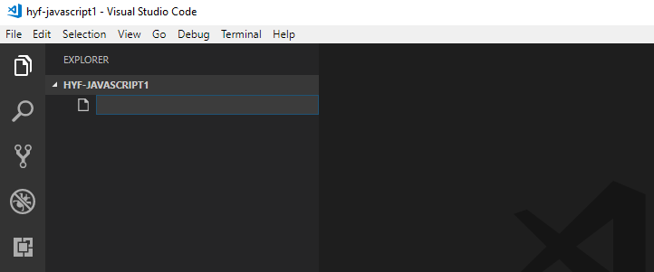

3. Digite um nome de arquivo na caixa de edição, por exemplo. `app.js` e pressione **Enter**. Isso adicionará um arquivo `apps.js` à sua pasta de trabalho e abrirá uma guia do editor para o arquivo recém-criado.

   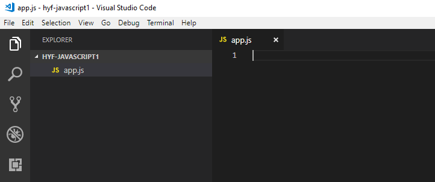

5) Comece a digitar seu código JavaScript no novo arquivo.

   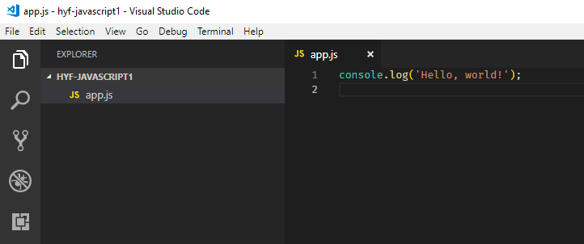

6) Você também pode criar subpastas no painel `EXPLORER`. Clique com o botão direito em um espaço vazio na janela `EXPLORER` e selecione **New Folder** no menu de contexto, por exemplo `week1`.

   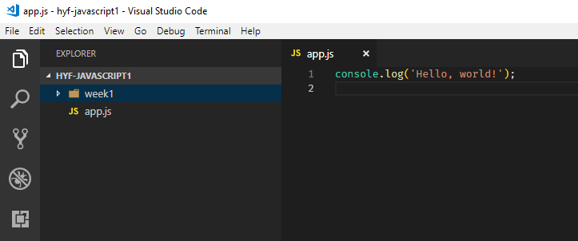

7) Para criar um novo arquivo na subpasta, clique com o botão direito do mouse na subpasta e digite um nome de arquivo na caixa de entrada.

   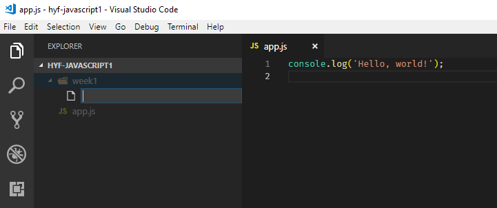

8) Fique atento aos sublinhados ondulados coloridos em seu código. Esses são avisos do ESLint ou do verificador ortográfico de que algo pode estar errado. Se você vir esses sublinhados ondulados, passe o ponteiro do mouse sobre o texto sublinhado e uma dica de ferramenta aparecerá explicando o que pode estar errado.
9) Você também pode abrir o painel "problema" selecionando **Visualizar**, **Problemas** no menu para ver os problemas identificados.
10) Preste atenção também na parte inferior esquerda da janela do VSCode, ou seja, a barra de status. Dá uma indicação do número de erros e avisos emitidos. Na figura abaixo há zero erros, 7 avisos (geralmente do ESLint) e 14 mensagens informativas (geralmente do corretor ortográfico).

    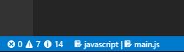

## Alguns comandos de atalho úteis

Na seção anterior, frequentemente o referíamos à barra de menus para selecionar comandos. À medida que você se torna mais proficiente com o VSCode, você pode querer inspecionar esses menus um pouco mais de perto e observar os comandos de atalho listados na margem direita. Por exemplo, o comando de atalho para **Arquivo**, **Novo** é listado como Ctrl+N (pressione as teclas `Ctrl` e `N` simultaneamente) em um PC Windows ou Linux e ⌘N em um Mac .

Aqui estão alguns comandos de atalho que você usará muitas vezes ao dia e com os quais recomendamos que você se familiarize desde o primeiro dia:

| Operação | Janelas | Mac | Linux |
| -------------------------------------------------- -------------- | ----------- | --- | ------------ |
| **Formatar Documento** (tornar bonito) | Shift-Alt-F | ⇧⌥F | Ctrl-Shift-I |
| **Pesquisar** (Localizar) | Ctrl+F | ⌘F | Ctrl+F |
| **Substituir** (Localizar e substituir) | Ctrl+H | ⌥⌘F | Ctrl+H |
| **Rename Symbol** (altere todos os nomes no arquivo para um nome diferente) | F2 | F2 | F2 |
| Abra uma janela **Terminal Integrado** no VSCode | Ctrl+' | ⌃\` | Ctrl+' |

- **Formatar Documento**. Este comando reformata seu arquivo JavaScript em um formato padrão geralmente aceito, usando recuo adequado, uso adequado de espaços, colocação de chaves e muito mais. Um documento bem formatado ajuda você a entender melhor seu próprio código e seus professores, mentores e colegas também vão adorar quando revisarem seu trabalho.

  _Com o VSCode na ponta dos dedos, não há mais desculpa para enviar trabalhos de casa mal formatados!_

- **Procurar**. Procure o texto especificado.
- **Substituir**. Substitua o texto especificado por algum outro texto.

  Na figura abaixo, a janela pop-up **Replace** é mostrada. O pop-up **Pesquisar** é semelhante, mas com apenas um campo de entrada.

  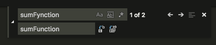

  - O botão `Aa` ativa a opção **Match Case**.
  - O botão `Ab|` corresponde a **Somente palavras inteiras**.
  - O botão `.*` permite pesquisar usando _expressões regulares_, que você pode encontrar em módulos posteriores como um tópico avançado de programação JavaScript.
  - O botão `c-b` próximo ao segundo campo de entrada substitui a próxima ocorrência do texto correspondente.
  - O botão `ab-ac` substitui **todas** as ocorrências do texto correspondente.
  - As setas esquerda e direita movem o cursor para a partida anterior e seguinte.
  - Para se livrar do pop-up pressione `Esc` ou pressione o botão `x`.

- **Renomear símbolo**. Este comando renomeia todas as ocorrências de uma variável JavaScript ou nome de função. Para fazer isso, mova o cursor de texto para o nome da variável ou função e pressione F2. Uma pequena janela pop-up aparecerá na qual você poderá digitar um novo nome. Pressione Enter para finalizar a alteração ou Esc para cancelá-la.

- **Abra uma janela do Terminal Integrado**. Já abordamos isso quando mencionamos o comando de menu **View**, **Integrated Terminal**.

## Executando e depurando seu código com o depurador VSCode Node

Se o seu programa JavaScript estiver contido em um único arquivo, a maneira mais fácil de executar e examinar seu código é começar direto no VSCode.

1. Pressione a tecla de função F5 para iniciar o depurador VSCode.

2. Você será solicitado a selecionar um ambiente. Escolha `Node.js` como mostrado abaixo.

   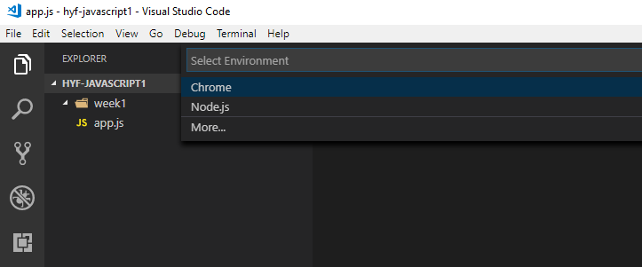

Isso inicia seu programa no depurador VSCode.

### Colocando pontos de interrupção e inspecionando variáveis

Isso é abordado em aula.

### Outras informações

Observe que o VSCode está sendo desenvolvido ativamente. No momento, há um ciclo de lançamento mensal, portanto, não se surpreenda quando você for solicitado uma vez por mês a atualizar para a versão mais recente. Aconselhamos que você atualize quando solicitado (naturalmente, não quando estiver no meio de algo que não deseja interromper).

Você pode encontrar informações detalhadas sobre o VSCode no [site do VSCode](https://code.visualstudio.com/docs).
