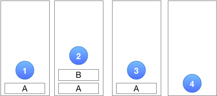
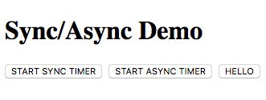
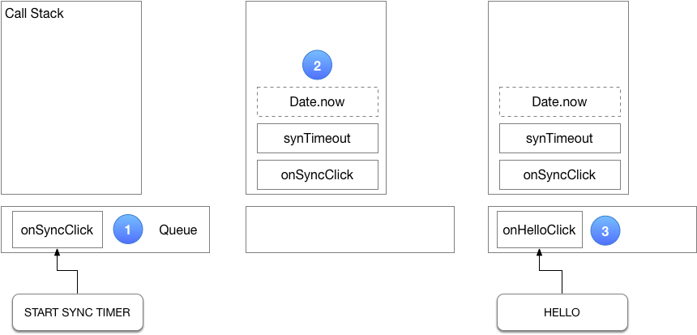
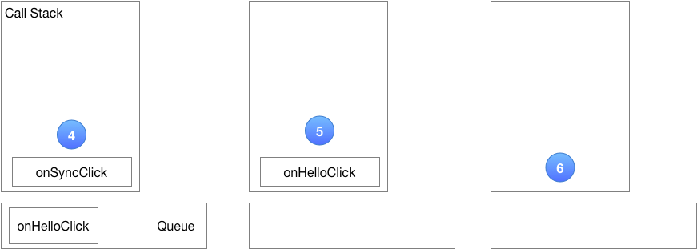
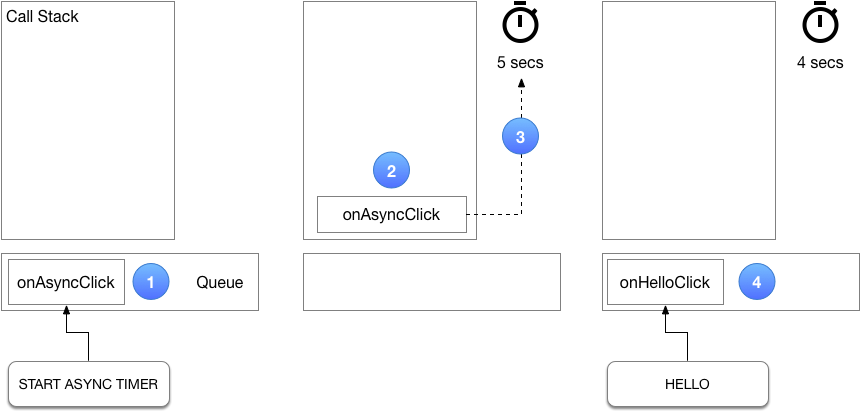
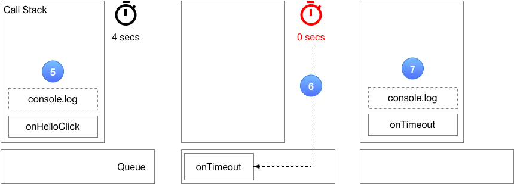
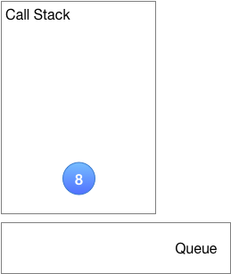

# Loop de eventos

## Vídeo do youtube

Este artigo acompanha o excelente vídeo do YouTube [What the heck is the event loop afinal?](https://www.youtube.com/watch?v=8aGhZQkoFbQ) de Philip Roberts.

[](https://www.youtube.com/watch?v=8aGhZQkoFbQ "Event Loop")

## Introdução

A maneira de programar ao desenvolver aplicativos JavaScript para o navegador às vezes é chamada de _Programação Orientada a Eventos_. Uma vez que um programa JavaScript tenha sido carregado no navegador e tenha completado sua inicialização, ele normalmente está esperando que “eventos” específicos aconteçam. Esses eventos podem assumir a forma de movimentos e cliques do mouse, interações de teclado e eventos relacionados à rede (por exemplo, uma resposta de um `XMLHttpRequest`)*.

Para que um programa JavaScript responda a um (tipo de) evento específico, um programador precisa adicionar um "ouvinte de evento" para o tipo de evento de interesse ao elemento DOM de destino ou objeto de solicitação de rede.

Exemplos de eventos são:

- um evento `'click'` de um elemento de botão HTML.
- um evento `'load'` de um XMLHttpRequest.

Um programa JavaScript também pode configurar um ou mais temporizadores e executar uma função quando um tempo limite específico expirar. Pode-se considerar estes eventos _iniciados por software_.

Quando ocorre um evento, o navegador coloca um objeto com informações sobre o evento junto com a função JavaScript designada para tratar o evento em uma Fila de Eventos. Quando o mecanismo JavaScript está ocioso (ou seja, quando a pilha de chamadas está vazia, veja abaixo), ele pega o próximo evento da fila de eventos e invoca o manipulador de eventos correspondente, passando o objeto de evento como parâmetro. Este mecanismo pode ser representado pelo seguinte pseudo-código:

```
// Loop de eventos
while (waiting_for_event) {
  execute_event_handler(evento)
}
```


\* Observação: há mais [APIs da Web](https://developer.mozilla.org/en-US/docs/Web/API) disponíveis no navegador que podem gerar eventos, por exemplo, a [API SpeechSynthesis](https://developer.mozilla.org/en-US/docs/Web/API/SpeechSynthesis) e a [API MIDIAccess](https://developer.mozilla.org/en-US/docs /Web/API/MIDIAccess), para citar apenas dois.

## Pilha de chamadas

O mecanismo JavaScript mantém uma [pilha de chamadas](https://developer.mozilla.org/en-US/docs/Glossary/Call_stack) para acompanhar as chamadas de função aninhadas. (A pilha de chamadas é semelhante a uma matriz JavaScript para a qual os itens são enviados e de quais itens são exibidos.)

A Figura 1 abaixo mostra a pilha de chamadas para um cenário em que a função **A**() chama a função **B**(). A função atualmente em execução é sempre a que está no topo da pilha de chamadas. Neste caso, a execução começa com a função **A**().

1. O mecanismo JavaScript empurra **A**() na pilha de chamadas e inicia sua execução.
2. A função **A**() chama a função **B()**: o mecanismo JavaScript suspende a execução de **A**() (observando de onde parou), empurra **B**( ) na pilha de chamadas e começa a executar **B**().
3. Quando a função **B**() retorna, o mecanismo JavaScript remove **B**() da pilha. Como a função **A**() agora está novamente no topo da pilha, o mecanismo JavaScript retoma **A**() no ponto em que parou.
4. Finalmente, quando a função **A**() retorna, ela é removida da pilha e com a pilha de chamadas agora vazia, o mecanismo JavaScript entra em seu loop de eventos.



Figura 1. Pilha de Chamadas

## Código de exemplo

Usaremos o aplicativo de exemplo abaixo para nossa discussão sobre o loop de eventos. O aplicativo consiste em uma página HTML simples com três botões e um arquivo JavaScript associado. A página da web se parece com isso:



Todas as saídas resultantes de cliques de botões serão impressas no console do navegador.

### index.html

```html
<!DOCTYPEhtml>
<html>
<cabeça>
  <title>Demonstração de sincronização/assíncrona</title>
  <estilo>
    botão {
      margem direita: 4px;
    }
  </style>
</head>
<corpo>
  <div>
    <h1>Demonstração de sincronização/assíncrona</h1>
    <button id="btn-sync">INICIAR TEMPORIZADOR DE SINCRONIZAÇÃO</button>
    <button id="btn-async">INICIAR TEMPORIZADOR ASYNC</button>
    <button id="btn-hello">OLÁ</button>
  </div>
  <script src="app.js"></script>
</body>
</html>
```

### app.js

O arquivo JavaScript `app.js` adiciona um ouvinte de evento `'click'` para cada um dos três botões. Em vez de usar funções anônimas para os manipuladores de eventos, todas as funções recebem um nome para que esses nomes apareçam na pilha de chamadas, caso executemos esse código no depurador do Chrome.

``` js
'usar estrito';
{
  function synTimeout(atraso) {
    const stopTime = Date.now() + delay;
    while (Date.now() < stopTime);
  }

  function addSyncOnClickListener() {
    documento
      .getElementById('btn-sync')
      .addEventListener('click', function onSyncClick() {
        console.log('iniciar cronômetro de sincronização');
        synTimeout(5000);
        console.log('parar cronômetro de sincronização');
      });
  }

  function addAsyncOnClickListener() {
    documento
      .getElementById('btn-async')
      .addEventListener('click', function onAsyncClick() {
        console.log('iniciar timer assíncrono');
        setTimeout(função onTimeout() {
          console.log('parar temporizador assíncrono');
        }, 5000);
      });
  }

  function addHelloOnClickListener() {
    documento
      .getElementById('btn-hello')
      .addEventListener('click', function onHelloClick() {
        console.log('Olá, mundo!');
      });
  }

  window.onload = () => {
    addSyncOnClickListener();
    addAsyncOnClickListener();
    addHelloOnClickListener();
  };
}
```

### Síncrono, código de bloqueio

Na Figura 2.1 abaixo, quando o botão **START SYNC TIMER** é clicado ①, um evento `click` com seu manipulador de eventos `onSyncClick` é colocado na Event Queue e, como a pilha de chamadas está vazia, é executada imediatamente. A função `onSyncClick` chama a função `synTimeout`, passando o atraso de tempo desejado em milissegundos no parâmetro `delay`. A pilha de chamadas neste momento é descrita em ②.

A função `synTimeout` continua correndo em um loop `while` apertado, em cada iteração do loop chamando `Date.now()` para verificar se o atraso especificado já foi alcançado. Enquanto o mecanismo JavaScript está ocupado executando esse loop `while`, ele não pode executar nenhum outro código. Em particular, ele não pode pegar eventos da Fila de Eventos, por exemplo, clicar em eventos do botão **HELLO**, enquanto o loop está sendo executado ③. O manipulador de eventos `onHelloClick` aguarda a execução na Fila de Eventos (com o navegador parecendo não responder) até que a função `synTimeout` seja concluída e, com ela, a função `onSyncClick` (Figura 2.2, ④).



Figura 2.1 O Event Loop - código de bloqueio.

Neste ponto, a pilha de chamadas fica vazia e o loop de eventos pode pegar `onHelloClick` da fila de eventos e executá-lo ⑤. No navegador, isso é percebido como uma resposta demorada e lenta ao clique no botão **HELLO**.

Finalmente, quando o manipulador de eventos `onHelloClick` termina a execução, a pilha de chamadas fica vazia novamente ⑥, e o loop de eventos aguarda mais eventos futuros.

**Em conclusão:** Código de bloqueio síncrono, como implementado por
a função `synTimeout` deve ser evitada, pois faz com que o aplicativo pareça não responder.



Figura 2.2 O Event Loop - código de bloqueio - continuação.

## Código assíncrono e sem bloqueio

Em contraste, na Figura 3.1, quando clicamos no botão **START ASYNC TIMER** ①, o manipulador de eventos `onAsyncClick` é colocado e a Event Queue e, como a pilha de chamadas está vazia, é executada imediatamente ②. Ele, por sua vez, chama a função `setTimeout` fornecida pelo navegador (**não** o mecanismo JavaScript!). Isso inicia um temporizador interno ao navegador ③. Uma vez que o temporizador foi configurado, a função `setTimeout` retorna e, posteriormente, o manipulador de eventos `onAsyncClick` é encerrado.

Suponha que um segundo depois cliquemos no botão **HELLO** ④. Isso faz com que o manipulador de eventos `onHelloClick` seja colocado na Fila de Eventos. Como a pilha de chamadas está vazia, o manipulador de eventos `onHelloClick` é executado imediatamente ⑤ e, posteriormente, é encerrado.



Figura 3.1 O Event Loop - código não bloqueante.


Quando algum tempo depois o temporizador configurado na etapa 3 expirar, o retorno de chamada `onTimeout` é colocado na fila de eventos ⑥. Novamente, como a pilha de chamadas está vazia naquele momento, ela é executada imediatamente ⑦.



Figura 3.2 O Event Loop - código sem bloqueio - continuação.

Subseqüentemente, ele sai, deixando a pilha de chamadas vazia novamente ⑧, pronta para receber novos eventos do loop de eventos sempre que eles ocorrerem.



Figura 3.3 O Event Loop - código sem bloqueio - continuação.

**Em conclusão:** o código assíncrono e sem bloqueio deve ser sempre preferido para garantir que o aplicativo mantenha sua capacidade de resposta.

## Mais Informações

Mozilla Developer Network: [Modelo de simultaneidade e loop de eventos](https://developer.mozilla.org/en-US/docs/Web/JavaScript/EventLoop)