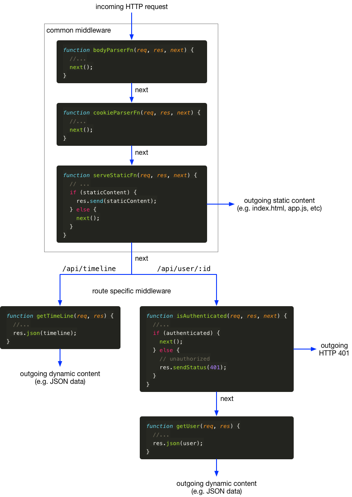

# Expresso

## Objetivo

Este artigo fornece uma visão geral do Express e como ele pode ser usado para construir aplicativos de servidor HTTP complexos baseados no módulo `http` do Node.js.

## Um servidor Express simples

Vamos criar um servidor Express simples com o Node:

``` js
const http = require('http');
const express = require('express');
const app = express();

http.createServer(app)
  .listen(3000, () => {
    console.log('Express server escutando na porta 3000');
  });
```

Então, o que é `app` aqui? A função `http.createServer()` faz parte do módulo `http` do Node.js. A inspeção da documentação do Node.js mostra que `createServer()` espera um **request listener** como argumento. Esta é uma função que recebe dois argumentos: um objeto de solicitação e um objeto de resposta, nomeados aqui respectivamente: `req` e `res`.

``` js
function requestListener(req, res) {
  // ...
}
```

Portanto, `app` deve ser (e na verdade é) uma função de ouvinte de solicitação:

``` js
função app(req, res) {
  // ...
}
```

Mas, na verdade, `app` é muito mais do que isso. O pacote Express adiciona várias propriedades à função `app`. Lembre-se de que uma função JavaScript é essencialmente um objeto JavaScript, embora seja de um tipo especial. Você pode adicionar propriedades a qualquer objeto JavaScript, incluindo objetos de função, como `app` aqui.

Abaixo está uma representação simplificada dos componentes internos do Express:

``` js
// Implementação interna simplificada do módulo Node 'express'

function criarAplicativo() {
  const app = function(req, res) {
    // ...
  }
  
  app.use = function use(...middleWareFns) {
    // adiciona middleware compartilhado em todas as rotas
  };

  app.get = function get(path, ...middleWareFns) {
    // adiciona middleware para o método GET para uma rota específica
  }

  //etc

  aplicativo de retorno;
}

module.exports = criarAplicativo;
```

## Um aplicativo Expresso do mundo real

A Figura 1 abaixo mostra um exemplo do mundo real (embora reduzido) de um aplicativo Express (este é retirado do aplicativo **Hyfer**). Vamos dissecar esse trecho de código nas próximas seções.

``` js
const http = require('http');
const express = require('express');
compressão const = require('compressão');
const bodyParser = require('body-parser');
const cookieParser = require('cookie-parser');
const serveStatic = require('serve-static');

const app = express();

// middleware compartilhado para todas as rotas
app.use(bodyParser.json());
app.use(cookieParser());
app.use(serveStatic('./public'));

// rotear manipuladores de requisições específicas
app.get('/api/timeline', getTimeLine);
app.get('/api/user/:id', isAuthenticated, getUser);

http.createServer(app)
  .listen(3000, () => {
    console.log('Express server escutando na porta 3000');
  });

// exemplo de implementações de manipulador de requisições

function getTimeLine(req, res) {
  //...
  res.json(linha do tempo);
}

function getUser(req, res) {
  //...
  res.json(usuário);
}

function isAuthenticated(req, res, next) {
  //...
  if (autenticado) {
    Next();
  } senão {
    // não autorizado
    res.sendStatus(401);
  }
}
```

Listagem 1: Um aplicativo Express do mundo real

## Middleware

Na documentação do Express, o termo **middleware** é usado para descrever um tipo especial de manipulador de solicitação. Tem a seguinte [assinatura de função](https://developer.mozilla.org/en-US/docs/Glossary/Signature/Function):

``` js
function middlewareFn(req, res, next) {
  // ...
}
```

Observe que um terceiro parâmetro, `next`, é adicionado à assinatura da função. Este parâmetro `next` é uma função que não recebe parâmetros.

O Express constrói um pipeline de funções de middleware através do qual uma solicitação HTTP de entrada (`req`) é roteada e uma resposta HTTP de saída (`res`) é enviada de volta.

Espera-se que cada função de middleware passe a solicitação para a próxima função no pipeline, ou seja, chamando `next()`, ou envie uma resposta por conta própria. Neste último caso, o tratamento do pedido termina ali mesmo. Caso contrário, a próxima função de middleware no pipeline é chamada.

As funções de middleware podem (e geralmente fazem) fazer alterações no objeto de solicitação, no objeto de resposta ou em ambos, antes de passá-las adiante. Na verdade, esse é o objetivo principal do middleware: adicionar funcionalidades e informações à medida que a solicitação avança pelo pipeline.

Em última análise, deve haver alguma função de middleware no pipeline que envie uma resposta. Caso contrário, o cliente atingirá o tempo limite com um erro.

A Figura 1 abaixo ilustra a configuração de middleware da Listagem 1 acima.



Figura 1. Representação do pipeline de middleware expresso do código da Listagem 1.

Todas as solicitações recebidas são roteadas através das funções de middleware comuns adicionadas e configuradas através de `app.use()`. Em seguida, as solicitações são roteadas para funções de middleware com base no método de solicitação (por exemplo, um `GET`) e no caminho da solicitação (por exemplo, `/api/timeline`). Essas funções geralmente são adicionadas e configuradas através de `app.get()`, `app.post()`, etc.

As rotas específicas do aplicativo são tratadas por manipuladores de solicitação em nós folha do pipeline. Por serem nós folha, eles geralmente deixam de fora o parâmetro `next`, pois não há 'next' para passar a solicitação.

### Middleware condicional

Na Listagem 1 e na Figura 1 há duas funções de middleware que chamam condicionalmente `next()`.

1. O primeiro vem do middleware [serve-static](https://github.com/expressjs/serve-static). Este middleware verifica se a URL solicitada corresponde a um arquivo (por exemplo, `index.html`) na pasta do servidor designada para hospedar conteúdo estático. Em caso afirmativo, esse arquivo é servido como resposta. Caso contrário, a função de middleware chama `next()` para continuar o pipeline.

2. A segunda neste exemplo é a função `isAuthenticated()` que testa se o usuário solicitante está autenticado (os detalhes de como isso é feito são deixados de fora aqui). Se o usuário solicitante for um usuário autenticado, a solicitação terá permissão para passar. Caso contrário, um `HTTP 401 - Unauthorized` é enviado de volta, sem permitir que a solicitação continue.

## Leitura adicional

Há muito mais no Express do que pode ser abordado neste artigo.

- [Site oficial do Express](https://expressjs.com/)
- [Métodos de solicitação HTTP](https://developer.mozilla.org/en-US/docs/Web/HTTP/Methods)
- [códigos de status de resposta HTTP](https://developer.mozilla.org/en-US/docs/Web/HTTP/Status)
