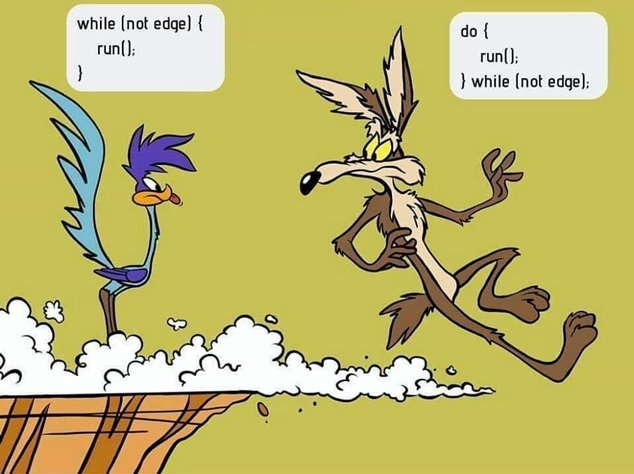

# Rotações

Um loop é uma construção de programação para executar uma ação repetitiva. Frequentemente (mas nem sempre) a ação repetitiva envolve acessar ou manipular os elementos individuais de um array.

Usaremos a matriz de nomes de meses fornecida abaixo para ilustrar os vários tipos de construções de loop disponíveis em JavaScript. Nos exemplos, imprimiremos os nomes dos meses individuais usando uma instrução `console.log`.

``` js
const meses = [
  'Janeiro',
  'Fevereiro',
  'Marchar',
  'Abril',
  'Maio',
  'Junho',
  'Julho',
  'Agosto',
  'Setembro',
  'Outubro',
  'Novembro',
  'Dezembro',
];
```

## enquanto

O loop `while` é provavelmente o mais simples do grupo. Sua sintaxe geral é:

``` js
enquanto (cond.) {
  // bloco de instruções a ser repetido
}
```

O 'corpo' do loop (ou seja, o bloco de instruções incluindo as chaves) é executado enquanto a condição 'cond' for verdadeira. Para que este laço while seja executado pelo menos uma vez e termine em tempo finito, duas pré-condições devem ser cumpridas:

1. A condição 'cond' deve inicialmente ser verdadeira.
2. Algum código dentro do bloco de código deve eventualmente fazer com que a condição se torne falsa.

Aplicado ao nosso array `months`, o loop while ficaria assim:

``` js
const meses = [
  ...
];

deixe índice = 0;
const len = meses.comprimento; // 12

while (índice < len) {
  console.log(meses[índice]);
  índice += 1;
}
```

Neste exemplo, as duas pré-condições mencionadas anteriormente são atendidas:

1. A condição `index < len` inicialmente é verdadeira porque `index` é inicializado com `0` e sabemos que `len` é fixado no valor de `12` (daí o uso de `const` em vez de `let `).
2. Como o valor de `index` é incrementado em um cada vez que o corpo do loop é executado, haverá um ponto no tempo em que a condição do loop se tornará falsa. Isso acontecerá quando o valor `index` se tornar `12` e `index < len` não for mais verdadeiro.

Se a pré-condição 2 **não** for atendida, seu loop será executado para sempre. Isso é o que é comumente chamado de _loop infinito_. Seu código parecerá 'travar' quando isso acontecer, e você precisará de alguma forma encerrar o programa e corrigir o problema (por exemplo, pressione Ctrl-C ao executar no Node).

Mais informações sobre o MDN: [while](https://developer.mozilla.org/en-US/docs/Web/JavaScript/Reference/Statements/while)

## fazer enquanto

Esta é uma variação do loop while discutido acima. Sua sintaxe geral é:

``` js
Faz {
  // bloco de instruções a ser repetido
} enquanto (cond);
```

O loop do...while é executado pelo menos uma vez, porque a condição do loop é avaliada no _end_ do loop e não no _início_ como é o caso do loop `while` regular.

Aplicado ao nosso exemplo de 'meses', o código ficaria assim:

``` js
const meses = [
  ...
];

deixe índice = 0;
const len = meses.comprimento;

Faz  {
  console.log(meses[índice]);
  índice += 1;
} while (índice < len)
```

Recomendamos que você não use o loop `do...while`, exatamente pelo motivo de que o corpo do loop é executado pelo menos uma vez sem levar em consideração a condição do loop. É sempre possível reescrever um loop `do...while` em um loop regular `while` que atenda estritamente às duas pré-condições mencionadas anteriormente.



Mais informações sobre o MDN: [do...while](https://developer.mozilla.org/en-US/docs/Web/JavaScript/Reference/Statements/do...while)

## por

O loop `for` é a construção de loop mais usada que você encontrará e que provavelmente usará mais em seu próprio código. Existe em várias variações em JavaScript que abordaremos uma a uma abaixo. A sintaxe da forma mais genérica é a seguinte:

``` js
for ([inicialização]; [condição]; [final - expressão]) {
  // bloco de instruções a ser repetido
}
```

Vejamos primeiro um exemplo:

``` js
const meses = [
  ...
];

const len = meses.comprimento;

for (let índice = 0; índice < len; índice++) {
  console.log(meses[índice]);
}
```

A instrução `for` combina três partes da construção do loop em uma única instrução. Essas três partes são separadas por ponto e vírgula e, entre parênteses, seguem diretamente a palavra-chave `for`.

1. A primeira parte é a inicialização do loop for de uma variável 'index' do loop, aqui chamada de 'index'. (Muitas vezes você verá nomes de variáveis de uma letra, como `i` para o índice de loop.). Esta parte é executada apenas uma vez.
2. A segunda parte é a condição do loop e é avaliada para cada loop [iteration](http://www.dictionary.com/browse/iteration). O corpo do loop é executado enquanto esta condição for verdadeira. Observe que esta condição é testada no início do loop (como `while` acima) e **not** no final (como `do...while`).
3. A última parte é onde a variável de índice do loop é atualizada, neste caso incrementada em um (`index++` é a abreviação de `index += 1`, que em si é a abreviação de `index = index + 1`). Essa atualização é feita efetivamente no final do loop (no exemplo, após a execução do console.log).

Esta forma do loop `for` é aproximadamente equivalente<sup>1</sup> ao seguinte:

``` js
// for (let index = 0; index < len; index++) {
// ↑A ↑B ↑C

deixe índice = 0; // ← A
while (índice < len) {
  // ←B
  console.log(meses[índice]);
  índice++; // ← C
}
```

<sup>1</sup> Nesta versão do loop `while`, a variável `index` é acessível tanto dentro quanto fora do corpo do loop (ou seja, o bloco de código dentro das chaves). No caso de um loop `for` equivalente, o escopo da variável index depende se ela é declarada com `let` ou `var`. Veja este [artigo do Web Bos](http://wesbos.com/for-of-es6/) para detalhes.

Mais informações sobre o MDN: [for](https://developer.mozilla.org/en-US/docs/Web/JavaScript/Reference/Statements/for)

## para de

A construção de loop `for...of` é relativamente nova e muito adequada para uso com arrays. Foi introduzido com a variante ES6 do JavaScript. Sua sintaxe geral é:

``` js
for (variável de iterável) {
  // bloco de instruções a ser repetido
}
```

Aqui, `iterable` pode ser algumas coisas, mas na maioria das vezes é apenas uma variável de array. Vejamos novamente um exemplo.

``` js
const meses = [
  ...
];

para (const mês de meses) {
  console.log(mês);
}
```

Com esta variante de loop `for`, o array é considerado uma coleção de elementos (você pode _iterar_ através de uma coleção: é 'iterável'). Cada vez que o corpo do loop é executado a variável do loop recebe o próximo valor do array (no exemplo, começando com `'Janeiro'` e terminando com `'Dezembro'`).

Isso agora nos permite escrever um código muito elegante e curto. Não há necessidade de mexer com uma variável de índice de loop, comprimentos de array, etc. Se você precisar usar um loop `for` envolvendo arrays, esta será frequentemente sua primeira escolha.

Mais sobre MDN: [for...of](https://developer.mozilla.org/en-US/docs/Web/JavaScript/Reference/Statements/for...of)

## para..em

Essa variante de loop é para uso apenas com objetos JavaScript. Ele existia antes que a variante de loop `for...of` se tornasse disponível.

Discutiremos a variante `for...in` com mais detalhes na parte do currículo onde lidamos com Objetos. Aqui, basta dizer que a construção do laço `for...in` pode ser facilmente reescrita como um laço `for...of`, como segue:

``` js
const obj = {
  um: 10,
  b: 'teste',
};

// para... em
for (chave const em obj) {
  console.log(obj[chave]);
}

// equivalente para... de
for (chave const de Object.keys(obj)) {
  console.log(obj[chave]);
}
```

Mais informações sobre o MDN: [for...in](https://developer.mozilla.org/en-US/docs/Web/JavaScript/Reference/Statements/for...in)

## Array.forEach()

O método de array `.forEach()` pode ser usado para iterar sobre todos os elementos de um array de forma funcional. Isso é explicado em detalhes nos fundamentos sobre métodos de array: [Array.forEach()](https://github.com/HackYourFuture/fundamentals/blob/master/fundamentals/map_filter.md#arrayforeach). Muitos programadores preferem essa maneira funcional aos loops tradicionais ao trabalhar com arrays.
