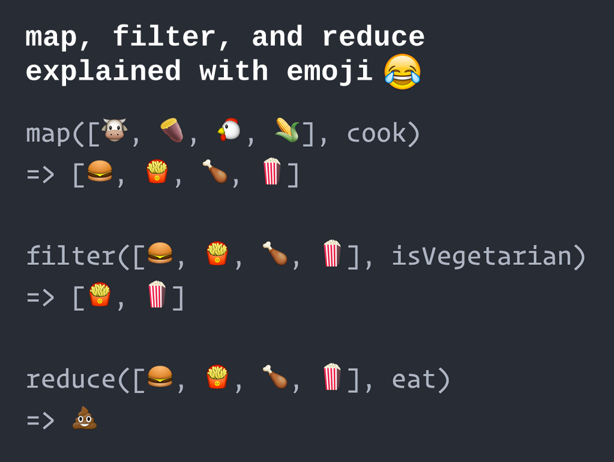

# forEach, mapear, filtrar, reduzir

Os métodos de matriz **forEach**, **map**, **filter** e **reduce** são mais bem compreendidos observando como eles podem ser implementados se você mesmo tiver que escrevê-los em JavaScript. Nas próximas seções apresentaremos equivalentes simplificados das implementações nativas.

O comum a esses métodos é que todos eles usam um loop **for** internamente para iterar pelos elementos da matriz de destino. Ao trabalhar com matrizes, muitos desenvolvedores preferem esses métodos em vez de usar um loop **for** em seu código. Em virtude de seus nomes, eles revelam mais claramente o que se pretende que os loops **for** equivalentes, que devem ser examinados mais de perto para determinar o que está acontecendo.

## Array.forEach()

> [definição de MDN](https://developer.mozilla.org/en-US/docs/Web/JavaScript/Reference/Global_Objects/Array/forEach): O método **forEach()** executa uma função fornecida uma vez por cada elemento da matriz.

``` js
const números = [1, 2, 3, 4];
deixe soma = 0;

números.forEach(x => {
  soma += x;
});

console.log(soma); // -> 10
```

> _Veja isso em ação neste [JSBin](https://jsbin.com/quforih/edit?js,console)._

### Uma implementação personalizada de forEach()

``` js
function forEach(arr, func) {
  for (seja i = 0; i < arr.length; i++) {
    func(arr[i], i, arr);
  }
}

const números = [1, 2, 3, 4];
deixe soma = 0;

forEach(números, x => {
  soma += x;
});

console.log(soma); // -> 10
```

> _Veja isso em ação neste [JSBin](https://jsbin.com/bufamuz/edit?js,console)._

### Chamando forEach() como um método em um array

Para demonstrar como podemos usar a notação de ponto diretamente em um array para chamar nossa função `forEach()` personalizada, semelhante a como o método nativo embutido `.forEach()` funciona, adicionaremos um novo método `.myForEach ()` para o tipo nativo `Array` que por sua vez chama nossa função `forEach()`.

> _Observe que é considerado uma prática ruim modificar tipos de JavaScript embutidos como é feito aqui. Você não deve fazer isso no código de produção. Mostramos aqui apenas para fins de demonstração._

``` js
function forEach(arr, func) {
  for (seja i = 0; i < arr.length; i++) {
    func(arr[i], i, arr);
  }
}

Array.prototype.myForEach = function(func) {
  forEach(isto, func);
};

const números = [1, 2, 3, 4];
deixe soma = 0;

números.meuParaEach(x => {
  soma += x;
});

console.log(soma); // -> 10
```

> _Veja isso em ação neste [JSBin](https://jsbin.com/pehexug/edit?js,console)._

### A função de retorno de chamada

Para fins ilustrativos, podemos adicionar uma instrução `console.log` à função de retorno de chamada e ver o que é passado como segundo e terceiro argumentos:

``` js
const números = [1, 2, 3, 4];

números.forEach((elem, índice, arr) => {
  console.log('elem: ' + elem + ', índice: ' + índice + ', arr: ' + arr);
});

/* saída:
elem: 1, index: 0, arr: 1,2,3,4
elem: 2, index: 1, arr: 1,2,3,4
elem: 3, index: 2, arr: 1,2,3,4
elem: 4, index: 3, arr: 1,2,3,4
*/
```

> _Veja isso em ação neste [JSBin](https://jsbin.com/nohipew/edit?js,console)._

O primeiro valor é o valor do elemento atual, o segundo valor é o valor do índice do loop atual e o valor do array é o array no qual `.forEach()` é chamado.

Como é comum em JavaScript, você não precisa necessariamente usar todos os parâmetros que são passados para a função de retorno de chamada. Na verdade, em muitos casos, você precisará apenas do primeiro argumento (o elemento atual do array).

Observe que as funções de retorno de chamada para **map**, **filter** e **reduce**, conforme descrito abaixo, recebem os mesmos três argumentos, aqui denominados `elem`, `index` e `arr`.

## Array.map()

> [definição de MDN](https://developer.mozilla.org/en-US/docs/Web/JavaScript/Reference/Global_Objects/Array/map): O método **map()** cria um novo array com o resultados de chamar uma função fornecida em cada elemento na matriz de chamada.

``` js
const números = [1, 2, 3, 4];
const quadrado = x => x * x;
const squaredNumbers = números.map(quadrado);

console.log(squaredNumbers); // -> [ 1, 4, 9, 16 ]
```

> _Veja isso em ação neste [JSBin](https://jsbin.com/wewewej/edit?js,console)._

### Uma implementação de map() personalizada

A função **map()** abaixo inicializa um novo array vazio para o qual ele envia _transformed_ elementos, um por um, enquanto itera através do argumento array `arr`, chamando a função `mapFn` para cada elemento individual. Quando o loop for concluído, a nova matriz será retornada. Observe que a matriz `arr` permanece inalterada.

``` js
function map(arr, mapFn) {
  resultado const = [];
  for (seja i = 0; i < arr.length; i++) {
    const mappedValue = mapFn(arr[i], i, arr);
    resultado.push(mappedValue);
  }
  retorno resultado;
}

const números = [1, 2, 3, 4];
const quadrado = x => x * x;
const squaredNumbers = map(numbers, square);

console.log(squaredNumbers); // -> [1, 4, 9, 16]
```

> _Veja isso em ação neste [JSBin](https://jsbin.com/winudul/edit?js,console)._

Para evitar resultados indesejados é essencial que a função passada como argumento `mapFn` não modifique o array original. Em termos de informática, essa função deve ser _pura_, sem efeitos colaterais.

> - Leia mais: [O que é uma função pura?](https://medium.com/javascript-scene/master-the-javascript-interview-what-is-a-pure-function-d1c076bec976)

## Array.filter()

> [definição de MDN](https://developer.mozilla.org/en-US/docs/Web/JavaScript/Reference/Global_Objects/Array/filter): O método **filter()** cria um novo array com todos elementos que passam no teste implementado pela função fornecida.

``` js
const números = [1, 2, 3, 4];
const éPar = x => x % 2 === 0;
const evenNumbers = números.filter(isEven);

console.log(evenNumbers); // -> [ 2, 4 ]
```

> _Veja isso em ação neste [JSBin](https://jsbin.com/zepemuc/edit?js,console)._

### Uma implementação de filtro () personalizada

Este método funciona de forma semelhante ao método `map()`, mas agora os elementos só são enviados para o novo array se a função de predicado retornar `true`. A nova matriz terá (potencialmente) menos elementos que a matriz original, mas os elementos filtrados não serão alterados de forma alguma.

No exemplo abaixo, a função de predicado testa se o elemento atual é par verificando se seu valor dividido por dois tem um resto igual a zero. O resultado dessa comparação (`true` ou `false`) é o valor de retorno do predicado e determina se o elemento atual é adicionado ao novo array ou não.

``` js
função filtro(arr, predicateFn) {
  resultado const = [];
  for (seja i = 0; i < arr.length; i++) {
    if (predicadoFn(arr[i], i, arr)) {
      resultado.push(arr[i]);
    }
  }
  retorno resultado;
}

const números = [1, 2, 3, 4];
const éPar = x => x % 2 === 0;
const evenNumbers = filter(numbers, isEven);

console.log(evenNumbers); // -> [2, 4]
```

> _Veja isso em ação neste [JSBin](https://jsbin.com/nugibag/edit?js,console)._

<small>\*Um _predicate_ é uma função que retorna um booleano, **true** ou **false**, dependendo dos argumentos fornecidos.</small>

## Array.reduce()

> [definição de MDN](https://developer.mozilla.org/en-US/docs/Web/JavaScript/Reference/Global_Objects/Array/reduce): O método **reduce()** executa um **reducer* * função (que você fornece) em cada membro da matriz, resultando em um único valor de saída†.

<small>†Embora seja feita referência a um 'valor de saída único', esse valor único pode muito bem ser uma matriz ou um objeto, como você verá mais adiante nos exemplos abaixo.</small>

``` js
const números = [1, 2, 3, 4];

soma const = (a, b) => a + b;
const total = números.reduce(soma, 0);

console.log(total); // -> 10
```

> _Veja isso em ação neste [JSBin](https://jsbin.com/sutamiy/edit?js,console)._

### Uma implementação customizada de reduce()

``` js
function reduce(arr, redutorFn, valorInicial) {
  let acumulador = valorInicial;
  for (seja i = 0; i < arr.length; i++) {
    acumulador = redutorFn(acumulador, arr[i], i, arr);
  }
  acumulador de retorno;
}

const números = [1, 2, 3, 4];

soma const = (a, b) => a + b;
const total = reduz(números, soma, 0);

console.log(total); // -> 10
```

> _Veja isso em ação neste [JSBin](https://jsbin.com/jofojej/edit?js,console)._

A chave para entender o método **reduce()** está na linha:

``` js
acumulador = redutorFn(acumulador, arr[i], i, arr);
```

No caso de não precisarmos do índice do loop atual e do array de assunto na função redutor (o que geralmente é o caso), podemos simplificar isso para:

``` js
acumulador = redutorFn(acumulador, arr[i]);
```

A partir desta linha, podemos definir a função redutora como uma função que recebe um valor acumulador e o elemento atual do array e retorna um novo valor acumulador.

O método **reduce()** é o mais flexível do tripleto map/filter/reduce. Na verdade, é possível reescrever **map()** e **filter** usando **reduce()**.

### Usando reduce() para filtrar

``` js
const arr = [6, 3, 10, 1];

const evenNumbers = arr.reduce((acc, elem) => {
  if (elem % 2 === 0) {
    acc.push(elem);
  }
  retorno acc;
}, []);

console.log(evenNumbers); // -> [6, 10]
```

> _Veja isso em ação neste [JSBin](https://jsbin.com/pucaruv/edit?js,console)._

Neste exemplo, nosso acumulador é um array (inicialmente vazio). Empurramos elementos (neste caso, números inteiros) no acumulador somente quando eles são divisíveis por 2.

### Usando reduce() para mapear

Neste exemplo, uma matriz de números inteiros é mapeada para uma matriz de seus quadrados.

``` js
const arr = [6, 3, 10, 1];

const quadrados = arr.reduce((acc, elem) => {
  acc.push(elem * elem);
  retorno acc;
}, []);

console.log(quadrados); // -> [36, 9, 100, 1]
```

> _Veja isso em ação neste [JSBin](https://jsbin.com/gatayet/edit?js,console)._

## Usando reduce() para 'agrupar por'

Neste exemplo, nosso acumulador não é um array, mas um objeto (inicialmente vazio). Ele agrupa os elementos do array por gênero.

``` js
const arr = [
  { sexo: 'F', nome: 'Joyce' },
  { sexo: 'M', nome: 'Jim' },
  { sexo: 'F', nome: 'Lucy' },
  { sexo: 'F', nome: 'Janet' },
  { sexo: 'M', nome: 'Jack' },
  { gênero: 'M', nome: 'Ferdinand' },
];

const groupedNames = arr.reduce((acc, elem) => {
  if (acc[elem.gender]) {
    acc[elem.gender].push(elem);
  } senão {
    acc[elem.gender] = [elem];
  }
  retorno acc;
}, {});

console.log(groupedNames);
```

Resultado:

``` js
{
  F: [
    { sexo: 'F', nome: 'Joyce' },
    { sexo: 'F', nome: 'Lucy' },
    { sexo: 'F', nome: 'Janet' }
  ],
  M: [
    { sexo: 'M', nome: 'Jim' },
    { sexo: 'M', nome: 'Jack' },
    { sexo: 'M', nome: 'Ferdinand' }
  ]
}
```

> _Veja isso em ação neste [JSBin](https://jsbin.com/rufubu/edit?js,console)._

### Encadeamento de métodos

Os métodos **map()** e **filter()** retornam um novo array. Isso possibilita encadear esses métodos e criar um 'pipeline' de operações, a serem aplicadas em sequência. O método **reduce** pode retornar qualquer coisa, incluindo um array. Se um método **reduce** retornar algo diferente de um array, ele só pode ser localizado no final de uma cadeia de métodos de array. O mesmo se aplica a **forEach()**: não retorna nada. Portanto, ele só pode ser colocado no final de uma cadeia.

Vamos pegar o último exemplo, mas agora filtrando apenas os elementos da matriz para os quais o nome começa com um 'J':

``` js
const arr = [
  { sexo: 'F', nome: 'Joyce' },
  { sexo: 'M', nome: 'Jim' },
  { sexo: 'F', nome: 'Lucy' },
  { sexo: 'F', nome: 'Janet' },
  { sexo: 'M', nome: 'Jack' },
  { gênero: 'M', nome: 'Ferdinand' },
];

const groupedNames = arr
  .filter(elem => elem.name.startsWith('J'))
  .reduce((acc, elem) => {
    if (acc[elem.gender]) {
      acc[elem.gender].push(elem);
    } senão {
      acc[elem.gender] = [elem];
    }
    retorno acc;
  }, {});

console.log(groupedNames);
```

Resultado:

```
{
  F: [
    { sexo: 'F', nome: 'Joyce' },
    { sexo: 'F', nome: 'Janet' }
  ],
  M: [
    { sexo: 'M', nome: 'Jim' },
    { sexo: 'M', nome: 'Jack' }
  ],
}
```

> _Veja isso em ação neste [JSBin](https://jsbin.com/yovodag/edit?js,console)._

## Resumindo



Crédito: http://www.globalnerdy.com/2016/06/23/map-filter-and-reduce-explained-using-emoji/
