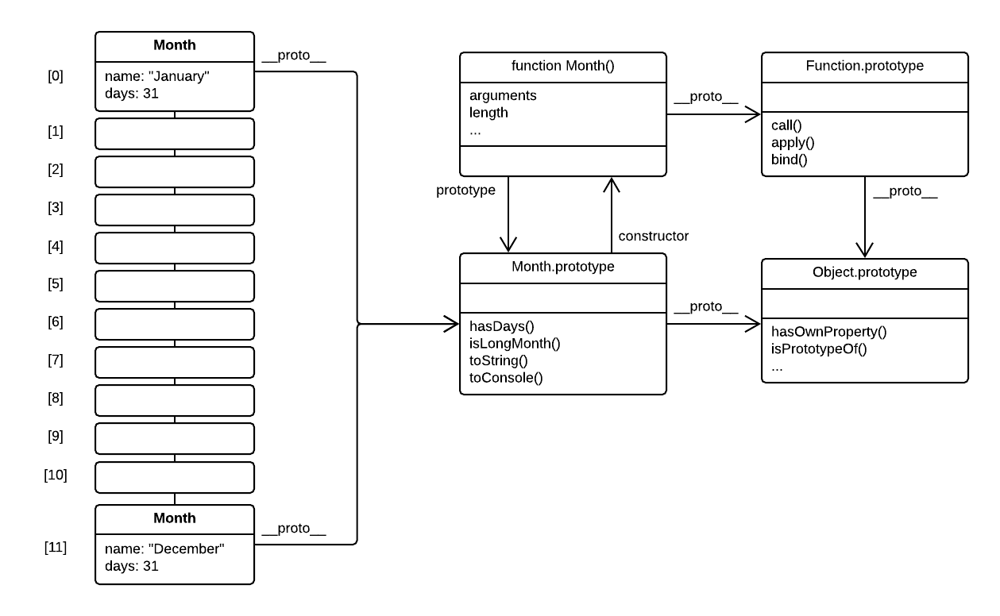

# Programação e Classes Orientadas a Objetos

### Literais de Objetos e Programação Imperativa

Em palestras anteriores sobre JavaScript vimos que podemos criar objetos por meio de literais de objetos e usar funções para acessar e manipular suas propriedades. Um exemplo típico é mostrado abaixo, onde definimos um array de objetos, neste caso cada um representando o nome de um mês e seu número de dias associado.

Estamos percorrendo os meses e imprimindo uma mensagem informativa no console para cada mês com 31 dias.

Este estilo de programação é chamado de Programação Imperativa: no detalhe do código que contém o loop `for`, instruímos o computador _como realizar a(s) tarefa(s) em questão_.

``` js
const meses = [
  { nome: 'janeiro', dias: 31 },
  { nome: 'fevereiro', dias: 28 },
  { nome: 'março', dias: 31 },
  { nome: 'abril', dias: 30},
  { nome: 'maio', dias: 31 },
  { nome: 'junho', dias: 30},
  { nome: 'julho', dias: 31 },
  { nome: 'agosto', dias: 31 },
  { nome: 'setembro', dias: 30 },
  { nome: 'outubro', dias: 31 },
  { nome: 'novembro', dias: 30 },
  { nome: 'dezembro', dias: 31 }
];

para (const mês de meses) {
  if (mês.dias === 31) {
    console.log(`${month.name} tem ${month.days} dias.`);
  }
}
```

## Programação Funcional

No estilo de Programação Funcional (também conhecido como Programação Declarativa), preferimos declarar _o que o computador deve fazer_.

No próximo exemplo, usamos o método `filter` para extrair um subconjunto de meses com 31 dias, usamos o método `map` para criar uma string informativa para cada mês e um método `forEach` para enviar essas strings para o console.

Em outras palavras, declaramos ou **declaramos** que o computador deve **filtrar** nosso array de acordo com algum critério predefinido, então **mapear** cada objeto filtrado para uma string e imprimir cada string no console .

> Um excelente exemplo de linguagem declarativa é o SQL, que você aprenderá no módulo HYF Database.

Em contraste com o estilo imperativo, não temos que inferir olhando para o código o que está realmente acontecendo. Em vez disso, os nomes das funções e métodos já indicam o que queremos alcançar.

``` js
const meses = [
  { nome: 'janeiro', dias: 31 },
  { nome: 'fevereiro', dias: 28 },
  { nome: 'março', dias: 31 },
  { nome: 'abril', dias: 30},
  { nome: 'maio', dias: 31 },
  { nome: 'junho', dias: 30},
  { nome: 'julho', dias: 31 },
  { nome: 'agosto', dias: 31 },
  { nome: 'setembro', dias: 30 },
  { nome: 'outubro', dias: 31 },
  { nome: 'novembro', dias: 30 },
  { nome: 'dezembro', dias: 31 }
];

meses
  .filter(mês => mês.dias === 31)
  .map(month => `${month.name} tem ${month.days} dias.`)
  .forEach(string => console.log(string));
```

### Funções Construtoras (pré-ES6) e a palavra-chave `new`

No exemplo abaixo, em vez de usar literais de objeto, usamos uma função em conjunto com a palavra-chave `new` para criar objetos. Essa função é chamada de função **construtor** e, por convenção, iniciamos seu nome com uma letra maiúscula.

Quando uma função é chamada e precedida pela palavra-chave `new`, algo especial acontece. O mecanismo JavaScript cria um novo objeto vazio e atribui esse objeto à variável `this`.

> A variável `this` está sempre presente em JavaScript. Seu valor depende do contexto de execução atual. Na maioria das vezes, o valor de `this` é `undefined`. No entanto, ao chamar um método em um objeto, a variável `this` mantém uma referência ao objeto em que é chamada. Podemos usar a variável `this` dentro da implementação do método para obter outras propriedades e métodos dentro do objeto.

Agora podemos adicionar propriedades ao novo objeto através da variável `this`, conforme mostrado abaixo.

Quando a função construtora termina, ela retorna o objeto recém-construído como seu valor de retorno.

``` js
function Mês(nome, dias) {
  este.nome = nome;
  este.dias = dias;
}

const meses = [
  new Month('Janeiro', 31),
  new Month('Fevereiro', 28),
  new Month('Março', 31),
  new Month('Abril', 30),
  new Month('Maio', 31),
  new Month('Junho', 30),
  new Month('Julho', 31),
  new Month('Agosto', 31),
  new Month('Setembro', 30),
  new Month('Outubro', 31),
  new Month('Novembro', 30),
  new Month('Dezembro', 31)
];

meses
  .filter(mês => mês.dias === 31)
  .map(month => `${month.name} tem ${month.days} dias.`)
  .forEach(string => console.log(string));
```

- [Compreendendo a invocação de função JavaScript e "isto"](http://yehudakatz.com/2011/08/11/understanding-javascript-function-invocation-and-this/), por Yehuda Katz.

- StackOverflow: [Qual é a palavra-chave 'nova' em JavaScript?](https://stackoverflow.com/questions/1646698/what-is-the-new-keyword-in-javascript)

### Introdução à programação orientada a objetos

No exemplo anterior, não havia muito a ganhar usando uma função construtora em conjunto com a palavra-chave `new`, em comparação com o uso de literais de objeto. As vantagens ficam mais claras quando começamos a adicionar **métodos** ao objeto. Métodos são apenas funções JavaScript simples que você chama em um objeto, usando a notação de ponto. No trecho de código abaixo, definimos algumas funções e as atribuímos às propriedades do objeto por meio da variável `this` na função construtora. Isso transforma essas funções em métodos.

``` js
function Mês(nome, dias) {
  este.nome = nome;
  este.dias = dias;

  this.hasDays = function (dias) {
    return this.days === dias;
  };

  this.isLongMonth = function() {
    return this.hasDays(31);
  };

  this.toString = function() {
    return `${this.name} tem ${this.days} dias.`;
  };

  this.toConsole = function() {
    console.log(this.toString());
  };
}

const meses = [
  new Month('Janeiro', 31),
  new Month('Fevereiro', 28),
  new Month('Março', 31),
  new Month('Abril', 30),
  new Month('Maio', 31),
  new Month('Junho', 30),
  new Month('Julho', 31),
  new Month('Agosto', 31),
  new Month('Setembro', 30),
  new Month('Outubro', 31),
  new Month('Novembro', 30),
  new Month('Dezembro', 31)
];

meses
  .filter(mês => mês.isLongMonth())
  .forEach(mês => mês.toConsole());
```

Agora podemos chamar esses métodos usando a notação de ponto, como em:

``` js
mês.isLongMonth()
mês.paraConsole()
```

Já vimos essa notação quando usamos, por exemplo, `map` e `filter`.

Quando adicionamos métodos a um objeto para operar nos dados contidos no objeto, criamos um objeto mais ou menos autocontido. O objeto sabe como operar seus dados e o código externo não precisa saber nada sobre seus internos. Este conceito é conhecido como Programação Orientada a Objetos. É o estilo padrão de programação em linguagens orientadas a objetos, como Java, C# e C++. Em JavaScript é opcional. No módulo HYF React, as classes ES6 são usadas extensivamente.

### Protótipos

O código do exemplo anterior tem uma ineficiência significativa: cada objeto obtém sua própria cópia dos métodos (`hasDays` etc). Isso ocupa memória desnecessária. Seria muito melhor se os objetos pudessem compartilhar um conjunto comum de métodos. É aqui que entra o conceito de um `protótipo` do JavaScript.

Cada função JavaScript tem uma propriedade `prototype` que aponta para um objeto protótipo, inicialmente vazio. Ele só entra em jogo ao usar essa função como uma função **construtor**. Podemos atribuir funções a este protótipo que são compartilhadas por todos os objetos que criamos chamando a função construtora em combinação com a palavra-chave `new`.

``` js
function Mês(nome, dias) {
  este.nome = nome;
  este.dias = dias;
}

Mês.prototipo.hasDias = function (dias) {
  return this.days === dias;
};

Mês.prototype.isLongMonth = function () {
  return this.hasDays(31);
};

Mês.protótipo.toString = function () {
  return `${this.name} tem ${this.days} dias.`;
};

Mês.prototype.toConsole = function () {
  console.log(this.toString());
}

const meses = [
  new Month('Janeiro', 31),
  new Month('Fevereiro', 28),
  new Month('Março', 31),
  new Month('Abril', 30),
  new Month('Maio', 31),
  new Month('Junho', 30),
  new Month('Julho', 31),
  new Month('Agosto', 31),
  new Month('Setembro', 30),
  new Month('Outubro', 31),
  new Month('Novembro', 30),
  new Month('Dezembro', 31)
];

meses
  .filter(mês => mês.isLongMonth())
  .forEach(mês => mês.toConsole());
```



Figura 1: Todos os objetos instanciados com a função construtora Model compartilham um protótipo comum.

### Protótipo vs \_\_protótipo\_\_

O diagrama acima mostra como esse compartilhamento funciona.

A propriedade `prototype` existe em todas as funções, mas só é relevante quando essa função é usada como uma **função construtora**. Ao atribuir métodos à propriedade `prototype` você está basicamente definindo um objeto 'prototype' que será compartilhado por todos os objetos criados através da função construtora quando chamados em conjunto com a palavra-chave `new`.

Em contraste com `prototype`, a propriedade `__proto__` (na documentação às vezes denotada como `[[proto]]`) é uma propriedade que existe em objetos criados através da função construtora. Esta propriedade `__proto__` aponta para o objeto 'prototype' compartilhado, conforme definido na propriedade `prototype` da função construtora.

O próprio objeto protótipo também possui uma propriedade `__proto__`. Na maioria dos casos, esta propriedade aponta para o protótipo do protótipo padrão JavaScript `Object`. Isso ocorre porque, em última análise, todos os objetos em JavaScript são vinculados ao protótipo `Object`. Em termos de POO, pode-se dizer que todos os objetos JavaScript derivam de `Object`.

Não há propriedade `__proto__` no protótipo `Object` em si. É aqui que a cadeia de protótipos termina.

Quando você chama um método em um objeto que não existe no próprio objeto, o mecanismo JavaScript 'caminha' pela cadeia de protótipos até encontrar o método solicitado _ou_ até atingir o final da cadeia.

Se o método for encontrado, o JavaScript chama o método, definindo seu valor `this` para o objeto no qual o método foi chamado. Isso acontece nos bastidores sem exigir intervenção do programador.

Se o método não foi encontrado percorrendo a cadeia de protótipos, um erro em tempo de execução é produzido, por exemplo:

``` js
myObj.someNonExistingMethod();

```

```
myObj.someNonExistingMethod();
      ^

TypeError: myObj.someNonExistingMethod não é uma função
```

### Aulas de ES6

No ES6 foi introduzida uma nova forma de definir objetos e seus métodos. Ele usa o mesmo mecanismo `prototype` nos bastidores, mas sua sintaxe é mais próxima de outras linguagens orientadas a objetos, como Java, etc. muitas vezes designado como 'açúcar sintático'.

Nas classes ES6 usamos a palavra-chave `class` para definir uma classe. O método `constructor` substitui a função construtora dos exemplos anteriores.

Definimos métodos criando funções dentro do corpo da classe, porém sem a palavra-chave `function`. Como anteriormente, a palavra-chave `this` se refere ao objeto que um método é chamado.

``` js
aula Mês {
  construtor(nome, dias) {
    este.nome = nome;
    este.dias = dias;
  }

  temDias(dias) {
    return this.days === dias;
  }

  isLongMonth() {
    return this.hasDays(31);
  }

  para sequenciar() {
    return `${this.name} tem ${this.days} dias.`;
  }

  consolar() {
    console.log(this.toString());
  }
}

const meses = [
  new Month('Janeiro', 31),
  new Month('Fevereiro', 28),
  new Month('Março', 31),
  new Month('Abril', 30),
  new Month('Maio', 31),
  new Month('Junho', 30),
  new Month('Julho', 31),
  new Month('Agosto', 31),
  new Month('Setembro', 30),
  new Month('Outubro', 31),
  new Month('Novembro', 30),
  new Month('Dezembro', 31)
];

meses
  .filter(mês => mês.isLongMonth())
  .forEach(mês => mês.toConsole());
```


### Bônus: Implementações Array.prototype.map & Array.prototype.filter

Agora que sabemos um pouco mais sobre objetos, protótipos e a variável `this`, pode ser útil revisitar os métodos `map` e `filter` que usamos antes e examinar como eles podem ser implementados internamente.

Nos exemplos abaixo, definimos implementações alternativas para `map` e `filter` e as nomeamos `myMap` e `myFilter`. Se executarmos esse código, estamos na verdade adicionando esses métodos à função construtora `Array` existente (em geral, é uma má ideia modificar objetos JavaScript padrão, mas o usamos aqui para fins ilustrativos).

A variável `this` dentro das implementações do método se refere ao array (que tecnicamente é um objeto: `typeof arr === 'object'`) no qual o método é chamado.

Como você pode ver, ambos os métodos usam um loop `for` internamente, poupando-nos o trabalho de escrever um loop `for` nós mesmos. Ambos os métodos chamam um retorno de chamada que foi passado como parâmetro. O retorno de chamada, por sua vez, é chamado para cada iteração de loop com três parâmetros, a saber:

1. O elemento da matriz atual
2. O valor do índice de loop atual
3. A matriz completa em si

Para o método `map`, o valor que retornamos de nosso retorno de chamada é enviado para um novo array inicialmente vazio.

Para o método `filter`, o elemento atual é enviado sem modificações para um novo array inicialmente vazio se, e somente se nosso retorno de chamada retornar um valor 'verdadeiro'.

Finalmente, ambos os métodos retornam o array recém-construído como seu valor de retorno.

``` js
Array.prototype.myMap = function (retorno de chamada) {
  const arr = [];
  for (deixe i = 0; i < this.length; i++) {
    arr.push(callback(this[i], i, this));
  }
  retornar ar;
};
```


``` js
Array.prototype.myFilter = function (retorno de chamada) {
  const arr = [];
  for (deixe i = 0; i < this.length; i++) {
    if (callback(this[i], i, this)) {
      arr.push(this[i]);
    }
  }
  retornar ar;
};
```

