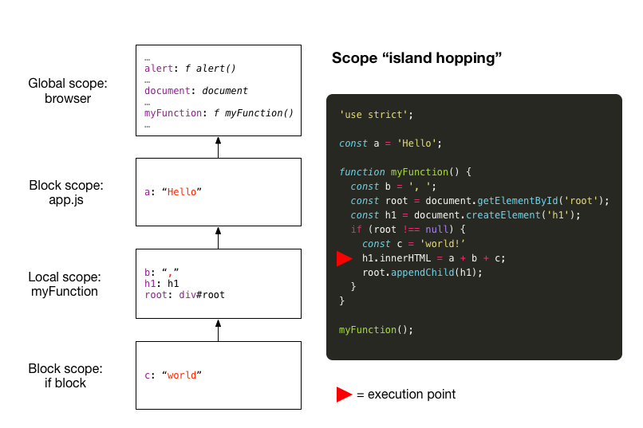

# Alcance

## O que é escopo?

Definição de [Dictionary.com](http://www.dictionary.com/browse/scope):

> substantivo
1\. extensão ou alcance de visão, perspectiva, aplicação, operação, eficácia, etc.:

Se você se imaginar como o computador que está executando seu código JavaScript, você pode pensar em escopo como significando:

> o que você pode ver de onde você está

Neste caso, as 'coisas' que você está procurando são variáveis e funções. Quando dizemos "O que está no escopo?", queremos dizer "Quais variáveis e funções podem ser acessadas a partir do ponto atual de execução em seu código?" Acontece que em JavaScript existem três tipos de escopo a serem considerados.

## Âmbito global

Variáveis e funções definidas no escopo global são visíveis de qualquer ponto de execução em seu código. Às vezes isso é uma coisa boa (ou mesmo essencial), mas em geral você deve evitar criar variáveis e funções no escopo global, a menos que tenha razões específicas para fazê-lo.

Considere o exemplo abaixo:

``` js
a = 'Olá'; // não faça isso
console.log(a);
```

Neste exemplo atribuímos o valor `'Hello'` a uma variável que esquecemos de declarar (esquecemos de usar `let`, `const` ou `var`). O mecanismo JavaScript tenta ser útil e define uma variável `a` para nós no escopo **global**. Mais recentemente, a comunidade JavaScript considerou essa facilidade um erro e com o ES5 introduziu o modo `strict`: coloque a string `'use strict';` no topo do seu arquivo. Isso agora faz com que nosso código falhe com um erro de tempo de execução ao esquecer de 'declarar' nossas variáveis.

``` js
'usar estrito';
a = 'Olá'; // produz: ReferenceError: a não está definido
console.log(a);
```

Você pode corrigir isso declarando sua variável com `let`, `const` ou `var`:

``` js
'usar estrito';
var a = 'Olá';
console.log(a);
```

Isso ainda coloca a variável `a` no escopo global. Então, por que o escopo global é um problema? Porque você não pode ter certeza de que os nomes de variáveis escolhidos não entram em conflito com os nomes já presentes no escopo global (o escopo global é um lugar ocupado).

É melhor aplicar o princípio da 'necessidade de saber'. Apenas exponha suas variáveis a outras partes do ecossistema JavaScript que precisam saber sobre elas. É aqui que entram o escopo local e o escopo do bloco.

## Escopo local

Quando você declara uma função em JavaScript, o corpo da função representa um novo escopo local, distinto do escopo global. As variáveis definidas no corpo da função são visíveis apenas nesse corpo da função: de fora, você não pode olhar para dentro.

``` js
'usar estrito';

função minhaFunção() {
  const a = 'Olá';
  console.log(a);
}

minhaFunção();

// console.log(a); <= isso produziria: ReferenceError: a não está definido
```

Mas de dentro você pode olhar para fora. No exemplo abaixo, a variável `a` é visível de dentro do corpo da função.

``` js
'usar estrito';

const a = 'Olá';

função minhaFunção() {
  const b = ', mundo';
  console.log(a + b);
}

minhaFunção();
```

Você pode pensar que a variável `a` está no escopo global. Na verdade, variáveis declaradas com `let` ou `const` têm escopo de bloco, como será discutido a seguir. Observe, no entanto, que a função `myFunction` ainda reside no escopo global. Existe uma maneira de tirar `myFunction` do escopo global usando, o que é chamado, um **IIFE** para criar um **escopo local** (ou, com ES6, colocando a definição da função em um bloco para criar um **escopo de bloco**). Veja mais abaixo.

## Escopo do bloco

As palavras-chave `let` e `const` foram introduzidas no ES6 como alternativas à palavra-chave `var` existente. Recomendamos que você use essas palavras-chave mais recentes em vez de `var`. Eles aderem às regras para **escopo do bloco**, enquanto `var` ignora completamente o conceito.

Um novo escopo de bloco (às vezes chamado de escopo _lexical_) é criado sempre que você cria um bloco de código dentro de um par de chaves. (Exceção: as chaves usadas para delimitar o corpo de uma definição de função não criam um escopo de bloco. Em vez disso, um **escopo local** é criado conforme discutido na seção anterior.)

Variáveis definidas com `let` e `const` no nível do arquivo (ou seja, não dentro de uma função ou bloco) são consideradas em um escopo de bloco em nível de arquivo (escopo 'script'). É por isso que a variável `a` no trecho de código anterior não está no escopo global. Se tivéssemos substituído `const a` por `var a`, então a variável `a` _seria_ no escopo global.

## Exemplo de escopo

Na figura abaixo mostramos um exemplo reunindo todos os tipos de escopo. O fragmento de código do lado direito é executado por meio de uma tag `<script>` em `index.html`. A hierarquia de escopo mostra o estado dos escopos no ponto de execução indicado pelo triângulo vermelho.



Vamos passar por esses escopos de cima para baixo:

- A função `alert` e o objeto `document` são colocados em **escopo global** pelo navegador na inicialização (junto com muitas outras variáveis 'sistema' predefinidas). A função `myFunction` se origina do nosso trecho de código.
- O próximo escopo mostrado é um **escopo de bloco** no nível do arquivo (nosso arquivo `app.js` carregado com uma tag `<script>`). As variáveis definidas fora de um bloco ou função neste arquivo serão visíveis de qualquer local dentro do arquivo. Isso vale para a variável `a`.
- Em seguida vem o **escopo local** da função `myFunction`. Ele contém as variáveis `b`, `h1` e `root`.
- O escopo mais interno é o **escopo do bloco** que existe apenas no bloco de instruções `if`. Este é o escopo que contém a variável `c`.

### Resolução variável

Vamos considerar a declaração abaixo tirada do trecho de código de exemplo e examinar como as referências de variáveis `a`, `b` e `c` são resolvidas 'caminhando na cadeia de escopo'.

``` js
h1.innerHTML = a + b + c;
```

A resolução de variável prossegue tentando resolver uma referência de variável do escopo atual (ou seja, no ponto de referência), através de escopos intermediários e, finalmente, terminando no escopo global, na direção das setas.

| Variável | Resolução |
| -------- | ---------- |
| `c` | Esta variável é definida no escopo atual (bloco) e é resolvida imediatamente. |
| `b` | Depois de falhar em resolver essa variável do escopo atual (bloco), o JavaScript percorre a cadeia de escopo e encontra sua definição no escopo local (função). |
| `a` | Para resolver essa variável, o mecanismo JavaScript deve saltar para o escopo do bloco no nível do arquivo. |

Para a declaração abaixo, tirada novamente do trecho de código na imagem, o mecanismo JavaScript deve percorrer a cadeia de escopo começando do escopo local (função) até o escopo global para encontrar a definição de `document`.

``` js
const root = document.getElementById('root')
```

## Orientação

Seguindo o princípio de 'necessidade de saber', é melhor definir as variáveis no momento da necessidade, ou seja, imediatamente antes de você precisar ter acesso a essas variáveis. Isso estará no mesmo escopo do código em que você acessa a variável ou, caso precise acessar a variável de vários lugares, o escopo mais próximo que seja comum aos pontos de necessidade.

## IIFE

Ficamos com o problema de que as funções definidas no nível do arquivo ainda acabam no escopo global. O método tradicional de resolver isso em JavaScript é usar uma Expressão de Função Imediatamente Invocada (IIFE). Apresentamos aqui para informação. Ao construir aplicativos da Web com ferramentas modernas, como React e Node, você não precisa usar IIFEs.

Para usar um IIFE, você deve envolver todo o seu código JavaScript em um corpo de função de uma função anônima (ou seja, uma função sem nome) e imediatamente chamar essa função (conforme indicado pelo conjunto vazio de parênteses na última linha). Isso cria um escopo local para seu código. Agora até a função `myFunction` está no escopo local.

``` js
(função () {
  'usar estrito';

  const a = 'Olá';

  função minhaFunção() {
    const b = ', mundo!';
    console.log(a + b);
  }

  minhaFunção();
})();
```

Mais informações sobre o MDN: [IIFE](https://developer.mozilla.org/en-US/docs/Glossary/IIFE)

## Alternativa IIFE (ES6)

No ES6 você pode substituir o IIFE por um bloco simples, como este, para obter o mesmo efeito.

``` js
{
  'usar estrito';

   const a = 'Olá';

  função minhaFunção() {
    const b = ', mundo!';
    console.log(a + b);
  }

  minhaFunção();
};
```
